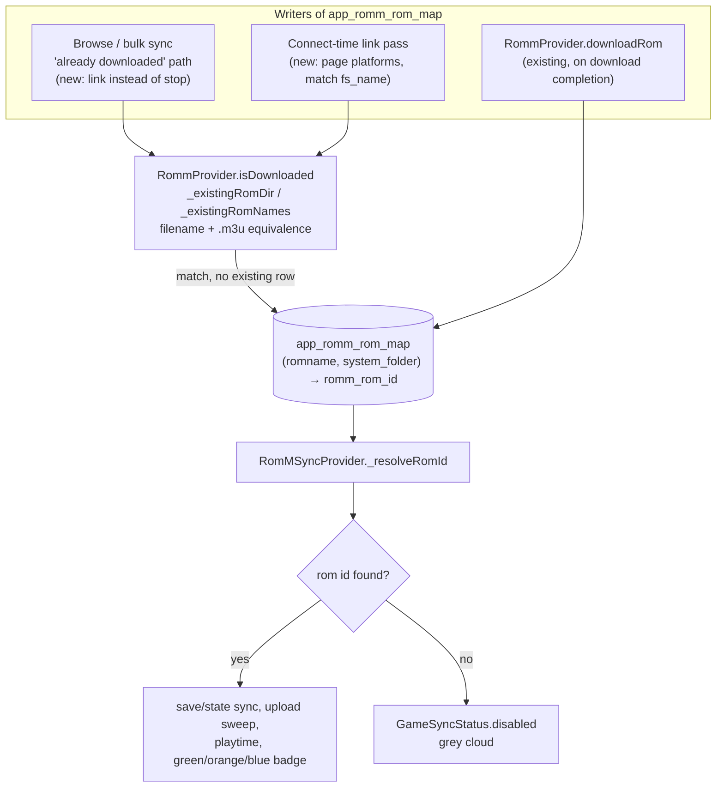

# ADR-0001: Link pre-existing local ROMs to RomM entries by filename

## Context and Problem Statement

Every RomM feature that acts on a game (save and state sync, the pending-upload sweep, playtime push/pull, and the cloud status badge) resolves the game to a RomM `rom_id` through a single table, `app_romm_rom_map`, keyed by ROM filename and system folder. That table has exactly one writer: the download-completion path in `RommProvider.downloadRom`. A game that already existed on the device before RomM was connected never gets a row, so `RomMSyncProvider._resolveRomId` returns null and every feature silently reports `GameSyncStatus.disabled`, which renders as the grey cloud users report in upstream issues #383 and #386.

The app already knows when a remote ROM corresponds to a local file. `RommProvider.isDownloaded` probes every configured ROM folder for the RomM `fs_name`, including multi-disc `.m3u` variants. Both of its callers use a positive match to *stop*: the browse screen shows an "already downloaded" toast, and bulk sync counts the ROM as skipped. The one code path that would write the link is made unreachable for the games that need it.

How should NeoStation establish the local-to-RomM link for ROMs it did not download itself?

## Decision Drivers

* Users with large existing libraries, typically copied from the RomM server over USB, need save sync without re-downloading anything. Copied files keep RomM's exact `fs_name`, so filename identity is reliable for the dominant case.
* RomM's own `gamelist.xml` export carries no RomM database id and no hash, so an offline metadata import cannot establish the link. Linking has to come from the live API.
* The client parses none of RomM's `crc_hash`, `md5_hash`, or `sha1_hash` fields, and local fingerprints are only computed during a ScreenScraper scrape. Local fingerprints hash the file inside an archive by No-Intro convention, while RomM hashes the archive it stores, so the two are not directly comparable.
* Android ROM folders are SAF `content://` trees. Any approach that reads file bytes pays a heavy cost there; filename probing is already implemented over SAF.
* A later manual link picker must be able to coexist with automatic linking without having its choices overwritten.
* The fix should stay in Dart. `EmulatorLauncher.kt` and the other Kotlin bridges are unaffected.

## Considered Options

* Filename-based linking: write the mapping whenever a local file matches a RomM `fs_name`, both on the "already downloaded" paths and in an automatic pass over the connected server's platforms
* Hash-based matching against RomM's stored hashes
* Manual-only linking through a per-game picker
* Do nothing and require users to re-download through NeoStation

## Decision Outcome

Chosen option: "Filename-based linking", because it reuses the existing filename-equivalence logic, needs no schema change, works over SAF, and covers the common case of a library copied from RomM with names intact. Two entry points share one rule:

1. **Link on "already downloaded".** When `RommBrowseScreen._confirmSelection` or `RommBulkSync._enumerate` finds the ROM on disk, write the mapping (and optionally import metadata) instead of only toasting or skipping.
2. **Automatic link pass on connect.** After a disconnected-to-connected transition, page each RomM platform that resolves to a local system, apply the same `fs_name` equivalence against the local library, and write mappings for every match. The pass is idempotent and runs on the existing sweep scheduler.

Automatic linking MUST only fill missing rows. It MUST NOT overwrite an existing `romm_rom_id`, so a mapping written by a future manual picker survives every subsequent pass without needing a provenance column today. When one local filename matches more than one RomM rom within the same resolved system, the pass MUST skip it and log the ambiguity rather than guess.

### Consequences

* Good, because it resolves the remaining case in upstream #383 and most of #386 with no migration and no Kotlin change.
* Good, because the link rule is exactly the rule `isDownloaded` already uses, so the "downloaded" badge and the sync badge cannot disagree.
* Good, because the automatic pass makes a USB-copied RomM library fully syncable the first time the app connects.
* Bad, because files renamed locally will not link. Those users need the manual picker, which is a separate decision.
* Bad, because the connect-time pass enumerates the server library once per connect. The existing page-size and page-cap constants bound the cost, but it is network traffic that did not exist before.
* Bad, because two distinct ROMs that share a filename across platforms mapping to the same local system are ambiguous. Skipping them is safe but leaves those games unlinked without a visible reason beyond the log.
* Neutral, because rows written by the automatic pass and by downloads are indistinguishable. That is acceptable until a manual picker needs provenance, at which point a column is added by a versioned migration.

### Confirmation

* `test/romm_bulk_sync_test.dart` "ROMs already on disk are skipped, not queued" becomes "skipped but linked", asserting a `putMapping` call.
* New tests cover: the connect pass links an unlinked game whose filename matches; the pass never overwrites an existing mapping; ambiguous matches are skipped; `.m3u` multi-disc names link the same way `isDownloaded` recognises them.
* `test/romm_upload_sweep_test.dart` "an unlinked game is never touched" continues to pass, since the sweep still gates on the map.
* Governing comments referencing this ADR on the two link entry points and the pass, checked by `/sdd:check`.

## Pros and Cons of the Options

### Filename-based linking

Match on RomM `fs_name` (plus the multi-disc `.m3u` variants) within the local system that the RomM platform resolves to, and write `app_romm_rom_map`.

* Good, because the matching logic and SAF handling already exist in `RommProvider._existingRomDir` and `_existingRomNames`.
* Good, because it is a Dart-only change with no schema migration.
* Good, because it is deterministic and cheap: no file reads, no hashing, one API enumeration per connect.
* Neutral, because the platform-to-system resolution depends on the hardcoded slug alias table, so an unmapped platform silently yields no links for that system.
* Bad, because renamed files never link.
* Bad, because identical filenames under different platforms that alias to one local system are ambiguous.

### Hash-based matching

Compute local CRC32/MD5 and compare against the hash fields RomM stores per ROM.

* Good, because it survives renames and is immune to filename collisions.
* Bad, because the client parses none of RomM's hash fields today and sends no hash filters, so both the model and the API layer need work first.
* Bad, because local fingerprints are computed only through the ScreenScraper path, so an unscraped library has none, and computing them means reading every ROM over SAF on Android.
* Bad, because of the archive semantics mismatch: local fingerprints describe the inner image, RomM's describe the stored archive. Zipped libraries would need a second hashing convention.
* Bad, because disc images and files over 512 MB are never fingerprinted, which excludes PS1, Saturn, PS2, and GameCube libraries entirely.

### Manual-only linking

Add a "Link to RomM" picker in the game settings dialog, backed by the server's `search_term` query, and make it the only way to link.

* Good, because the user is always right about identity, and the `RaMatchPickerDialog` precedent makes the UI cheap to build.
* Bad, because linking a multi-thousand-game library one game at a time is not a workflow anyone will complete.
* Bad, because it needs a provenance column and twelve languages of strings before it does anything, so it is slower to ship than the automatic path it would still eventually need.
* Neutral, because it remains valuable as a complement for renamed files, which is why the chosen option is designed not to overwrite its rows.

### Do nothing

Keep the download path as the only writer and tell users to re-download.

* Good, because it costs nothing.
* Bad, because re-downloading a library that is already on the device defeats the purpose of RomM for large collections, which is the exact complaint in #383.
* Bad, because the "already downloaded" guard blocks the re-download anyway, so the advice does not even work without deleting files first.

## Architecture Diagram

<!-- Call graph: cgg run 2026-09-04 with filter "_resolveRomId|putMapping|getRommRomId|isDownloaded|_existingRomDir|_syncGame|_confirmSelection|_enumerate|downloadRom" over lib/providers, lib/sync, lib/repositories, lib/screens/romm_screen. cgg identified the 12 callables but resolved zero Dart call edges, so the diagram below is hand-authored from the code paths named in this ADR. -->

## More Information

* Upstream reports: misobadev/neostation-frontend#383 (saves not syncing for pre-existing ROMs) and #386 (no RomM metadata for pre-existing ROMs).
* Key code: `lib/providers/romm_provider.dart` (`downloadRom`, `isDownloaded`, `_existingRomDir`, `resolveSystem`, `platformIdsForSystemName`), `lib/sync/providers/romm_provider.dart` (`_resolveRomId`, `_syncGame`, `retryPendingUploads`, `_scheduleSweep`), `lib/repositories/romm_save_map_repository.dart` (`putMapping`, `getRommRomId`, `getRomIdIndex`), `lib/providers/romm_bulk_sync.dart` (`_enumerate`), `lib/screens/romm_screen/romm_browse_screen.dart` (`_confirmSelection`).
* Related future decisions: importing RomM's in-folder `gamelist.xml` export for offline metadata, and a manual per-game link picker for renamed files. Both build on this decision and should reference it with an `extends` edge.
* This fork does not open upstream pull requests. Any upstream contribution of this work is rebased onto `upstream/main` without the `sdd/` commits.
