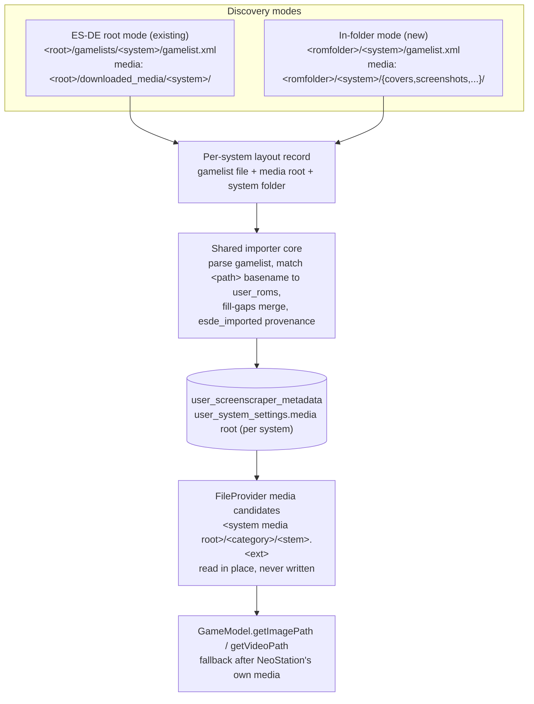

# ADR-0002: Import gamelist.xml metadata found inside ROM platform folders

## Context and Problem Statement

RomM can export its metadata alongside the ROMs it manages. With `scan.gamelist.export: true` it writes a `gamelist.xml` into each platform folder, with `<path>./Game.gba</path>` entries and relative media paths, and downloads the selected media into sibling folders named `covers`, `screenshots`, `marquees`, `fanart`, `videos`, `manuals`, `titlescreens`, `3dboxes`, `miximages`, `backcovers`, `bezels`, and `physicalmedia`, with files named by the ROM stem. Batocera uses the same in-folder layout. For a large library, copying that tree to the device over USB is far faster than downloading each ROM through NeoStation.

NeoStation already imports gamelist metadata, but only in the ES-DE layout: a user-picked root containing `gamelists/<system>/gamelist.xml` and `downloaded_media/<system>/<type>/<stem>.<ext>`. The importer's parsing, matching, fill-gaps merge, and persistence are layout-agnostic, and its media lookup is convention-based using the same folder names RomM writes. A user who restructured a RomM export into the ES-DE layout got a full import. What is missing is discovery of the in-folder layout and a per-system media root, since the ES-DE model assumes one global media root.

Two facts constrain the decision. RomM's export carries no RomM database id and no hash, so this import cannot establish save-sync links; that is ADR-0001's job, and the two together make up the USB workflow. And on Android, ROM folders are SAF `content://` trees while the importer is pure `dart:io`, so the in-folder layout raises a SAF question the ES-DE layout avoided.

How should NeoStation pick up metadata and media that already sit next to the ROMs?

## Decision Drivers

* Large libraries should reach "ROMs plus metadata plus artwork" without downloading through the app or restructuring the export by hand.
* The existing importer's core (gamelist parsing, filename matching, fill-gaps merge, convention media lookup, `esde_imported` provenance) is proven and tested, and its media category map already matches RomM's folder names.
* Media must be referenced in place and never written under the user's ROM folder. The importer's read-only guarantee is enforced by a structural test today.
* The layout is not RomM-specific. Batocera writes the same structure, so a generic "gamelist next to the ROMs" import has wider value than a RomM switch.
* Android ROM folders are SAF trees. Real-path access exists only with all-files permission, which the app requests but cannot assume.
* The importer is branded ES-DE throughout: config column, strings in twelve languages, provenance column. Renaming is expensive and gains nothing functionally.

## Considered Options

* Extend the ES-DE importer with a second discovery mode that walks configured ROM folders for `<system>/gamelist.xml` and treats sibling media folders as that system's media root
* Add a RomM-specific offline import that reads the export as a distinct source
* Pull metadata for every game over the RomM API once it is linked
* Keep the status quo and document the ES-DE restructuring workaround

## Decision Outcome

Chosen option: "Extend the ES-DE importer with a second discovery mode", because the layout-agnostic core already does the hard part, the media folder names already match, and a generic in-folder mode serves RomM exports and Batocera libraries alike. Concretely:

1. Discovery gains an in-folder mode: for each configured ROM folder, enumerate system subfolders and look for `gamelist.xml` directly inside them, using the same subdirectory enumeration the scanner uses. The existing `gamelists/` root mode stays unchanged.
2. The per-system media location becomes a per-system media root instead of a folder name joined under one global root. In-folder systems store an absolute media root pointing at the platform folder; ES-DE systems keep their current value. `FileProvider` builds candidates from the per-system root and no longer requires a global ES-DE path to be set.
3. Media stays referenced in place under the same read-only guarantee, extended to the ROM folders themselves. The importer never writes into a platform folder.
4. Provenance and reset keep using the existing `esde_imported` marker, so a re-scrape still upgrades imported rows and "reset import" still clears exactly what was imported. The feature is presented to users as a generic "import metadata from ROM folders" option rather than an ES-DE or RomM one, but the internal naming is not churned.
5. The first delivery targets real filesystem paths (desktop, and Android with all-files access). SAF support for the importer and for media existence checks is a separate, larger piece of work and is tracked as its own decision.

### Consequences

* Good, because a library copied from a RomM server with exports enabled imports metadata and artwork with no restructuring and no downloads.
* Good, because Batocera-style libraries get the same import for free.
* Good, because the parsing, matching, merge, media lookup, and tests are reused rather than duplicated; the change is discovery plus a media-root model.
* Bad, because the per-system media root needs a versioned migration and touches `FileProvider` candidate construction, whose exact paths are pinned by tests.
* Bad, because the first delivery leaves the most common Android setup, a SAF-picked ROM folder without all-files access, unsupported until the SAF decision lands.
* Bad, because RomM's export does not carry the RomM rom id, so this import alone never enables save sync. Users need ADR-0001's link pass as well, which the connect step provides automatically.
* Neutral, because imported rows remain indistinguishable from ES-DE imports. Nothing consumes that distinction today.

### Confirmation

* Existing `test/esde_import_service_test.dart` cases keep passing unchanged, since they construct the `gamelists/` layout explicitly.
* New tests cover in-folder discovery across multiple ROM folders, a system with a gamelist but no media, a system with media but no gamelist, and the "no gamelists found anywhere" result.
* `test/file_provider_test.dart` gains candidate-path cases for a per-system absolute media root alongside the existing ES-DE cases.
* `test/esde_media_write_protection_test.dart` continues to enforce that only the allowlisted files build media candidates, and its read-only assertion is extended to platform folders.
* Governing comments referencing this ADR on the discovery entry point and the media-root resolution, checked by `/sdd:check`.

## Pros and Cons of the Options

### Extend the ES-DE importer with in-folder discovery

* Good, because the core is reused as-is and the media folder names already match RomM's exporter.
* Good, because it is one option in the existing directories settings, not a new subsystem.
* Good, because it is generic across RomM and Batocera exports.
* Neutral, because the ES-DE branding stays internally, which reads oddly in code for a RomM library but costs nothing.
* Bad, because the per-system media root is a model change with a migration and pinned-path test updates.
* Bad, because the importer's `dart:io` core does not cover SAF, so the in-folder mode inherits that gap.

### RomM-specific offline import

Read the export as a RomM source with its own discovery, parsing, and media mapping.

* Good, because it could be tuned to RomM's exact element set, including the `<id>` element.
* Bad, because RomM's `<id>` is a gamelist id from its own metadata import, not the RomM database id, so the one thing a RomM-specific path could add does not enable linking.
* Bad, because it duplicates parsing, matching, and merge logic that already exists and is tested.
* Bad, because Batocera libraries with the identical layout would not benefit.

### Pull metadata over the RomM API after linking

Once ADR-0001 links a game, fetch its metadata and media from the server the way the download path does.

* Good, because it needs no file-based import at all and gets RomM's freshest data.
* Bad, because it downloads artwork for every game in the library over the network, which is the cost the USB workflow exists to avoid.
* Bad, because it only helps games that resolve to a linked RomM rom; unlinked or unresolved games get nothing.
* Neutral, because per-game metadata import on the browser's link action already exists in the linking work and remains useful for individual games.

### Status quo

Document the restructuring workaround.

* Good, because it costs nothing.
* Bad, because moving thousands of files into `gamelists/` and `downloaded_media/` by hand is the exact friction the suggestion reports.
* Bad, because the workaround requires a separate ES-DE root and a global media path, which the in-folder layout does not have.

## Architecture Diagram

## More Information

* RomM exporter behaviour verified against `backend/utils/gamelist_exporter.py` and `backend/config/config_manager.py` in the RomM repository: `gamelist.xml` per platform folder, `./{fs_name}` paths, relative media paths, `GAMELIST_MEDIA_DIRS` folder names, no rom id or hash in the output. Config keys `scan.gamelist.export` and `scan.gamelist.media.{thumbnail,image}`.
* Key code: `lib/services/esde_import_service.dart` (discovery at the `gamelists/` check, `_importSystem`, `_selectGames`, `_recordEsdeMediaDir`, `_linkMediaOnlySystems`), `lib/providers/file_provider.dart` (`getEsdeMediaCandidates`, `_esdeMediaCategories`, `_loadEsdeConfig`), `lib/models/game_model.dart` (`getImagePath`, `getVideoPath`), `lib/repositories/scraper_repository.dart` (`buildEsdeMetadataWrite`, `resolveSystemByFolderName`), `lib/data/datasources/sqlite_database_service.dart` (`getExistingSubdirectories`), settings entry in `lib/screens/settings_screen/new_settings_options/directories_settings_content.dart`.
* Related: ADR-0001 establishes the RomM link by filename; together they form the copy-then-connect workflow. A follow-up decision will cover SAF support in the importer and media existence checks.
* Upstream context: the suggestion attached to misobadev/neostation-frontend#383 and #386. This fork does not open upstream pull requests.
