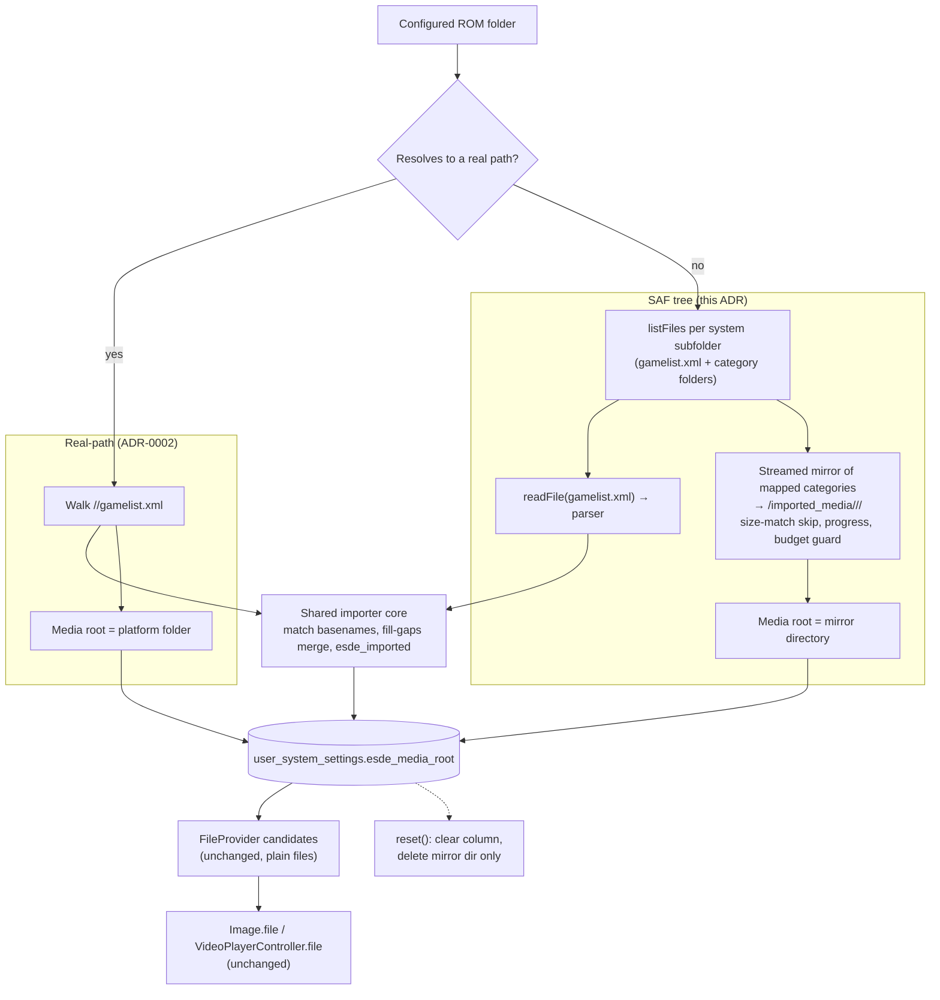

# ADR-0003: Mirror SAF platform-folder gamelists and media into app storage at import time

## Context and Problem Statement

ADR-0002 adds an in-folder gamelist import but scopes it to ROM folders that resolve to a real filesystem path. On Android the common setup is a Storage Access Framework tree picked by the user, addressed as a `content://` URI, and a real path is only available on the primary volume or a mounted SD card when the app holds all-files access. Everything else is skipped and reported.

The importer core is pure `dart:io`. The media resolver builds up to eighteen image and fourteen video candidate paths per game and stats them synchronously on every card build, softened only by process-wide memo caches. Every render site uses `Image.file` or `FileImage`, every video site uses `VideoPlayerController.file`, and there is no custom `ImageProvider` anywhere in the app. `MediaCacheService` and its isolate worker are plain-filesystem too. The only SAF primitives are a per-directory `listFiles`, whole-file and ranged reads, and a native tree walk that works on the primary volume alone. There is no single-file existence check for a `content://` document.

The app already copies SAF bytes into real files in two places: archive extraction reads a `content://` ROM in chunks into a temp file, and a native streamed mirror copies an emulator's SAF NAND tree into app-private storage, skipping files whose size already matches. Both are precedents for "make it a real file, then use the normal code".

How should the in-folder import serve gamelists and media that live inside a SAF tree with no real path?

## Decision Drivers

* Android users who picked a SAF folder are the reporters of this workflow; leaving them at "skipped" leaves the feature unfinished on its main platform.
* The render and existence-check surface is large, synchronous, and performance-sensitive. Making it `content://`-aware means a custom image provider, a video source change, an async existence path, and cache changes across grid, carousel, list, and secondary-screen widgets.
* Media inside a platform folder is small relative to the ROMs, typically kilobytes per image, and is static once exported.
* The in-folder media root model from ADR-0002 already lets a system's media root be any absolute directory, and the media resolver already reads it. Nothing requires that root to be the platform folder itself.
* Media must remain read-only in place under the user's ROM folder, and the app's own media directory must keep its precedence over imported art so later scrapes win.
* Reset must be able to undo an import completely, including anything the import created.

## Considered Options

* Mirror at import time: read `gamelist.xml` through SAF, copy the mapped media folders into an app-storage mirror directory, and record that directory as the system's media root
* Make the importer, media resolver, existence checks, and render sites SAF-aware so `content://` media is used in place
* Keep the ADR-0002 scope and require all-files access for in-folder import on Android

## Decision Outcome

Chosen option: "Mirror at import time", because it makes the SAF case identical to the real-path case at the point where all the expensive code lives, reuses two existing copy precedents, and needs no change to the resolver or any widget. Concretely:

1. **Discovery over SAF.** For a `content://` ROM folder, enumerate system subfolders with the scanner's existing listing, list each subfolder once to find `gamelist.xml` and the mapped media category folders, and resolve the system through the same alias table. One directory listing per folder; no per-file probes.
2. **Gamelist read over SAF.** Read `gamelist.xml` bytes with the existing whole-file SAF read and feed the same parser. `<path>` entries are matched by basename exactly as today, which is layout-independent.
3. **Media mirror.** Copy the files in the mapped category folders (the same category set ADR-0002 defines) into `<user data>/imported_media/<system folder>/<category>/`, streaming through a native mirror that skips files whose size already matches the destination and reports progress. Unmapped folders are not copied. The mirror directory, not the platform folder, is recorded as the system's `esde_media_root`.
4. **Unchanged consumers.** The media resolver, `GameModel` path lookups, caches, and widgets read the mirror as ordinary files. NeoStation's own media directory keeps precedence because the mirror lives under the imported-media root, which sits in the ES-DE candidate slot.
5. **Reset and re-import.** Reset deletes the mirror directory for systems whose media root points inside it and clears the column. Re-import is idempotent through the size-match skip. The mirror is never written back to the SAF tree.
6. **Budget guard.** Before copying, sum the candidate file sizes from the listing and refuse with a named result when free space is insufficient, using the existing free-space channel.
7. **Real-path folders keep ADR-0002 behaviour.** No mirror is made for folders that resolve to a real path; the platform folder remains the media root there.

### Consequences

* Good, because Android SAF users get the full import with no permission escalation and no restructuring.
* Good, because the change is confined to the importer and a copy step. No widget, cache, or resolver changes, and no new `ImageProvider`.
* Good, because the size-skip mirror makes repeated imports cheap and resumable.
* Bad, because media is duplicated on disk. Bounded by the category filter and the budget guard, and reported in the summary.
* Bad, because a mirror can go stale if the user updates the export in place. Re-running the import refreshes changed sizes; same-size edits are missed, which is acceptable for artwork.
* Bad, because reset now deletes files, not only rows. The deletion is scoped to the imported-media root and never touches the ROM folder.
* Neutral, because real-path and SAF folders end up with different kinds of media root (platform folder versus mirror). The resolver does not care, and the result summary states which was used.

### Confirmation

* Importer tests with a fake SAF listing and reader: gamelist parsed from SAF bytes; mapped folders copied and unmapped ignored; size-match skip on second run; budget refusal; media root recorded as the mirror path; reset removes the mirror and clears the column.
* Write-protection test extended: the SAF tree is never written (the fake records every call and asserts none is a write, create, move, or delete).
* Existing ES-DE and real-path in-folder tests unchanged.
* Governing comments referencing this ADR on the SAF discovery path, the mirror step, and the reset deletion, checked by `/sdd:check`.

## Pros and Cons of the Options

### Mirror at import time

* Good, because it converts the problem into the already-solved real-path case at the cheapest boundary.
* Good, because both copy mechanisms exist: chunked SAF reads into a file, and a native streamed tree mirror with size skipping.
* Good, because precedence and reset semantics stay expressible with the ADR-0002 column.
* Neutral, because progress reporting must be added to the native mirror or the Dart copy loop; the RomM download's progress callback is the model.
* Bad, because of disk duplication and the possibility of stale mirrors.

### SAF-aware resolver and render stack

Read media directly from `content://` documents.

* Good, because there is no duplication and no staleness.
* Bad, because the app has no `content://` image provider or video source, and every render site would need one.
* Bad, because existence checks are synchronous per card build; a binder call per candidate is not viable, so the resolver would need a listing-backed index and an async path through the caches and widgets.
* Bad, because the change touches the hottest UI paths in the app and its blast radius is the whole library UI.

### Require all-files access

Keep ADR-0002's scope and tell users to grant all-files access.

* Good, because it is already implemented and reported.
* Bad, because it fails for non-primary providers and for `Android/data`, and leaves SAF-only users with no import at all.
* Bad, because it asks for a broad permission to read a few kilobytes of artwork.

## Architecture Diagram

## More Information

* Facts this decision rests on: `lib/services/saf_directory_service.dart` (`listFiles`, `readFile`, `readRange`; no exists primitive), `lib/utils/optimized_md5_utils.dart` (`readAllBytes` chunked SAF read; `fileExists` returns true for `content://`), `lib/services/archive_service.dart` (SAF bytes to temp file), `android/.../MainActivity.kt` (`mirrorSafRecursive` streamed copy with size skip; `fastWalkSafTree` primary-volume only; `getFreeSpace`), `lib/models/game_model.dart` (`getImagePath` precedence and sync stats), `lib/providers/file_provider.dart` (`getEsdeMediaCandidates`), `lib/services/media_cache_service.dart` and `media_isolate_service.dart` (plain-filesystem only), `lib/services/user_data_location_service.dart` (`safUriToRealPath` scope).
* Extends ADR-0002, which deferred this case. The category set and the read-only rule are ADR-0002's.
* Upstream context: the copy-then-connect suggestion attached to misobadev/neostation-frontend#383 and #386. This fork does not open upstream pull requests.
