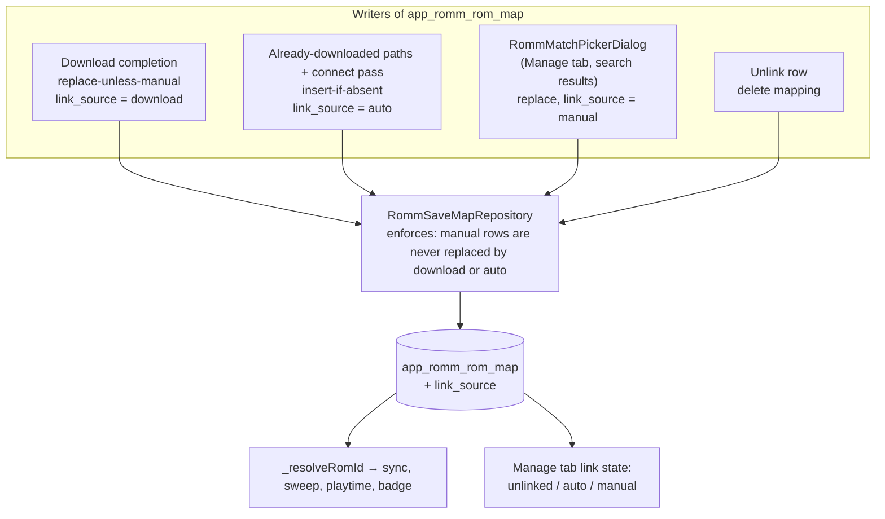

# ADR-0004: Manual per-game RomM link picker with link provenance

## Context and Problem Statement

ADR-0001 links pre-existing local ROMs to RomM entries by filename, on the "already downloaded" paths and in a connect-time pass. It deliberately leaves two cases unlinked: files renamed locally so no RomM `fs_name` matches, and files that match more than one RomM ROM within a system, which the pass skips as ambiguous and logs. ADR-0001 also required that automatic linking never overwrite an existing mapping row, precisely so a later manual choice would survive, and noted that a provenance column could be added when a manual picker needed it.

The app has a direct precedent. RetroAchievements matching offers `RaMatchPickerDialog`, a debounced title search over candidates that writes the chosen id together with `ra_match_source = 'manual'`, and the automatic RA pass filters on that column so manual matches are never touched. The game settings dialog's Manage tab already reaches `RommProvider` for unlinking on delete, and the RomM client already exposes a server-side `search_term` query scoped by `platform_ids`. The RomM link table, `app_romm_rom_map`, has no provenance column; rows written by downloads, by the "already downloaded" paths, and by the pass are indistinguishable.

How should a user link, relink, or unlink a single game to a RomM ROM, and how should that choice be protected from automatic linking?

## Decision Drivers

* Renamed and ambiguous files are the residual gap after ADR-0001, and only the user can resolve them correctly.
* A manual choice must be permanent against the connect-time pass and the "already downloaded" paths. Today that holds only because those paths insert-if-absent; a manual relink that replaces an automatic row needs a marker so a future re-link feature or a re-download cannot clobber it silently.
* The RA picker is a proven, controller-navigable pattern with the same shape: search, pick, mark manual.
* Every user-facing string goes through `AppLocale` in twelve languages, and every element must be reachable by D-pad.
* Schema changes require a versioned migration; the downgrade path recreates the database.
* The picker must be reachable from a per-game surface the user already uses, not only from the RomM browser.

## Considered Options

* A search-backed picker in the game settings Manage tab that writes the link with a `link_source` provenance column, plus an unlink action; automatic writers keep insert-if-absent and additionally refuse to replace a manual row
* A search-backed picker without provenance, relying on insert-if-absent alone
* Resolve renamed files automatically by fuzzy title matching instead of a picker

## Decision Outcome

Chosen option: "Picker with provenance in the Manage tab", because it mirrors the RA precedent exactly, closes the residual gap with the user in control, and makes the never-overwrite guarantee explicit in data rather than implicit in which code path ran. Concretely:

1. **Provenance column.** Add `link_source TEXT` to `app_romm_rom_map` by a versioned migration, nullable, with values `download`, `auto`, and `manual`. Existing rows are left null and read as automatic, because both the download path and the automatic paths write `romm_fs_name`, so no reliable backfill exists. Only `manual` changes behaviour.
2. **Picker.** A `RommMatchPickerDialog` modelled on `RaMatchPickerDialog`: opened from a new "Link to RomM" row in the Manage tab (and reachable from the search screen's result actions), pre-filled with the game's stem, debounced against `getRomsPage(search:, platformIds:)` scoped to the game's system, showing name, platform, and `fs_name`, with the current link indicated. Confirming writes the mapping with `link_source = 'manual'`, replacing any automatic row; B cancels.
3. **Unlink.** A "Unlink from RomM" row that removes the mapping. Unlinking a manual row does not block the automatic pass from relinking by filename later; the user can re-pick.
4. **Automatic writers respect manual rows.** The connect-time pass and the "already downloaded" paths keep insert-if-absent, and the download path's replace is changed to a replace-unless-manual so a re-download cannot overwrite a manual choice. The pass logs manual rows it would have targeted as conflicts, per SPEC-0001's conflict logging.
5. **Status visibility.** The Manage tab shows the current link state (unlinked, linked automatically, linked manually) so the user can tell why a badge looks the way it does.

### Consequences

* Good, because renamed and ambiguous files finally get save sync, and the fix is one dialog the codebase already knows how to build.
* Good, because the never-overwrite guarantee becomes a data rule enforced in the repository rather than a property of call sites.
* Good, because the same column can later distinguish auto rows for diagnostics and bulk "unlink automatic" actions.
* Bad, because it is a schema migration, with the usual version-collision care across branches.
* Bad, because the picker is a controller-navigable modal with its own gamepad layer, search field, and twelve languages of strings, which is the largest UI piece in this workflow.
* Neutral, because the download path's replace becomes replace-unless-manual. Re-downloading a manually linked game keeps the manual link; if the user wants the downloaded ROM's own id, they unlink first.

### Confirmation

* Migration test: column added, idempotent re-run, download-path rows backfilled to `download`, others null.
* Repository tests: `putMapping` refuses to replace a manual row; a manual write replaces an automatic row; insert-if-absent unchanged.
* Linker test: a manual row matched to a different id is logged as a conflict and untouched.
* Picker tests: search debounce and scoping to the game's platform ids; confirm writes `manual`; B cancels; the Manage tab row is reachable by D-pad and shows the link state.
* Governing comments referencing this ADR on the picker, the Manage tab rows, the repository rule, and the migration, checked by `/sdd:check`.

## Pros and Cons of the Options

### Picker with provenance

* Good, because it is the RA pattern applied to RomM, with the same repository-enforced protection.
* Good, because the user resolves ambiguity with full information (name, platform, `fs_name`).
* Bad, because of the migration and the modal UI cost.

### Picker without provenance

Rely on insert-if-absent alone to protect manual rows.

* Good, because no migration is needed.
* Bad, because the download path replaces rows today, so a re-download would silently overwrite a manual link.
* Bad, because nothing can tell a manual row from an automatic one for diagnostics or a future bulk action, and the guarantee stays implicit in call sites.

### Fuzzy automatic matching for renamed files

Match renamed local files to RomM entries by normalised title similarity.

* Good, because it needs no UI.
* Bad, because a wrong automatic guess attaches saves to the wrong server entry, which ADR-0001 rejected as a failure mode, and the never-overwrite rule makes the guess permanent.
* Bad, because title similarity across regions, revisions, and hacks is unreliable enough that it would need a confirmation step anyway, which is the picker.

## Architecture Diagram

## More Information

* Precedent: `lib/screens/game_screen/game_details_card/dialogs/ra_match_picker_dialog.dart` (search picker with its own gamepad layer), `lib/repositories/retro_achievements_repository.dart` (`raMatchManual` and the automatic-pass filter on `ra_match_source`).
* Key code: `lib/repositories/romm_save_map_repository.dart` (`putMapping`, `putMappingIfAbsent`, `removeMapping`), `lib/services/romm_service.dart` (`getRomsPage` with `search` and `platformIds`), `lib/providers/romm_provider.dart` (`platformIdsForSystemName`, `forgetLocalDownload`), `lib/screens/game_screen/game_settings_dialog/game_settings_manage_tab.dart`, `lib/screens/search_screen/search_screen.dart` (`_localGameForRemote`, result actions), `lib/services/romm/romm_library_linker.dart` (conflict logging).
* Extends ADR-0001, which reserved this decision. SPEC-0001's conflict logging is the hook the pass uses to report manual rows it would have changed.
* Upstream context: misobadev/neostation-frontend#383. This fork does not open upstream pull requests.
