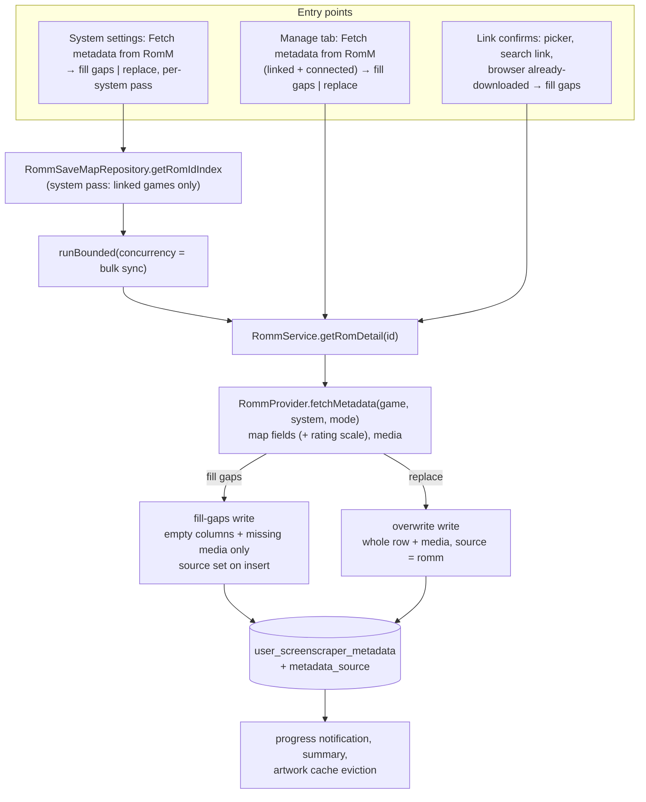

# ADR-0005: RomM as a metadata source for linked games

## Context and Problem Statement

After ADR-0001 and ADR-0004, most of a RomM-backed library is linked: every game with a row in `app_romm_rom_map` has a server-side identity NeoStation can address. RomM holds rich metadata and artwork for those entries, yet the only time NeoStation reads it is when a ROM is downloaded through the app, plus the RomM browser's "already downloaded" confirm, which imports only when the game has no metadata row at all. The connect-time link pass and the manual picker deliberately fetch nothing. Device testing confirmed the gap: linked games showed the sync badge but no RomM metadata, and the user expected linking to bring metadata with it.

The existing RomM import, `RommProvider._importMetadata`, reads the `/api/roms/{id}` detail: name, summary, genres, companies, player count, release date, cover, fan art, logo, a screenshot, and a video, and writes them through `ScraperRepository.saveGameMetadata`, which is a whole-row replace that also forces `is_fully_scraped`. That is why the browser path gates on "no row at all": running it over an ES-DE-imported or ScreenScraper-scraped row would null the publisher, the rating, and every non-English description. Meanwhile the ES-DE importer has a pure fill-gaps writer, `buildEsdeMetadataWrite`, that only touches empty columns, and a bounded-concurrency helper exists for fan-out fetches. There is no per-system ScreenScraper scrape either; the only bulk scrape is global across all enabled systems, keyed on a `new_only` or `all` mode, and nothing records which source wrote a row.

How should NeoStation let a user pull RomM metadata for linked games, one at a time and per system, without destroying metadata from other sources, and how should RomM sit beside ScreenScraper?

## Decision Drivers

* The user wants RomM to serve as the metadata source when a game matches, replacing ScreenScraper for a RomM-backed library, and to be able to trigger that per system, not only per game.
* Existing metadata from ScreenScraper or ES-DE must survive by default. The user chose fill-gaps as the default with an explicit overwrite option.
* Linking should bring metadata along where the fetch is proportionate: one game on picker confirm or browser confirm is fine; the connect-time pass over thousands of games is not, and ADR-0001 keeps that pass network-light.
* RomM's detail is English-only for descriptions and has no publisher split; fill-gaps handles that naturally, overwrite must not pretend otherwise.
* `RommService` has no throttling. Fan-out must be bounded, cancellable, and single-instance.
* ScreenScraper's `new_only` mode decides on `is_fully_scraped`. RomM writes should cooperate with that rather than conflate sources silently.
* Every string through `AppLocale` in twelve languages, every action reachable by controller.

## Considered Options

* Explicit RomM fetch actions: a per-game "Fetch metadata from RomM" in the Manage tab and a per-system pass over linked games, both fill-gaps by default with an overwrite choice, plus fill-gaps on link confirm, backed by a `metadata_source` column
* Make RomM a selectable source inside the ScreenScraper options screen and run it through the global scrape pipeline
* Backfill metadata automatically for every linked game during the connect-time pass

## Decision Outcome

Chosen option: "Explicit RomM fetch actions with fill-gaps default", because it gives the user both granularities they asked for, reuses the fill-gaps writer and the bounded fetch helper that already exist, and keeps the connect-time pass cheap. Concretely:

1. **One RomM metadata writer with two modes.** A public `RommProvider.fetchMetadata(game, system, {mode})` that reads the detail once and writes either fill-gaps (only empty columns and missing media files) or overwrite (the existing whole-row behaviour, including replacing media). Fill-gaps into a row that had no metadata marks the row fully scraped with source `romm`; fill-gaps into an existing row leaves `is_fully_scraped` and the source unchanged; overwrite sets both.
2. **Field mapping extended.** Rating from RomM's `metadatum.average_rating` scaled from 0 to 100 onto the app's 0 to 20 scale; `publisher` left untouched since RomM has no split; descriptions written to English only, so other languages are never nulled in fill-gaps mode and are cleared only by overwrite, which the user asked for by name.
3. **Provenance column.** `user_screenscraper_metadata.metadata_source TEXT` by a versioned migration, values `screenscraper`, `romm`, `esde`, `steam`, `manual`, null for legacy rows. Every writer sets it; fill-gaps writes set it only on insert, mirroring `esde_imported`. This is what makes "which games has RomM already filled" and a per-source badge possible.
4. **Per-game action.** "Fetch metadata from RomM" in the Manage tab beside Link and Unlink, enabled when the game is linked and RomM is connected. Confirming offers fill gaps or replace, then refreshes artwork caches the way Force Rescrape does.
5. **Per-system pass.** "Fetch metadata from RomM" on the system's settings dialog, iterating the system's games filtered by the link index, fetching details with the bounded helper at the bulk-sync concurrency, fill gaps or replace chosen up front, progress in the global notification, cancellable, single-instance, and a summary of filled, replaced, skipped, and failed. Games with no link are counted, not fetched.
6. **Link confirm fills gaps.** The picker confirm, the search-screen link, and the browser's "already downloaded" confirm run the fill-gaps import for that one game, replacing the browser path's "no row at all" gate. The connect-time pass still fetches nothing.

### Consequences

* Good, because a RomM-backed library gets its metadata from RomM at whatever granularity the user chooses, with ScreenScraper and ES-DE data safe by default.
* Good, because the writer, the fan-out helper, the link index, and the Manage tab state all exist; the new code is the mode switch, the mapping additions, the per-system loop, and UI.
* Good, because `metadata_source` finally records who wrote a row, which also fixes the current conflation where RomM rows hide from ScreenScraper's `new_only` mode.
* Bad, because it is a migration, and the source column must be threaded through the ScreenScraper, ES-DE, and manual-edit writers too.
* Bad, because overwrite mode discards non-English descriptions and the publisher, which RomM cannot provide. The confirmation names that.
* Bad, because a per-system pass against a homelab server with no throttling is bounded only by the concurrency constant. Acceptable for detail fetches, and the constant is shared with bulk sync.
* Neutral, because RomM is not selectable inside the ScreenScraper options screen. That screen is account-, region-, and language-shaped around ScreenScraper, and a source selector there would be a larger rework for no extra capability.
* Revised by ADR-0006 (2026-09-05): RomM is still not selectable on that screen, but every scrape action now tries RomM first and falls back to ScreenScraper.

### Confirmation

* Migration test for `metadata_source`: guarded, idempotent, legacy rows null.
* Writer tests: fill-gaps leaves populated columns and existing media untouched and sets the source only on insert; overwrite replaces columns and media and sets the source; rating scaled; publisher untouched; non-English descriptions untouched in fill-gaps.
* Per-system pass tests with fakes: only linked games fetched, bounded concurrency, cancellation between games, per-game failure isolated and counted, single instance refused, summary counts.
* Link-confirm tests: picker, search link, and browser confirm each trigger one fill-gaps import.
* Governing comments referencing this ADR on the writer, the migration, the per-game and per-system actions, and the link-confirm hooks, checked by `/sdd:check`.

## Pros and Cons of the Options

### Explicit RomM fetch actions with fill-gaps default

* Good, because it matches both granularities the user asked for and the overwrite policy they chose.
* Good, because it reuses the fill-gaps writer, the link index, and the bounded fetch helper.
* Good, because the provenance column makes the feature re-runnable and inspectable.
* Bad, because of the migration and a modest amount of new UI.

### RomM as a source in the ScreenScraper options screen

Add a source selector to the scraper options and route RomM through `startMetadataScraping`.

* Good, because one scrape pipeline and one progress model.
* Bad, because that screen and pipeline are ScreenScraper-shaped: credentials, daily quota, region and language priority, thread count. RomM needs none of it, and a source selector would have to disable most of the screen.
* Bad, because it offers no per-system entry either; the global pipeline scrapes every enabled system.
* Bad, because it delays the feature behind a UI rework for no additional capability.

### Automatic backfill in the connect-time pass

Fetch details for every linked game with no metadata during the pass.

* Good, because metadata appears with no user action.
* Bad, because it is the network cost ADR-0001 explicitly kept out of the pass: thousands of detail fetches plus media downloads on every connect.
* Bad, because it cannot express the fill-gaps versus overwrite choice per run.

## Architecture Diagram

## More Information

* Key code: `lib/providers/romm_provider.dart` (`_importMetadata`, `importMetadataIfMissing`, `_saveRommMedia`, `_rommResourcePath`), `lib/services/romm_service.dart` (`getRomDetail`, `fetchImageBytes`), `lib/repositories/scraper_repository.dart` (`saveGameMetadata` replace, `buildEsdeMetadataWrite` fill-gaps, `getGameMetadata`, `getRomsForScraping`), `lib/utils/bounded_concurrency.dart` (`runBounded`), `lib/repositories/romm_save_map_repository.dart` (`getRomIdIndex`, `getMapping`), `lib/screens/game_screen/game_settings_dialog/game_settings_manage_tab.dart`, `lib/screens/game_screen/game_settings_dialog/game_settings_scrapping_tab.dart` (Force Rescrape refresh sequence), `lib/widgets/system_emulator_settings_dialog/`, `lib/screens/scraper_screen/scraper_contents/scraping_content.dart` (notification pattern).
* RomM detail fields mapped today: `summary`, `metadatum.genres`, `metadatum.companies`, `metadatum.player_count`, `metadatum.first_release_date`, cover paths, `ss_metadata.{fanart,logo,marquee,title_screen,video}_path`, `merged_screenshots`. Unmapped until this decision: `metadatum.average_rating`.
* Incidental finding to fix separately: `ScraperRepository.getRomsForScraping` and `getRomCountForScraping` join `user_roms` to `user_screenscraper_metadata` on `filename` only, without `app_system_id`, so a scraped ROM in one system suppresses an identically named ROM in another under `new_only`.
* Extends ADR-0001 (links make RomM entries addressable). Related to ADR-0002 (offline metadata from exports, which needs no link) and ADR-0004 (the Manage tab surface and picker confirm this decision hooks).
* Upstream context: misobadev/neostation-frontend#386. This fork does not open upstream pull requests.
