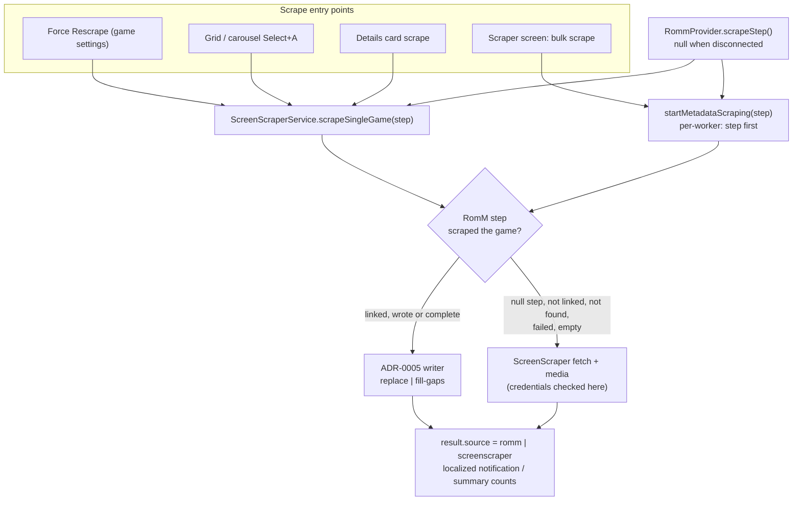

# ADR-0006: RomM-first scraping with ScreenScraper fallback

## Context and Problem Statement

ADR-0005 made RomM a metadata source for linked games, but only through explicit RomM actions: the Manage tab row, the system settings pass, and the link confirms. The scrape actions the user reaches for by habit still go straight to ScreenScraper: Force Rescrape in game settings, the Select+A scrape in the grid and carousel, the details-card scrape in the list view, and the global scrape on the Scraper screen all call `ScreenScraperService.scrapeSingleGame` or `startMetadataScraping`, and two of the per-game sites refuse outright when no ScreenScraper credentials are saved. A user who has set up RomM therefore has to remember a second set of actions to get RomM's metadata, and a user with RomM but no ScreenScraper account cannot scrape at all from those actions.

The user asked that "scrape" mean: try RomM first when the app is logged in, and if RomM cannot supply the game, fall back to ScreenScraper; with no RomM login, behave exactly as today. That applies to the per-game actions and to the bulk scrape. How should the two sources be chained so every scrape entry point behaves the same way, existing ScreenScraper behaviour is untouched when RomM is absent, and the bulk pipeline's threading, progress, and quota handling keep working?

## Decision Drivers

* One rule for every scrape entry point, so users never have to think about which source an action uses.
* RomM is authoritative when it has the game; ScreenScraper is the safety net. A user who set up both wants their ROMs scraped, not a report that RomM had nothing.
* No behaviour change when RomM is disconnected: the ScreenScraper paths, their credentials gate, quota handling, and summary must be identical to today.
* A RomM-only user (no ScreenScraper credentials) must be able to scrape from the same actions.
* The bulk pipeline runs ROMs in worker threads sized by the ScreenScraper thread setting, with a candidate query keyed on `is_fully_scraped`; the RomM step must slot into that without a second pipeline.
* Strict layering: `ScreenScraperService` is a service and must not import `RommProvider`.
* Provenance from ADR-0005 must stay truthful: rows RomM writes carry `romm`, rows ScreenScraper writes carry `screenscraper`.

## Considered Options

* A source chain inside the existing scrape functions: an injected RomM step runs first, ScreenScraper runs only when the step reports it did not scrape the game
* A user-selectable scrape source on the Scraper screen (RomM or ScreenScraper) applied to every scrape action
* Keep the sources separate: explicit RomM actions from ADR-0005 only, scrape stays ScreenScraper

## Decision Outcome

Chosen option: "A source chain inside the existing scrape functions", because it gives every entry point the same behaviour with one change per function, keeps the ScreenScraper code path byte-for-byte when the step is absent, and reuses the ADR-0005 writer and the injected-function pattern the RomM services already follow. Concretely:

1. **An injectable RomM step.** A `RommScrapeStep` value, built by `RommProvider` when it is connected and `null` otherwise, that given a scrape target (system id, filename with extension, system folder, overwrite flag) returns a `RommMetadataOutcome` or `null` when the game has no link. `ScreenScraperService.scrapeSingleGame` and `startMetadataScraping` accept the step as an optional parameter. When the step is `null` nothing changes.
2. **RomM counts as done only when it delivered.** The step's outcome is "scraped" when RomM wrote at least one metadata column or media file, or when it confirmed the row already holds everything RomM offers with no media failure. Not linked, not found, a request failure, or an entry that supplied nothing all fall through to ScreenScraper for that game.
3. **Overwrite maps to mode.** `forceOverwrite: true` (Force Rescrape, and the grid chord when a description already exists) runs the RomM writer in replace mode; otherwise fill-gaps. ScreenScraper keeps its own semantics, where the flag only affects media.
4. **The credentials gate moves behind the step.** Per-game sites stop pre-checking ScreenScraper credentials; `scrapeSingleGame` checks them only when the RomM step did not scrape the game, and reports "no ScreenScraper credentials" only then. Bulk may start with RomM connected and no ScreenScraper credentials; ScreenScraper is skipped for every ROM in that run. With neither source available, both refuse as today.
5. **Bulk keeps its pipeline.** The candidate query and threading are unchanged; the step runs at the start of each worker before the ScreenScraper fetch, using a link index read once per run. The summary and progress name which source handled each game, and per-source counts are added to the summary dialog.
6. **Every result names its source.** The per-game result map gains a `source`, and the notifications say "scraped from RomM" or "scraped from ScreenScraper" (and "RomM had nothing; scraped from ScreenScraper" when it fell through). The hardcoded strings at the three per-game sites ("Scraping completed", "Please log in to ScreenScraper in the Scraping tab first.", "Error: System ID is missing.") are localized in the same change.

This revises ADR-0005's "Neutral" consequence that RomM stays out of the ScreenScraper pipeline: RomM is still not a selectable option on the Scraper screen, but it now runs inside every scrape action ahead of ScreenScraper.

### Consequences

* Good, because a RomM user gets RomM metadata from the actions they already use, and a mixed setup gets the best available source per game with no extra steps.
* Good, because the RomM-absent path is untouched: the step is `null`, and every existing ScreenScraper test still describes the behaviour.
* Good, because the writer, the link index, and the provenance column already exist; the new code is the step type, two optional parameters, the success rule, and messages.
* Bad, because the bulk summary and the three per-game sites all change their messaging, which is twelve-language work.
* Bad, because "RomM had the game but supplied nothing" costs one RomM request and then a ScreenScraper request; acceptable, and it is exactly the fallback the user asked for.
* Neutral, because bulk `new_only` mode skips rows RomM completed on an earlier run, which is the cooperation ADR-0005 already promised.

### Confirmation

* Unit tests on `scrapeSingleGame` with a fake step: step scrapes → ScreenScraper not called and `source` is `romm`; step returns not linked / not found / failed / empty → ScreenScraper called and `source` is `screenscraper`; step `null` → identical to today including the credentials message; no credentials and step scraped → success.
* Bulk tests with a fake step: linked games handled by RomM, unlinked by ScreenScraper, per-source counts in the summary, run starts with RomM only, refuses with neither.
* Widget-free tests for the per-game message mapping; manual steps for each entry point with RomM on and off.
* Governing comments on the step type, both scrape functions, the success rule, and each entry point.

## Pros and Cons of the Options

### A source chain inside the existing scrape functions

* Good, because one behaviour for every entry point, implemented once per scrape function.
* Good, because injection keeps `ScreenScraperService` free of provider imports and makes the step trivially fakeable in tests.
* Good, because the ScreenScraper path is unchanged when the step is absent.
* Bad, because the step type and its success rule are one more concept to keep aligned with the ADR-0005 writer.

### A user-selectable scrape source on the Scraper screen

Add a "Metadata source" setting (RomM or ScreenScraper) and route every scrape action to the chosen one.

* Good, because explicit and predictable per run.
* Bad, because it does not do what the user asked: a chosen source has no fallback, so a RomM-only choice leaves unlinked games unscraped and a ScreenScraper choice ignores RomM.
* Bad, because it adds a setting to a screen shaped around ScreenScraper accounts and quotas, and users must flip it back and forth.

### Keep the sources separate

Leave scrape as ScreenScraper-only and rely on the ADR-0005 actions for RomM.

* Good, because nothing changes.
* Bad, because it is the situation the user rejected: two sets of actions, and no scrape at all for RomM-only users.

## Architecture Diagram

## More Information

* Key code: `lib/services/screenscraper_service.dart` (`scrapeSingleGame` :671, `startMetadataScraping` :780, `_processRomInThread`), `lib/providers/romm_provider.dart` (`fetchMetadataForRomId`, `fetchMetadata`, `isConnected`), `lib/repositories/romm_save_map_repository.dart` (`getMapping`, `getRomIdIndex`), entry points `lib/screens/game_screen/game_settings_dialog/game_settings_scrapping_tab.dart` (`_forceRescrape`), `lib/screens/game_screen/my_games_list.dart` (`_scrapeSelectedGame`), `lib/screens/game_screen/game_details_card/game_details_card_list.dart` (`_startSingleGameScrape`), `lib/screens/scraper_screen/scraper_contents/scraping_content.dart` (bulk start and summary).
* Extends ADR-0005 (the writer, modes, provenance). Related to ADR-0001 (links make a game addressable in RomM) and ADR-0004 (manual links are what the step resolves).
* This fork does not open upstream pull requests.
