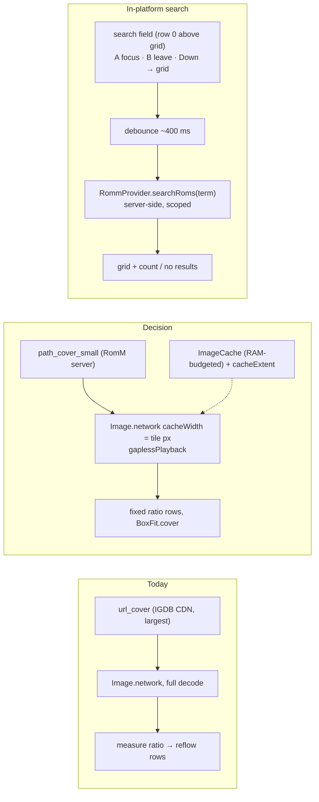

# ADR-0008: Faster RomM browsing with server thumbnails, fixed tiles, and in-platform search

## Context and Problem Statement

Browsing a large RomM library in the RomM tab is slow and the tiles visibly resize while covers arrive. Reading the code shows why. Each ROM card asks for its cover in the order `url_cover` (the metadata provider's own image, usually an IGDB CDN URL and the largest file), then RomM's cached `path_cover_large`, then `path_cover_small`; so the first request for every tile goes to an external CDN for the biggest copy, even though the RomM server on the LAN holds a small thumbnail. The card renders with `Image.network` and no decode-size hint, so every cover is decoded at full resolution into the in-memory image cache. The grid lays rows out from a per-cover height/width ratio: every unmeasured card starts at an assumed IGDB ratio and the row reflows once the real image decodes, which is the "odd resizing" whenever a library's covers are not all IGDB-shaped. The user asked for this to be faster without caching all images on the device.

Searching within a platform is the second request. The provider already has server-side, scope-aware search (`searchRoms(term)` re-runs the current platform or collection query with RomM's `search_term`), and the global search screen uses it library-wide, but the RomM tab has no search field once a platform is open.

How should covers be fetched and drawn so a large library scrolls smoothly on a handheld without a disk cache, and how should search be offered inside a platform?

## Decision Drivers

* No on-device image cache beyond the process-lifetime in-memory cache Flutter already keeps (user constraint).
* Handheld hardware: decode work and bitmap memory matter more than bandwidth; the RomM server is usually on the LAN.
* Tiles must not change size after first paint; layout must not depend on image content.
* Every interactive element controller-reachable; B leaves a focused text field; the existing browse selection model must stay intact.
* Reuse the provider's search rather than a client-side filter over one page.

## Considered Options

* Server thumbnails first, decode-size hints, fixed-ratio tiles, in-memory cache only, plus a debounced in-platform search field
* Add a persistent on-device cover cache (e.g. `cached_network_image`) and keep the current layout
* Eagerly prefetch every page's covers when a platform opens

## Decision Outcome

Chosen option: "Server thumbnails first, decode-size hints, fixed-ratio tiles, in-memory cache only, plus a debounced in-platform search field", because it removes the three measurable costs (external full-size fetch, full-resolution decode, post-decode reflow) with no new storage, and the search reuses code that already exists. Concretely:

1. **Tiles use the server's small cover first.** `RommService.tileCoverUrlCandidates(rom)` returns `path_cover_small`, then `path_cover_large`, then `url_cover`; the existing `coverUrlCandidates` (large first) stays for surfaces that show one cover big. The grid and list tiles use the tile order.
2. **Decode to tile size.** Tiles pass a `cacheWidth` derived from the tile's pixel width (logical width × device pixel ratio, rounded up) so the decoded bitmap matches what is drawn; `gaplessPlayback` keeps a recycled tile from flashing the placeholder.
3. **Fixed tile ratio, no reflow.** Rows are laid out from one constant height/width ratio (the IGDB 264×374 ratio the grid already assumes) and covers are drawn with `BoxFit.cover`; `RommCoverAspect` measurement and the reflow path are removed. Off-ratio covers are cropped, as RomM's own web UI does.
4. **Memory cache only.** Flutter's `ImageCache`, already sized from device RAM by the app, is the only cache; a `cacheExtent` of about one viewport lets the next rows' covers start loading during a scroll. No disk cache, no persistent files.
5. **In-platform search.** When a platform or collection is open, a search field sits above the ROM grid as the first selectable row: A focuses it, B leaves it, Down moves into the grid. Input is debounced (about 400 ms) into `RommProvider.searchRoms(term)`, so results are server-side and scoped; clearing the field restores the full list; a result-count or "no results" line accompanies the grid; the term survives opening a ROM and returning, and is cleared by backing out to the platform list.

### Consequences

* Good, because the first paint of a page comes from small LAN files decoded at tile size, and the layout is settled before any image arrives.
* Good, because nothing is written to storage; scrolling back over a region hits the in-memory cache while it lasts, and re-fetching small files from the LAN is cheap.
* Good, because search is one field and one debounce over an existing provider method.
* Bad, because covers whose ratio differs from IGDB's are cropped rather than shown whole in the grid.
* Bad, because a library RomM never cached covers for still fetches the provider URL, now last instead of first; those libraries gain only the decode hint and the fixed layout.
* Neutral, because the list layout's 72-pixel cover benefits from the same small file and hint.

### Confirmation

* Unit tests for the tile candidate order (small, large, provider; missing entries skipped) and for the decode-width calculation.
* Grid tests that row heights come from the constant ratio and never change after covers load.
* Search: debounce coalesces keystrokes into one provider call; clearing restores; the field is in the selection order above the grid; B leaves the field; term retained across ROM open/return and cleared on back.
* Manual on the Nova: a 500+ ROM platform scrolls without tiles resizing; search narrows within the platform.

## Pros and Cons of the Options

### Server thumbnails first, decode-size hints, fixed-ratio tiles, in-memory cache only, plus search

* Good, because each change targets a measured cost and none adds storage.
* Good, because the search reuses `searchRoms`.
* Bad, because off-ratio covers are cropped.

### Persistent on-device cover cache

Add `cached_network_image` or a hand-rolled disk cache keyed by URL.

* Good, because a revisit after restart needs no network.
* Bad, because the user asked for no device-wide image caching, it adds storage growth and eviction policy, and it does nothing for first-visit speed or the reflow.

### Eagerly prefetch every page's covers

Fetch all covers for a page (or platform) as soon as it opens.

* Good, because scrolling never waits.
* Bad, because it multiplies bandwidth and memory for content that may never be scrolled to, and a 5,000-ROM platform would fetch thousands of images.

## Architecture Diagram

## More Information

* Key code: `lib/services/romm_service.dart` (`coverUrlCandidates`, `coverUrl`, `imageHeadersFor`), `lib/screens/romm_screen/romm_rom_card.dart` (`_buildCover`, `_coverAttempt` fallback), `lib/screens/romm_screen/romm_rom_grid.dart` (row layout, `_ensureMeasured`, `_scheduleReflow`, `SliverVariedExtentList`), `lib/screens/romm_screen/romm_cover_aspect.dart`, `lib/screens/romm_screen/romm_browse_screen.dart` (header bar, selection model, `_handleBack`), `lib/providers/romm_provider.dart` (`searchRoms`, `selectPlatform`, `selectCollection`, `loadMoreRoms`, `backToPlatforms`), `lib/utils/image_cache_budget.dart`, `lib/screens/search_screen/search_screen.dart` (text-field-in-gamepad-screen pattern).
* RomM fields: `url_cover` (provider image), `path_cover_large`, `path_cover_small` (server-cached copies, served under the RomM base URL with the app's auth headers).
* Related to ADR-0001 only as part of the same RomM tab.
* This fork does not open upstream pull requests.
