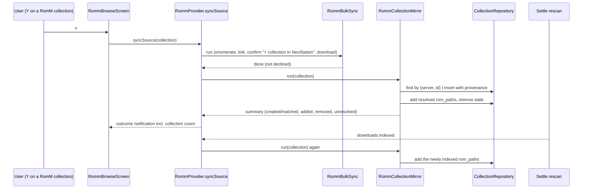

# ADR-0009: Mirror synced RomM collections into NeoStation collections

## Context and Problem Statement

The upstream 0.12.0 merge brought user-defined collections to NeoStation: `user_collections` (uuid id, name, image, colours, sort order) and `user_collection_items` keyed by the ROM's `rom_path`, with `CollectionRepository`, `CollectionsService`, `CollectionsProvider`, a collections browser, and a badge on games that belong to one. RomM has its own collections (user collections with integer ids and virtual collections with opaque ids, both listable and pageable through `/api/roms`). The RomM tab can already bulk-sync a whole RomM collection with Y: it enumerates the collection's ROMs, links the ones already on disk (ADR-0001), prices the rest, asks, downloads them, and a debounced settle rescan indexes the new files.

Nothing carries the collection itself across. After syncing "Best of SNES" from RomM, the user has the ROMs but no NeoStation collection named "Best of SNES". The user asked that syncing a collection from RomM make it show up in NeoStation. How should a RomM collection become a local one, keep up with later syncs without duplicating itself, and stay editable in the ways a local collection is?

## Decision Drivers

* A second sync of the same RomM collection must update the same local collection, never create another.
* Membership must include ROMs downloaded by the sync, which only exist in `user_roms` after the settle rescan, and ROMs that were already local and linked.
* Local collections are the user's: renaming, artwork, and deletion must keep working; deleting a mirrored collection must not break the next sync.
* Virtual RomM collections (by genre, franchise, and so on) are collections too and can be large.
* Keep the connect-time pass network-light (ADR-0001); no automatic mirroring of every RomM collection on connect.
* Strict layering, versioned migration with guards, twelve-language strings, controller reachability.

## Considered Options

* Provenance-linked mirror: the Y-sync of a RomM collection creates or updates one local collection that records which RomM collection it mirrors, with membership set from the RomM collection after the sync and again after the settle rescan
* Mirror every RomM collection automatically on connect
* One-shot import into a plain local collection with no link back

## Decision Outcome

Chosen option: "Provenance-linked mirror", because it makes the existing Y-sync the single gesture that brings a collection across, guarantees idempotence through a stored link, and reuses the collection tables, repository, and provider as they are. Concretely:

1. **Provenance columns.** A versioned migration adds `romm_server_url TEXT`, `romm_collection_id TEXT`, `romm_collection_virtual INTEGER`, and `romm_synced_at TEXT` to `user_collections`, all nullable, guarded and idempotent. `CollectionModel` exposes them; the collection queries select them.
2. **A mirror service.** `RommCollectionMirror` under `lib/services/romm/` takes injected functions: page the collection's ROMs, resolve a ROM to a local `rom_path` (the existing local-copy lookup plus the link index), and the repository calls. `run(collection)` finds the local collection by `(server, collection id)` or creates one named after the RomM collection, then sets membership to the resolved set: adds missing members, removes members no longer in the RomM collection, and reports created, matched, added, removed, and unresolved counts. One summary log line; a single-instance guard; cancellation checked between pages.
3. **Triggered by the sync, twice.** `RommProvider.syncSource` for a collection runs the mirror as soon as the user approves the plan (the link pass has already run during enumeration, so every local copy is resolvable), so the collection exists while the downloads are still running; when no plan is shown it runs after the sync finishes instead, and never when the user declined. Downloads finish later: the provider remembers the collection and runs the mirror again after the settle rescan has indexed the downloads, so the new files join as soon as they are in `user_roms`. The sync's confirmation dialog gains a line saying the collection will be created or updated in NeoStation, and the outcome notification reports how many games it holds.
4. **Managed membership, user-owned everything else.** On each run membership mirrors the RomM collection exactly for the ROMs that exist locally. Name is set at creation and left alone afterwards, so a rename sticks; image, colours, and sort order are never touched. Deleting the local collection is allowed; the next sync recreates it. Unresolved ROMs (not local, not downloaded) are counted, not added.
5. **Visible and unlinkable.** The collections browser marks a mirrored collection with a RomM indicator and offers "Unlink from RomM", which clears the provenance and leaves the collection and its games as an ordinary local collection.
6. **Virtual collections included; no connect-time mirroring.** Virtual RomM collections mirror the same way when synced. Nothing happens on connect.
7. **Linked members get metadata.** Device testing showed a synced collection whose ROMs were already local came across with no metadata: bulk sync links without fetching (ADR-0001). For a collection sync the set is bounded and curated, so after the mirror resolves its members the provider runs the SPEC-0005 fill-gaps fetch over the members the sync linked (not the ones it downloaded, which get metadata on completion), through the same bounded, notified pass the system settings action uses. Platform syncs stay metadata-free.

### Consequences

* Good, because syncing a RomM collection now produces the same collection in NeoStation with one press, and syncing again keeps it current.
* Good, because the collection tables, repository, provider, browser, badge, and the bulk sync are reused; the new code is four columns, one service, a provider hook, a dialog line, a badge, and a menu item.
* Bad, because games the user added by hand to a mirrored collection are removed on the next sync; the indicator and the unlink action make that predictable.
* Bad, because a large virtual collection can page thousands of ROMs; the enumeration is the same one the sync already does, and the mirror reuses its pages where possible.
* Neutral, because a mirrored collection on server A and a same-named one on server B are two local collections; provenance is per server.

### Confirmation

* Migration test: columns added, guarded, idempotent, legacy rows null.
* Service tests with fakes: create on first run, update on second (no duplicate), add and remove membership, unresolved counted, cancellation between pages, single instance, summary line.
* Provider tests: mirror runs after a completed sync and again after settle; not after a declined plan.
* UI: indicator and unlink action tested at the layout level; dialog line and notification count localized in twelve languages; manual on the Nova.
* Governing comments on the migration, the service, the provider hooks, and the browser surfaces.

## Pros and Cons of the Options

### Provenance-linked mirror

* Good, because idempotent and reversible (unlink), with one gesture.
* Good, because it fits the existing collection model without new tables.
* Bad, because managed membership can surprise a user who edits a mirrored collection by hand.

### Mirror every RomM collection on connect

* Good, because no gesture at all.
* Bad, because it enumerates every collection on every connect, which ADR-0001 kept out of the pass, and creates collections the user never asked for.

### One-shot import without a link

* Good, because trivial.
* Bad, because a second sync creates a duplicate and nothing can keep membership current.

## Architecture Diagram

## More Information

* Key code: `lib/repositories/collection_repository.dart`, `lib/services/collections/collections_service.dart`, `lib/providers/collections_provider.dart`, `lib/models/collection_model.dart`, `lib/data/datasources/sqlite_migrations.dart` (`createUserCollectionsTableSql`, v139), `lib/providers/romm_bulk_sync.dart` (`RommBulkSync.run`, `RommBulkSyncPlan`), `lib/providers/romm_provider.dart` (`syncSource`, `findLocalCopy`, `_completedPendingIndex`, `onDownloadsSettled`, `_scheduleSettle`), `lib/screens/romm_screen/romm_browse_screen.dart` (`_syncFocusedSource`, `_confirmSyncPlan`, `_reportSyncOutcome`), `lib/screens/collections_screen/collections_browser_screen.dart` (per-collection menu), `lib/widgets/collection_badge.dart`.
* Extends ADR-0001 (the sync and the link index this builds on); related to ADR-0008 (same RomM tab).
* This fork does not open upstream pull requests.
