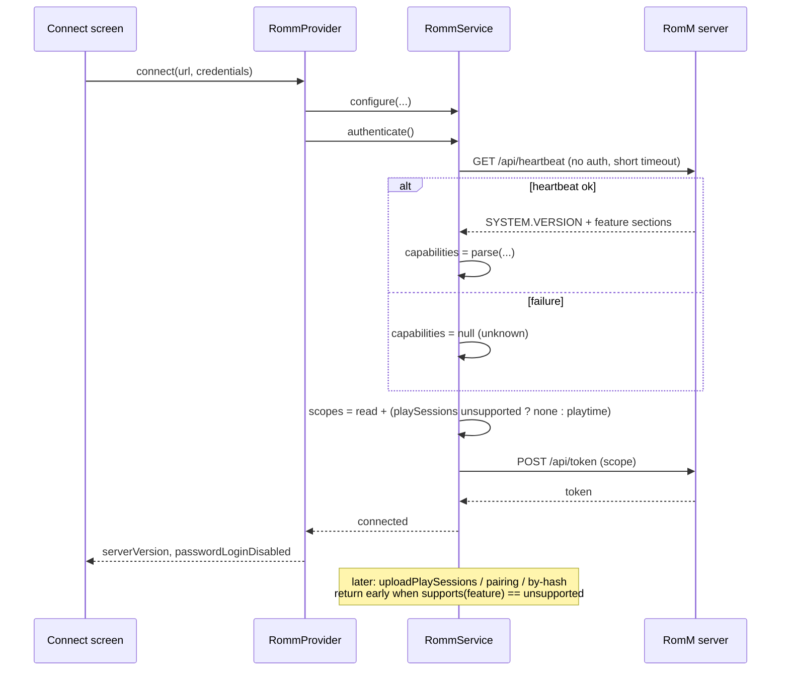

# ADR-0010: Probe RomM capabilities with the heartbeat endpoint at connect time

## Context and Problem Statement

Every RomM feature NeoStation has added since ADR-0001 depends on the server's version: play sessions (RomM 4.8.0), client-token pairing (4.8.0, ADR-0007), ROM lookup by hash (4.5.0, ADR-0011), and the firmware, props, collections-write, screenshot, and manual endpoints queued behind them. Today the client discovers what the server can do by trying and failing. `RommService._authenticateWithPassword` requests the playtime scopes, and when the token endpoint answers 403 it cannot tell "account lacks the scopes" from "server predates them", so it re-posts the grant without them. `_notePlaySessionFailure` turns a 404 or a post-re-auth 403 into a per-connection "never try again" flag. `connectWithPairCode` surfaces a raw 404 from `/api/client-tokens/exchange` on an old server. Each new endpoint would add another probe-and-degrade branch, another optimistic flag, and another way to send a request the server was never going to answer.

RomM exposes `GET /api/heartbeat`: unauthenticated, cheap, and returning `SYSTEM.VERSION` plus per-feature sections (`METADATA_SOURCES.*`, `TASKS.*`, `EMULATION.*`, `FRONTEND.*`, `FILESYSTEM.*`, `OIDC.*`). How should NeoStation learn the server's capabilities once, so every version-dependent feature can be gated cleanly instead of probed?

## Decision Drivers

* One probe at connect time, not one per feature; no request to an endpoint the server is known not to have.
* The heartbeat is unauthenticated, so it can run before the token grant and shape the scopes requested.
* Scope denial is a property of the account, not the server; the heartbeat cannot answer it, so the 403 handling must survive.
* A heartbeat failure (reverse proxy blocking it, timeout, unparseable body) must not make a working server unusable: the fallback is today's optimistic behaviour.
* Version thresholds belong in one table with a test, not scattered across services.
* Strict layering: the probe is a service concern; the provider consumes a value object; the UI reads the provider.

## Considered Options

* Heartbeat probe at connect time with a capability value object and a single feature-threshold table
* Keep probe-and-degrade per endpoint (status quo)
* Fetch the server's OpenAPI document and gate on endpoint presence
* Parse only `SYSTEM.VERSION` and ignore the feature sections

## Decision Outcome

Chosen option: "Heartbeat probe at connect time with a capability value object and a single feature-threshold table", because it answers the version question for every present and future feature with one cheap, public request, and it keeps the account-scope question exactly where it is answered today. Concretely:

1. **Value object.** `RommServerCapabilities` (version, parsed as major.minor.patch with an optional prerelease tag; the metadata-source, task, emulation, frontend, and filesystem sections as typed fields with tolerant parsing; `fetchedAt`). `RommFeature` enumerates the endpoints NeoStation gates, each with the RomM version that introduced it: `playSessions` 4.8.0, `clientTokenExchange` 4.8.0, `romLookupByHash` 4.5.0. `supports(feature)` returns `supported`, `unsupported`, or `unknown`.
2. **Probe in the service.** `RommService.fetchHeartbeat()` does an unauthenticated GET of `/api/heartbeat` with a short timeout, stores the result on the connection, logs one line, and never throws to its caller. `authenticate()` probes first when the connection has not been probed, and omits the playtime scopes from the grant when the feature is `unsupported`; the scope fallback stays for `supported` and `unknown`.
3. **Gate at the call site.** A gated method returns early, without a request, when its feature is `unsupported`. `unknown` behaves as today: try, and degrade on 404 or a confirmed 403.
4. **Provider and UI.** `RommProvider` re-probes on `connect` and `connectWithPairCode`; a session restored by `initialize` probes lazily on its first authenticated request instead (the restore itself stays offline by design, so the probe cannot happen there — see SPEC-0010 REQ "Probe Before The Token Grant", amended after issue #168), and exposes the version and the `FRONTEND.DISABLE_USERPASS_LOGIN` flag. The connect screen shows the server version and, when password login is disabled on the server, leads with pairing and API-key modes. The pairing flow reports "this server is too old for pairing" instead of a raw 404.
5. **Not persisted.** Capabilities live in memory for the connection and are refreshed on every connect. A restored session runs with `unknown` until its first authenticated request probes (there is no background probe at restore; see SPEC-0010 REQ "Provider Exposure And Re-Probe", amended after issue #168).

### Consequences

* Good, because new endpoints (firmware, props, collections push, screenshots, manuals, ADR-0011's hash lookup) each add one enum entry and one guard instead of a probe branch.
* Good, because the token grant no longer double-posts on servers older than 4.8.0, and no request is sent to an endpoint that does not exist.
* Good, because a blocked or broken heartbeat degrades to today's behaviour, so nothing that works now stops working.
* Bad, because the threshold table is knowledge about another project's release history; a wrong entry gates a feature that exists. The table is one file, each entry carries the commit or release it was verified against, and `unknown` never gates.
* Bad, because the heartbeat cannot say whether the account holds a scope; the 403 fallback and `_notePlaySessionFailure` remain, so there are two mechanisms, each with a clear job: version from the heartbeat, scope from the grant.
* Neutral, because a restored session runs `unknown` until its first authenticated request rather than for a fixed startup window; nothing is sent in that window that is not sent today. A session that issues no authenticated request stays `unknown`, which costs nothing because the gated call sites are the requests themselves.

### Confirmation

* Unit tests for version parsing (plain, `v` prefix, prerelease, garbage), tolerant capability parsing (missing sections, unknown keys, non-boolean values), and `supports()` across the three outcomes.
* Service tests with a fake HTTP client: heartbeat failure leaves capabilities null and the grant unchanged; an old server drops the playtime scopes from the grant and `uploadPlaySessions` sends nothing; a new server keeps them; pairing exchange on an old server yields the localized error without a request.
* Provider tests: `connect` and `initialize` probe; the version is exposed; the connect screen's mode order follows the flag.
* Governing comments on the value object, the probe, the grant, each gate, and the connect screen.

## Pros and Cons of the Options

### Heartbeat probe with a capability value object

One public GET before the grant; typed fields; a single threshold table; `unknown` never gates.

* Good, because it is the mechanism RomM's own web client uses to configure itself.
* Good, because it runs before authentication, so it can shape the scope request.
* Good, because it is cheap (one small JSON body) and cacheable per connection.
* Neutral, because the feature sections describe server configuration (which metadata sources are enabled, which tasks are scheduled), not the account; the version is the part that gates endpoints.
* Bad, because the version thresholds must be maintained by hand.

### Probe-and-degrade per endpoint (status quo)

Try each endpoint; treat 404 and confirmed 403 as "not on this server".

* Good, because it needs no knowledge of RomM's release history.
* Good, because it is already written for play sessions.
* Bad, because every new endpoint adds an optimistic flag, a probe branch, and a first request that is wasted on old servers.
* Bad, because the token grant double-posts on every login to an old server.
* Bad, because a 404 can also mean a reverse-proxy path rule, and the client cannot tell.

### Fetch the OpenAPI document

`GET /openapi.json` is public on FastAPI and lists every route the server has.

* Good, because it gates on endpoint presence directly, with no threshold table.
* Bad, because RomM's document is hundreds of kilobytes and grows with every release; fetching it on each connect on a handheld over Wi-Fi is not cheap.
* Bad, because it says nothing about server configuration (metadata sources, disabled password login) that the heartbeat reports.
* Bad, because route paths are less stable than a version number as a gating key.

### Version-only parsing

Fetch the heartbeat but keep only `SYSTEM.VERSION`.

* Good, because it is the smallest change.
* Bad, because `FRONTEND.DISABLE_USERPASS_LOGIN` and `METADATA_SOURCES.*` are useful now (login mode ordering, and ADR-0006's scrape decisions can learn which sources the server has) and cost nothing extra to parse.

## Architecture Diagram

## More Information

* Verified against `rommapp/romm` master: `backend/endpoints/heartbeat.py` (public route, response sections above); `/api/roms/by-hash` first shipped in 4.5.0 (commit 8a66ac81, 2025-12-12); client API tokens with QR pairing first shipped in 4.8.0 (commit e0b25fbc, 2026-03-11); play-session ingest landed 2026-03-22, between 4.7.0 and 4.8.0, so 4.8.0 is the threshold.
* Extends ADR-0007 (pairing flow gains a version gate); enables ADR-0011 (hash lookup gate); related to ADR-0001 (the connect-time pass shares the connection lifecycle).
* Spec: SPEC-0010.
