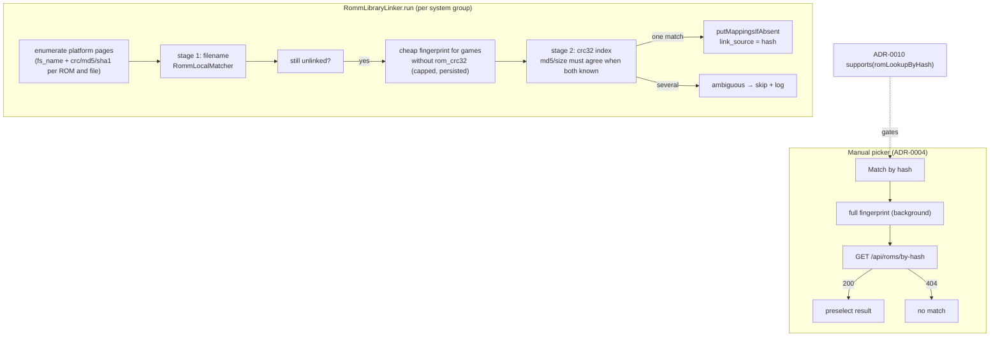

# ADR-0011: Link local ROMs to RomM entries by content hash

## Context and Problem Statement

ADR-0001 links a pre-existing local ROM to its RomM entry when the filename matches RomM's `fs_name`, and ADR-0004 lets the user pick a match by hand when it does not. Between the two sits the case neither handles well: a file whose name differs from the server's copy because it was renamed, carries a different region tag, or came from a different set ("(USA)" versus "(U)"). Those games stay unlinked until the user opens the picker for each one.

Both sides already have the content identity. RomM stores `crc_hash`, `md5_hash`, and `sha1_hash` per ROM and per file, and includes them in the ROM list pages the connect-time link pass already walks. NeoStation's `RomFingerprintService` computes crc32 and md5 for ScreenScraper, persists them as `user_roms.rom_crc32` and `ss_hash` (migration 135), and has a cheap path that reads a zip's crc32 from its central directory without reading the ROM. RomM 4.5.0 added `GET /api/roms/by-hash` (`crc_hash`, `md5_hash`, `sha1_hash`, `ra_hash`; `roms.read`; 404 when nothing matches). How should NeoStation use hashes to link the games filename matching misses?

## Decision Drivers

* Zero extra requests for the bulk case: the link pass already pages every platform, and the pages carry the hashes.
* Android ROM folders are SAF trees; reading every ROM to hash it is not acceptable as a connect-time cost. Cheap fingerprints and persisted ones are.
* Hash rows must obey the existing rules: never overwrite, never replace a manual row, skip ambiguity.
* The single-game case (the picker) can afford one full fingerprint and one request.
* ADR-0010 gates the by-hash endpoint by version; the page hashes need no gate.

## Considered Options

* Hash stage in the connect-time link pass using page hashes and local fingerprints, plus a by-hash shortcut in the manual picker
* One `by-hash` request per unlinked local ROM
* Full-library hashing (md5 of every local ROM) before matching
* Filename only (status quo)

## Decision Outcome

Chosen option: "Hash stage in the connect-time link pass using page hashes and local fingerprints, plus a by-hash shortcut in the manual picker", because the bulk case costs no network beyond what the pass already spends, the fingerprints it needs are mostly already on disk, and the one place a per-file request is worth it is the picker, where the user is looking at exactly one game. Concretely:

1. **Model.** `RommRom` and `RommRomFile` parse `crc_hash`, `md5_hash`, `sha1_hash`, and `ra_hash` (the file model also `chd_sha1_hash`), normalized to lowercase hex.
2. **Local fingerprints.** The pass's local index carries each game's persisted `rom_crc32`, `ss_hash` (md5), and `rom_size`. For unlinked games with no persisted crc32, the pass computes the cheap fingerprint (zip central directory; no read for anything else) up to a per-pass cap and persists it through the existing fingerprint columns, so later passes pay nothing.
3. **Second stage in the pass.** After the filename stage, games still unlinked are matched by crc32 against the ROMs enumerated for their system group, comparing the ROM-level hash and each file-level hash. When both sides have an md5, it must agree; when both have a size, it must agree. One local file matching more than one RomM ROM is an ambiguity and is skipped and logged, exactly as filename ambiguity is. Rows are written insert-if-absent with `link_source = 'hash'`.
4. **Picker shortcut.** The manual picker (ADR-0004) gains "Match by hash": it computes the full fingerprint for the one file in the background, calls `GET /api/roms/by-hash`, and preselects the result; a 404 shows a localized "no match" line. The action is present only when ADR-0010 reports the endpoint as supported or unknown.
5. **Same guards, same summary.** Hash matches are counted separately in the pass summary and its single log line; the pass's scheduling, cancellation, and single-instance rules are unchanged.

### Consequences

* Good, because renamed and re-tagged files link automatically on the next connect, with no new requests in the bulk case.
* Good, because a scraped library already has its fingerprints, and zipped libraries get crc32 without reading the ROM.
* Good, because the picker can resolve the hard cases in one press instead of a search.
* Bad, because archive semantics can differ: NeoStation fingerprints the image inside a zip by No-Intro convention, and RomM's hashes are per stored file, with inner-file hashing depending on the server version. Comparing against both the ROM-level and file-level hashes covers both conventions; the story includes a device check against the user's server before the stage is enabled by default.
* Bad, because 7z archives and disc images have no cheap fingerprint, so they still rely on filename matching or the picker.
* Neutral, because two identical local files link to the same RomM ROM; that is correct, RomM calls them siblings.

### Confirmation

* Model tests: hash fields parsed and normalized, absent fields null.
* Linker tests with fakes: a renamed file links by crc32; md5 disagreement blocks; one crc matching two RomM ROMs is skipped; filename match wins over hash; manual rows untouched; cheap-fingerprint cap respected and results persisted; summary counts hash links.
* Service test: `getRomByHash` sends only the hashes it has, returns null on 404, throws on other errors, and is not called when unsupported.
* Picker tests: the action appears only when supported or unknown; a hit preselects; a miss shows the message.
* Governing comments on the model fields, the hash stage, the row source, the service method, and the picker action.

## Pros and Cons of the Options

### Hash stage in the link pass plus a picker shortcut

* Good, because the bulk case is network-free beyond the existing enumeration.
* Good, because persisted and cheap fingerprints keep SAF reads near zero.
* Good, because the picker's per-file request is the only place one is justified.
* Bad, because the archive convention question needs a device check.
* Bad, because games without a persisted or cheap fingerprint do not benefit until scraped.

### One `by-hash` request per unlinked ROM

* Good, because the server does the matching and returns a full ROM.
* Bad, because a library with a thousand unlinked games is a thousand requests on every connect until they link.
* Bad, because it still needs a local fingerprint per game; it saves nothing on the expensive side.
* Bad, because it is gated on 4.5.0, so older servers get nothing.

### Full-library hashing

* Good, because md5 for every file makes matching unambiguous.
* Bad, because it reads every byte of every ROM, over SAF on Android; ADR-0001 rejected this cost and nothing has changed.

### Filename only (status quo)

* Good, because nothing changes.
* Bad, because renamed and re-tagged libraries stay unlinked except by hand.

## Architecture Diagram

## More Information

* `RomFingerprintService` (`lib/services/rom_fingerprint_service.dart`): `FingerprintEffort.cheap` reads the zip central directory; full effort streams crc32 and md5 in one pass; SAF reads work off the main isolate through the root isolate token.
* Migration 135 added `user_roms.rom_crc32`, `rom_size`, `rom_fingerprint_skipped`, and repurposed `ss_hash` for md5.
* RomM: hash fields on `RomSchema` (inherited by the list schema) and `RomFileSchema`; `GET /api/roms/by-hash` since 4.5.0.
* Extends ADR-0001 (second matching stage in the same pass) and ADR-0004 (picker action); related to ADR-0010 (version gate). Spec: SPEC-0011.
