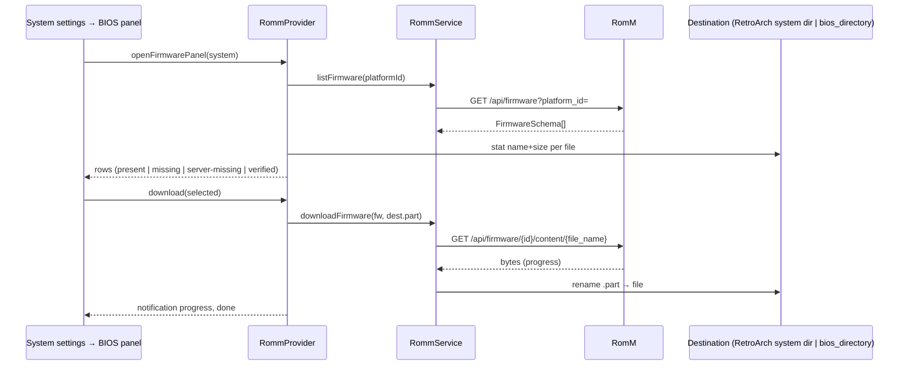

# ADR-0012: Download BIOS and firmware files from RomM into the emulator's system directory

## Context and Problem Statement

Getting BIOS files onto a handheld is the single most annoying step of setup, and NeoStation has no help for it: there is no BIOS model, no `bios` key in `assets/systems/*.json`, and no check that a system's firmware is present. The only knowledge the app holds is RetroArch's `system_directory`, parsed from `retroarch.cfg` by `RetroArchConfigService` and stored on the RetroArch config table. RomM already stores firmware per platform with hashes and a verified flag, NeoStation already requests the `firmware.read` scope in its base grant and never uses it, and the download path for ROMs (`RommService.downloadRom` streaming into a `.part` file through a SAF-to-real-path translation) is exactly what a firmware download needs. How should NeoStation pull BIOS files from RomM, and where should it put them?

## Decision Drivers

* The scope is already granted and the endpoints (`GET /api/firmware?platform_id=`, `GET /api/firmware/{id}/content/{file_name}`) have existed since RomM 3.10, so no version gate and no new grant.
* RetroArch is the one emulator whose system directory the app can locate today; standalone emulators each have their own BIOS location.
* Firmware files can be large (PS2, Saturn); nothing should download without the user asking.
* Presence and correctness must be visible: which files the server has, which are already local, which verified.
* Android writes go through the same path translation the ROM download uses; strict layering.

## Considered Options

* On-demand per-system firmware panel that lists RomM's firmware for the system, shows local presence, and downloads the selected files into the RetroArch system directory (or a user-chosen BIOS folder)
* Automatic firmware download for every resolved system on connect
* Bundle a BIOS manifest in `assets/systems/*.json` and only report missing files, without downloading

## Decision Outcome

Chosen option: "On-demand per-system firmware panel", because it reuses the granted scope and the existing download path, keeps large transfers behind an explicit choice, and gives the user the presence check they lack today. Concretely:

1. **Model and service.** `RommFirmware` parses `FirmwareSchema` (id, platform id, file name, size, crc/md5/sha1, `is_verified`, `missing_from_fs`). `RommService.listFirmware(platformId)` and `downloadFirmware(firmware, destFilePath, onProgress, shouldCancel)` stream into `.part` then rename, like `downloadRom`. Files the server marks `missing_from_fs` are listed but not downloadable.
2. **Destination.** The system's BIOS destination is an explicitly chosen `user_config.bios_directory` when one is set and writable (versioned, guarded migration); otherwise the RetroArch `system_directory` when the RetroArch config is known and that directory is writable; otherwise none. The panel always offers to pick a folder and names which candidate won, so a user whose RetroArch `system_directory` points somewhere they do not want BIOS files can redirect it in-app. A per-system override is out of scope; the emulator JSON may grow a `bios_dir` later.

   *Amended.* This decision originally put RetroArch first unconditionally and offered the picker only when nothing was known. Implemented faithfully in PR #142, that left `setBiosDirectory` with no reachable caller — there was no in-app way to set the folder at all. SPEC-0012 REQ "BIOS Destination" was amended in PR #151 and the code brought back into conformance in PR #157; this decision is updated to match.
3. **Presence check.** Local presence is filename plus size in the destination; when the server has an md5 and the local file exists, the panel offers "Verify", which streams the md5 (the sync provider's `_md5OfFile` pattern) and shows match or mismatch.
4. **Surface.** The system settings dialog gains a "BIOS files from RomM" row for systems whose RomM platform resolves (ADR-0001's platform-to-system rule), opening a panel with each file's name, size, verified flag, local state, and per-file or "download all missing" actions, with progress in the global notification.

### Consequences

* Good, because a fresh handheld gets its BIOS files from the same server it gets ROMs from, with no USB step.
* Good, because no new scope, no version gate, and the download and translation code is reused.
* Bad, because standalone emulators are not served in this version; the RetroArch directory is the one location the app can find.
* Bad, because presence by name and size can be fooled by a same-sized wrong file; the md5 verify covers it on request.
* Neutral, because the `missing` query filter is unreleased in RomM (master only), so the client filters on the schema flag instead.

### Confirmation

* Model test for `FirmwareSchema` parsing; service tests for listing, streaming download with cancel and `.part` cleanup, and 403 (scope absent) surfacing as a localized message.
* Migration test for `bios_directory`.
* Panel tests at the layout level: local state per row, download-all enables only when something is missing, controller reachability.
* Governing comments on the model, the service methods, the destination resolver, the panel.

## Pros and Cons of the Options

### On-demand per-system panel

* Good, because explicit, bounded, and visible.
* Good, because it reuses the granted scope and download path.
* Bad, because the user must open a dialog per system.

### Automatic download on connect

* Good, because zero effort.
* Bad, because it writes hundreds of megabytes without asking, on every new system, over Wi-Fi.
* Bad, because the destination is not always known.

### Manifest-only reporting

* Good, because it works without RomM.
* Bad, because a manifest of BIOS hashes per system is a maintenance burden this repo has avoided, and it still leaves the user copying files by hand.

## Architecture Diagram

## More Information

* RomM: `backend/endpoints/firmware.py`; `FirmwareSchema` fields listed above; content route is a `FileResponse` with the stored file name.
* NeoStation: `RetroArchConfigService` parses `system_directory`; `RommProvider._folderToRealBase` and `RommService.downloadRom` are the write path to reuse.
* Spec: SPEC-0012.
