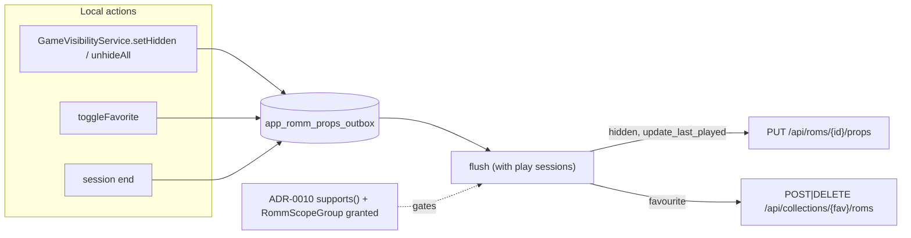

# ADR-0013: Push per-game play state to RomM, with optional scope groups

## Context and Problem Statement

NeoStation pushes play sessions to RomM and nothing else. Favouriting a game, hiding it, or finishing a session on the handheld is invisible in RomM's web UI. RomM has the surfaces: `PUT /api/roms/{id}/props` (`roms.user.write`) takes `hidden`, `rating`, `difficulty`, `completion`, `status`, `backlogged`, `now_playing`, `is_main_sibling`, plus `?update_last_played=true`; favourites are a collection flagged `is_favorite`, edited through `POST|DELETE /api/collections/{id}/roms` (`collections.write`, RomM 4.9.0). NeoStation stores `is_favorite`, `is_hidden`, `last_played`, and `play_time` on `user_roms`; it has no rating, completion, status, or backlog fields.

Two things stand in the way. The props body changed shape in RomM 4.9.0 (bare object plus query flags; a `{"data": ...}` wrapper before). And every new write needs a scope the base grant does not hold: RomM rejects the whole password grant when any requested scope is outside the account's allowance, and the client's only mechanism is the binary "retry without the playtime scopes" fallback. `collections.write` today, `roms.write` and `tasks.run` and `devices.*` for the features behind this one. How should NeoStation push play state, and how should it request several optional scope groups without turning one denial into "cannot log in"?

## Decision Drivers

* Push what NeoStation already stores; do not invent local rating or completion fields for the sake of the API.
* The device is the source of truth for its own state; no two-way merge.
* Offline changes must not be lost: the play-session outbox pattern already exists.
* Scope handling must generalize: groups, not one special case.
* Version gates come from ADR-0010's table.

## Considered Options

* Push-only write-back of `hidden`, favourite, and last-played through an outbox, with optional scope groups negotiated at login
* Two-way sync of RomM's `rom_user` and NeoStation's `user_roms`
* Add RomM's full prop set (rating, completion, status, backlog) to NeoStation and sync all of it

## Decision Outcome

Chosen option: "Push-only write-back through an outbox, with optional scope groups", because it makes the handheld's existing actions visible in RomM with no new local fields, keeps conflicts impossible by construction, and fixes the scope problem once for every feature queued behind it. Concretely:

1. **Optional scope groups.** `_playtimeScopes` becomes one entry of `RommScopeGroup {playtime (roms.user.read roms.user.write), collectionsWrite, romsWrite, tasksRun, devices}`. `_authenticateWithPassword` requests the read scopes plus every group; on 403 it probes each group alone (read scopes plus that group), records which are granted, and issues the final grant for the union. At most `groups + 2` token POSTs, once per login. API-key mode has no grant to negotiate, so it reads the groups from the `oauth_scopes` list on `GET /api/users/me` — the call that already verifies the key — marking a group `granted` when it holds every scope in it and `denied` otherwise; a missing or empty list leaves the groups `unknown` and a per-endpoint 403 settles them, as before. (Amended after issue #168: the original "always unknown until a 403" rule made `granted` unreachable for every pair-code, QR, API-key and token-restored login, and so hid every feature gated on `granted`.) `RommService.hasScope(group)` replaces `_playtimeScopeGranted`. A group whose feature ADR-0010 reports unsupported is not requested at all.
2. **What is pushed.** `hidden` on hide and unhide (including "unhide all"), `update_last_played=true` when a play session ends, and favourite add/remove through the favourites collection (created with `POST /api/collections?is_favorite=true` when the server has none). `rating`, `difficulty`, `completion`, `status`, `backlogged`, `now_playing`, `is_main_sibling` are not written.
3. **Outbox.** `app_romm_props_outbox` (versioned migration) queues one row per linked game per change with the pending values; the flush runs with the play-session flush (and from the sync provider's per-game playtime path, where that flush already ran after a session closes), coalesces rows per game, and deletes on success. Unlinked games are ignored; when a game links later, no historical push is made.
4. **Gates.** Props require RomM 4.9.0 (`romPropsBareBody`) and the playtime group; favourites require 4.9.0 (`collectionRomsAddRemove`) and the collections-write group. Below the version or without the group, changes are not pushed: not queued when the gate is known at hook time, and dropped at flush — without a request — when it is only knowable then (the hooks cannot see the connection's version or scopes while offline); a single info line per connection says why.
5. **User control.** A "Push play state to RomM" toggle in the RomM settings, on by default when the groups are granted.

### Consequences

* Good, because hide, favourite, and last played show in RomM within one flush, offline changes included.
* Good, because every later write feature gets scope negotiation for free.
* Bad, because it is one-way: a favourite set in RomM's web UI does not arrive on the device. That is the documented rule; the mirror (ADR-0009) covers collections that should flow the other way.
* Bad, because login on an account lacking some group costs a few extra token POSTs the first time.
* Neutral, because servers older than 4.9.0 get nothing; the wrapper body shape is not worth a second code path.

### Confirmation

* Service tests: grant negotiation for all-granted, one-denied, all-denied; API-key mode learns groups from `oauth_scopes`, and leaves them unknown when that list is missing or empty; `updateRomProps` sends the bare body and query flag; favourites collection created once.
* Migration and repository tests for the outbox; provider tests: hide → row queued → flushed; session end → `update_last_played`; unlinked games skipped; gate off → nothing queued.
* Governing comments on the scope groups, the outbox, each push hook, the toggle.

## Pros and Cons of the Options

### Push-only write-back with scope groups

* Good, because no new local fields and no merge rules.
* Good, because the outbox pattern exists.
* Bad, because one-way.

### Two-way sync of `rom_user`

* Good, because the web UI and the device agree.
* Bad, because two writers with no version vector: `updated_at` on both sides, clock skew on handhelds, and RomM's `rom_user` has no per-device history. Conflicts would be silent overwrites.
* Bad, because pulling `hidden` from RomM would hide games the user hid on another client for other reasons.

### Adopt RomM's full prop set locally

* Good, because rating and completion are useful on a handheld too.
* Bad, because it is a features project (UI, DB, gamepad flows for five fields) dressed as an integration; if wanted, it is its own ADR.

## Architecture Diagram

## More Information

* RomM: `PUT /roms/{id}/props` body `RomUserData` with `ge/le` ranges, `update_last_played`/`remove_last_played` query flags (both true → 400); favourites via `is_favorite` collection; `/collections/{id}/roms` since 4.9.0.
* NeoStation: `GameRepository.setGameHidden` (the hide hook sits above it in `GameVisibilityService.setHidden`), `toggleFavorite`, `recordGamePlayed`; `RommPlaytimeService.flushQueuedSessions`; `app_romm_play_sessions` outbox. A flush failure is logged, not shown: there is no user-facing surface for it.
* Spec: SPEC-0013. Later specs (upload, collections push, notes, library extras, device sync) require its scope groups.
