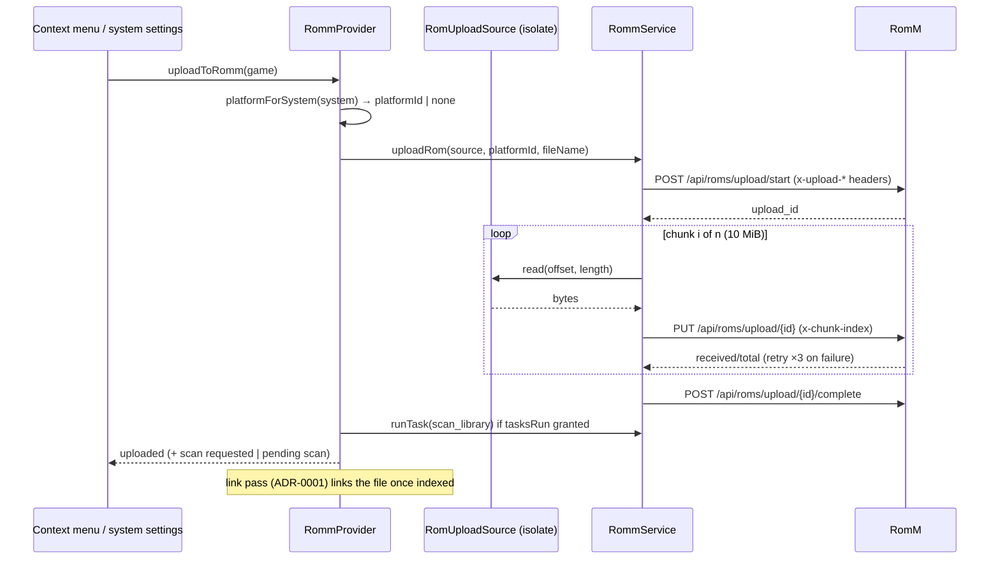

# ADR-0014: Upload local ROMs to RomM through its chunked upload session

## Context and Problem Statement

A library that grew on the handheld (a ROM copied over USB, a homebrew build, a patched dump) never reaches RomM, so it has no saves in the cloud, no metadata, and no link. RomM has no single-shot upload; since 4.8.0 it has a chunked session: `POST /api/roms/upload/start` with `x-upload-platform`, `x-upload-filename`, `x-upload-total-size`, `x-upload-total-chunks` headers, `PUT /api/roms/upload/{id}` per chunk with `x-chunk-index` and a raw body, `POST .../complete`, `POST .../cancel`. The server recomputes the chunk size as `ceil(total/chunks)`, requires every chunk but the last to match it, caps a chunk at 64 MiB, keeps the session in Redis for 24 hours, owner-checks it, answers 400 on a name collision in the platform folder, and needs `roms.write`. RomM's own web client uses 10 MiB chunks with three retries. After completion the file is not a ROM until a scan; the web client emits a Socket.IO `scan` event, and the REST equivalent is `POST /api/tasks/run/scan_library` (`tasks.run`). Uploading into an existing ROM's folder (which registers the file immediately) is on RomM master, not in 5.2.0.

On Android the ROM is a `content://` document; the app's asset uploads use `http.MultipartFile.fromPath`, which cannot chunk a SAF file. `SafDirectoryService.readRange(uri, offset, length)` exists (the fingerprint service uses it) and works off the UI isolate with the root isolate token. How should NeoStation upload a ROM, map its system to a RomM platform, and get it indexed?

## Decision Drivers

* Match the server's chunk arithmetic exactly; 10 MiB chunks, three retries, cancel on give-up, as RomM's client does.
* SAF reads by range, never a whole-file read into memory.
* `roms.write` and `tasks.run` are optional scope groups (ADR-0013); a missing group degrades a step, not the feature.
* The system-to-platform mapping already exists in one direction (platform to system, ADR-0001); the reverse must be explicit and must fail visibly when the server has no such platform.
* Indexing must be honest: "uploaded, pending scan" is a real state.

## Considered Options

* Chunked upload session with a range-reading source, platform mapping from the existing alias table, and a best-effort REST scan followed by the link pass
* Wait for RomM's upload-into-existing-ROM target and only support replacing files of already-linked ROMs
* Upload as a save-style multipart asset (not possible: no such endpoint for ROMs)

## Decision Outcome

Chosen option: "Chunked upload session with a range-reading source, platform mapping, and a best-effort scan followed by the link pass", because it is the only upload RomM offers today, the range reader already exists, and the scan and link steps reuse what ADR-0001 and ADR-0013 built. Concretely:

1. **Source abstraction.** `RomUploadSource` yields chunk `i` of a file by `(offset, length)`: `dart:io` random access on desktop, `SafDirectoryService.readRange` on Android, both driven from a background isolate that holds the root isolate token. Total size comes from `stat` or `getFileSize`.
2. **Session client.** `RommService.uploadRom(source, platformId, fileName, {onProgress, shouldCancel})`: chunks of 10 MiB (`ceil(total / 10 MiB)` chunks; last chunk the remainder), sequential PUTs with three retries and exponential backoff per chunk, `cancel` on give-up or user cancel, `complete` with a long timeout. Name collision (400 "already exists") surfaces as a distinct error kind. Gated by `romUpload` (RomM 4.8.0) and the `romsWrite` group.
3. **Platform mapping.** `RommProvider.platformForSystem(system)` inverts the platform-to-system resolution over the server's platform list; when no platform resolves, the action reports "no matching platform on the server" and does not start.
4. **Indexing.** After `complete`, if the `tasksRun` group is granted, `POST /api/tasks/run/scan_library` is requested once per upload batch; otherwise the outcome says "uploaded, pending scan on the server". In both cases the connect-time link pass (ADR-0001) links the file once RomM has indexed it; a "Link now" retry runs the pass on demand.
5. **Surfaces.** "Upload to RomM" in the game context menu for unlinked games while connected, and "Upload games missing from RomM" in the system settings dialog, which enumerates the system's unlinked games and uploads them in sequence with per-file progress in the global notification and a summary.
6. **Not in this version.** Uploading into an existing ROM's folder (unreleased in RomM), archives-as-folders, and multi-file ROMs; a multi-file game is skipped with a reason.

### Consequences

* Good, because a device-grown library can be pushed to the server the same way it is pulled, and the link pass closes the loop.
* Good, because SAF is handled by the range reader that already ships, with no new Kotlin.
* Bad, because a large upload is many sequential requests; progress and cancel make it tolerable, parallel chunks are a later option.
* Bad, because indexing is out of the client's hands: without `tasks.run` the user waits for RomM's scheduled or watcher scan.
* Neutral, because the scan is library-wide (RomM has no REST per-platform quick scan); it is one request and RomM rejects a second while one runs.

### Confirmation

* Source tests: chunk boundaries for sizes that are and are not multiples of 10 MiB; SAF range reads in an isolate.
* Service tests with a fake client: header values, chunk sequence, retry then success, retry exhaustion → cancel → error, collision → kind, gates → no request.
* Provider tests: platform mapping hit and miss; scan requested only with the group; outcome states.
* Governing comments on the source, the session client, the mapping, the scan step, and both surfaces.

## Pros and Cons of the Options

### Chunked session with a range reader

* Good, because it matches the server and the web client exactly.
* Good, because the reader exists and works off the UI isolate.
* Bad, because indexing depends on a scan the client may not be allowed to trigger.

### Wait for upload-into-existing-ROM

* Good, because the server registers the file at once.
* Bad, because it only serves ROMs the server already has, which is the opposite of the need.
* Bad, because it is unreleased.

### Multipart asset-style upload

* Not available: RomM has no single-shot ROM upload endpoint.

## Architecture Diagram

## More Information

* RomM: `backend/endpoints/roms/upload.py` (4.8.0), `frontend/src/services/api/rom.ts` (10 MiB, 3 retries), `tasks/registry.py` (`scan_library`), Socket.IO `scan` handler requires `tasks.run` since 5.0.0.
* NeoStation: `SafDirectoryService.readRange` (`lib/services/saf_directory_service.dart:275`), `RomFingerprintService.computeInBackground` isolate pattern, `RommService._uploadAsset` for the multipart precedent.
* Spec: SPEC-0014.
