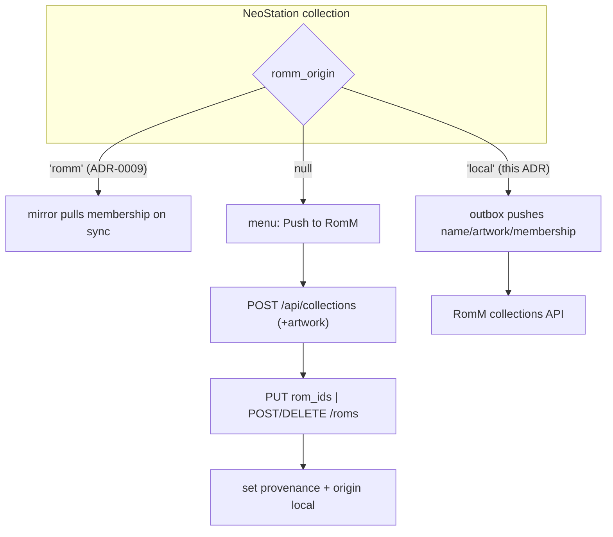

# ADR-0015: Push NeoStation collections to RomM, one origin per collection

## Context and Problem Statement

ADR-0009 mirrors a synced RomM collection into a local one, with provenance columns and managed membership, in one direction. A collection the user builds on the handheld stays on the handheld. RomM offers the write side: `POST /api/collections` (multipart: `name`, `description`, `artwork`), `PUT /api/collections/{id}` (multipart with `rom_ids` as a JSON string, replacing membership), `POST|DELETE /api/collections/{id}/roms` with `{"rom_ids": [...]}` since 4.9.0, `DELETE /api/collections/{id}`, all under `collections.write` with owner checks. How should a local collection reach RomM, and what happens when both sides change?

## Decision Drivers

* No two-way merge: the collection tables carry no version history on either side.
* The provenance columns and the mirror service exist; reuse them.
* Membership is expressed in RomM ROM ids; local members resolve through the link map, and unlinked members cannot be pushed.
* `collections.write` is an optional scope group (ADR-0013).
* Renames, artwork, and deletion need clear rules.

## Considered Options

* Explicit push with a recorded origin: a local collection pushed to RomM becomes NeoStation-origin, its later changes push; a mirrored RomM collection stays RomM-origin and keeps pulling
* Full two-way sync of every collection with last-writer-wins
* Push once, no follow-up (export)

## Decision Outcome

Chosen option: "Explicit push with a recorded origin", because it keeps each collection under exactly one writer, reuses the provenance the mirror already stores, and turns the mirror's one-way street into two one-way streets that cannot collide. Concretely:

1. **Origin column.** A versioned migration adds `user_collections.romm_origin TEXT` (`'romm'` set by the mirror, `'local'` set by a push, null otherwise). `isRommMirror` stays as is; `isPushedToRomm` is `romm_origin == 'local'`.
2. **Push action.** "Push to RomM" in the collection menu for collections with no provenance: `POST /api/collections` with the name (and the local image as `artwork` when present), then membership set from the linked members (`PUT` with `rom_ids` on 4.4–4.8, `POST .../roms` on 4.9.0+), provenance recorded with origin `local`. Unlinked members are counted in the outcome.
3. **Follow-up pushes.** On a local-origin collection: add/remove member → `POST|DELETE .../roms` (or a full `PUT rom_ids` below 4.9.0); rename → `PUT name`; image change → `PUT artwork`; delete → ask "also delete on RomM?" and `DELETE /api/collections/{id}` when confirmed. Pushes go through a small outbox so offline edits flush later, coalesced per collection to one membership replacement.
4. **RomM-origin collections unchanged.** Mirrors keep pulling per ADR-0009; edits to their membership still get overwritten on the next sync; the unlink action clears both provenance and origin.
5. **Gates.** `collections.write` group granted; add/remove endpoints gated on `collectionRomsAddRemove` (4.9.0), the `PUT rom_ids` fallback below.

### Consequences

* Good, because a curated handheld collection appears in RomM's web UI and stays current.
* Good, because mirror and push share the columns, the repository, and the menu.
* Bad, because a RomM-side edit to a NeoStation-origin collection is overwritten by the next local push; the origin badge tells the user which side owns it.
* Bad, because unlinked members never reach RomM; the outcome says how many, and ADR-0011 shrinks that set.
* Neutral, because favourites (ADR-0013) use the same endpoints but are not a pushed collection; they are excluded from the menu.

### Confirmation

* Migration test; repository tests for origin.
* Service tests: create with and without artwork; membership replace vs add/remove by version; rename; delete.
* Provider tests: push records origin; member change on local-origin flushes; on romm-origin does not; unlink clears both.
* Layout tests: menu item present only for unprovenanced collections; origin badge.
* Governing comments on the column, the push, the hooks, the menu.

## Pros and Cons of the Options

### Explicit push with recorded origin

* Good, because one writer per collection; no merge.
* Good, because the existing provenance carries it.
* Bad, because the user must choose a direction per collection.

### Full two-way sync

* Good, because edits anywhere land everywhere.
* Bad, because neither side has per-member history; last-writer-wins on membership loses removals silently.

### Push once, no follow-up

* Good, because minimal.
* Bad, because the copy drifts immediately and the user has no way to update it.

## Architecture Diagram

## More Information

* RomM: `backend/endpoints/collections.py`; duplicate name per user answers 500; owner mismatch 403.
* NeoStation: `CollectionRepository` (provenance, `replaceMembers`), `CollectionsService` (`addGame`, `removeGame`, `renameCollection`, `setCollectionImage`), `RommSaveMapRepository.getRomIdIndex` for member resolution.
* Spec: SPEC-0015.
