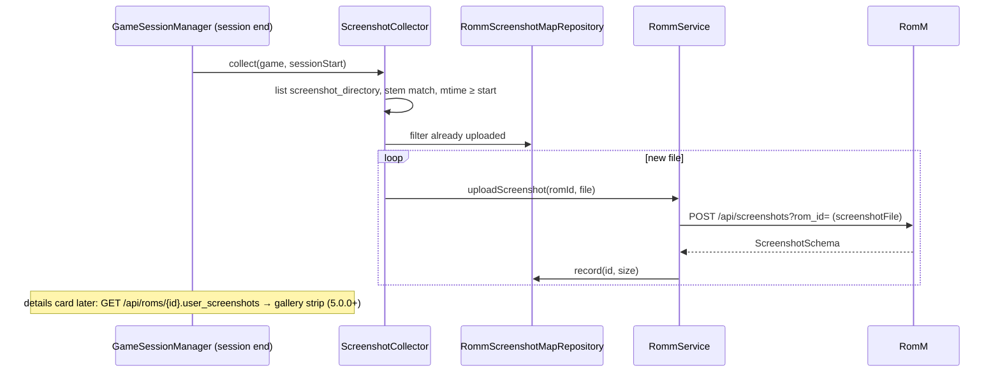

# ADR-0016: Push emulator screenshots to RomM and show the RomM gallery back

## Context and Problem Statement

NeoStation consumes one RomM screenshot per game as scraped media and nothing else. It does not capture screenshots itself: the Android accessibility service triggers a system screenshot that lands in the gallery, and RetroArch writes its own captures into its `screenshot_directory` named after the content. RomM stores user screenshots as assets: `POST /api/screenshots?rom_id=` with multipart `screenshotFile` (`assets.write`, which the base grant already holds), overwrite by `(user, rom, file name)`, `GET /api/screenshots/{id}/content` and gallery flags since 5.0.0, and `DetailedRomSchema.user_screenshots` on the ROM detail. How should captures taken during play reach RomM, and how should RomM's gallery appear on the device?

## Decision Drivers

* Reuse the granted `assets.write`; no new scope.
* The only reliable source of per-game captures on the device is the emulator's screenshot folder; RetroArch's is discoverable from `retroarch.cfg`.
* Uploads must be idempotent and bounded: after a session, only new files for that game.
* Showing the gallery must not download every image: thumbnails through the existing media cache, on demand.
* Version gate: gallery content route is 5.0.0.

## Considered Options

* After-session collection from the RetroArch screenshot directory (files matching the ROM stem, newer than the session start), upload with a ledger, plus a gallery section fed by `user_screenshots`
* Capture screenshots in NeoStation through the accessibility service and upload those
* Manual "upload a screenshot" file picker only

## Decision Outcome

Chosen option: "After-session collection from the RetroArch screenshot directory, upload with a ledger, plus a gallery section", because it captures what the user actually took, in the emulator, with no new permission, and the ledger keeps uploads idempotent. Concretely:

1. **Source.** `RetroArchConfigService` also parses `screenshot_directory` (and `sort_screenshots_by_content_enable`); the collector lists files there whose name starts with the game's ROM stem and whose mtime is at or after the session start. Standalone emulators are out of scope until their directories are known.
2. **Ledger.** `app_romm_screenshot_map(rom_path, file_name, size, uploaded_at, romm_screenshot_id)` (versioned migration) records uploads; a file already in the ledger with the same size is skipped.
3. **Upload.** At session end for a linked game, `RommService.uploadScreenshot(romId, file)` (`POST /api/screenshots?rom_id=`, `screenshotFile`) per new file, sequential, off the launch path, with one summary log line; failures stay unrecorded and retry on the next session end.
4. **Gallery.** The details card's screenshot tab gains a "RomM gallery" strip listing `user_screenshots` from `GET /api/roms/{id}` (own uploads, all clients), thumbnails through the media cache with `cacheWidth`, full view on confirm; gated on `screenshotGallery` (5.0.0).
5. **Toggle.** "Upload screenshots to RomM" in the RomM settings, on by default.

### Consequences

* Good, because captures taken with RetroArch's hotkey show up in RomM and on other devices with no extra step.
* Good, because `assets.write` is already granted and the ledger makes re-uploads impossible.
* Bad, because only RetroArch is served; other emulators need their directory known first.
* Bad, because the upload adds file I/O at session end; it runs after the playtime hooks and never blocks the UI.
* Neutral, because RomM overwrites by file name; RetroArch names are timestamped, so collisions are only true re-uploads.

### Confirmation

* Config parsing test for `screenshot_directory`; collector tests (stem match, mtime cut-off, ledger skip); service test for the multipart request and 413; migration and repository tests; gallery gated by version; governing comments throughout.

## Pros and Cons of the Options

### RetroArch directory collection with a ledger

* Good, because it is what the user captured, at native resolution.
* Good, because idempotent and bounded per session.
* Bad, because RetroArch only.

### Capture in NeoStation via the accessibility service

* Good, because emulator-agnostic.
* Bad, because it captures the whole screen (overlays included), lands in the gallery with an unrelated name, Android only, and needs the accessibility permission the user may not grant.

### Manual picker only

* Good, because trivial.
* Bad, because nobody will do it per screenshot on a handheld.

## Architecture Diagram

## More Information

* RomM: `backend/endpoints/screenshots.py`; 413 over `MAX_ASSET_UPLOAD_SIZE_BYTES` (5.1.0); `is_gallery`, `is_public`, content route since 5.0.0.
* NeoStation: `RetroArchConfigService`, `GameSessionManager._recordRommPlaySession` (session end hook), `RommService._uploadAsset`, `GameDetailsScreenshotVideoTab`.
* Spec: SPEC-0016.
