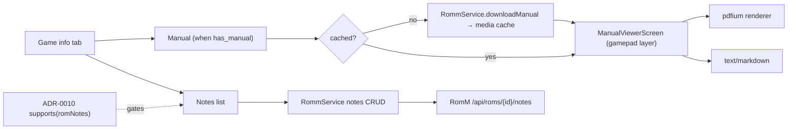

# ADR-0017: View RomM manuals in-app and keep per-game notes on RomM

## Context and Problem Statement

RomM stores a manual per ROM (`path_manual` on the ROM schema, served as a static file under `/assets/romm/resources/{path_manual}`, PDF since 3.10, `.md` and `.txt` since 5.0.0) and, since 4.5.0, per-user notes per ROM (`GET|POST|PUT|DELETE /api/roms/{id}/notes` with `title`, `content`, `is_public`, `tags`; `roms.user.write` to write). NeoStation has no manual viewer, no PDF dependency, skips `manuals` on gamelist import, and has no notes. A manual on a handheld is genuinely useful (a fighting game's move list, a flight sim's key map), and RomM already has the files. How should NeoStation show manuals and notes, on a gamepad, on Android and desktop?

## Decision Drivers

* Manuals are PDFs; a renderer must work on Android, Windows, Linux, and macOS with the same package.
* The manual must be navigable by controller: page turn, zoom, pan, and B to leave.
* Download once, cache in app storage; no re-fetch per open.
* Notes need text entry; the app's on-screen keyboard and text-field escape rules apply.
* `roms.user.write` is the playtime scope group (ADR-0013), already requested.

## Considered Options

* In-app viewer: download the manual into the media cache and render PDF with a pdfium-backed Flutter renderer, plain text and Markdown as text; notes as a list in the game info tab with create, edit, delete
* Open the manual with an external app (system intent / default PDF app)
* Notes only, no manual viewer

## Decision Outcome

Chosen option: "In-app viewer plus notes in the game info tab", because it keeps the user inside the gamepad UI on every platform and turns RomM's existing content into a device feature. Concretely:

1. **Manual availability.** `RommRom` parses `path_manual` and `has_manual`; a linked game's detail fetch stores the manual URL and extension. The game info tab shows "Manual" when present.
2. **Download and cache.** `RommService.downloadManual(rom, destPath)` streams the static file into the media cache under `manuals/<romId>.<ext>`; re-opened from cache; "Refresh" re-downloads.
3. **Viewer.** A full-screen `ManualViewerScreen` registered as a `GamepadNavigationManager` layer: PDF rendered by a pdfium-backed Flutter renderer that supports all four platforms (the implementer confirms the package's platform matrix and license before adding it); shoulders turn pages, D-pad pans, triggers or a button zooms, B leaves; `.txt` and `.md` render as scrollable text. Rendering failures offer "Open externally" as the fallback.
4. **Notes.** `RommService.listNotes(romId)`, `createNote`, `updateNote`, `deleteNote`; the game info tab lists the user's notes and other users' public notes (read only), with add, edit (title and content through the text-field flow), and delete for own notes; gated on `romNotes` (4.5.0) and the playtime group for writes.
5. **Uploading manuals** (`roms.write`) is out of scope.

### Consequences

* Good, because a manual is one press away during play setup, on any platform.
* Good, because notes made at the couch show in RomM's web UI and vice versa, per user.
* Bad, because a PDF renderer is a new native dependency; pdfium builds add to binary size on every platform.
* Bad, because the static manual route is unauthenticated on RomM; nothing to do client-side, worth noting for users of public servers.
* Neutral, because notes are per user and duplicate titles fail server-side (500); the client prevents duplicates locally.

### Confirmation

* Model parse test; service tests for the manual download, note CRUD, gates; viewer input mapping tests at the layout level; notes list tests; governing comments.

## Pros and Cons of the Options

### In-app viewer

* Good, because consistent across platforms and controller-driven.
* Good, because cached offline.
* Bad, because a new native dependency.

### External app

* Good, because no dependency.
* Bad, because it leaves the gamepad UI, depends on an installed viewer, and on Android needs a content URI and permission grant; on Linux and Windows the default viewer is a mouse app.

### Notes only

* Good, because small.
* Bad, because the manual is the part that helps during play.

## Architecture Diagram

## More Information

* RomM: `backend/endpoints/roms/manual.py`, `roms/notes.py`; `path_manual` on `RomSchema`; static route `GET /assets/romm/resources/{path_manual}`.
* NeoStation: `GameDetailsGameInfoTab`, media cache service, text-field escape rule (B leaves a focused field).
* Spec: SPEC-0017.
