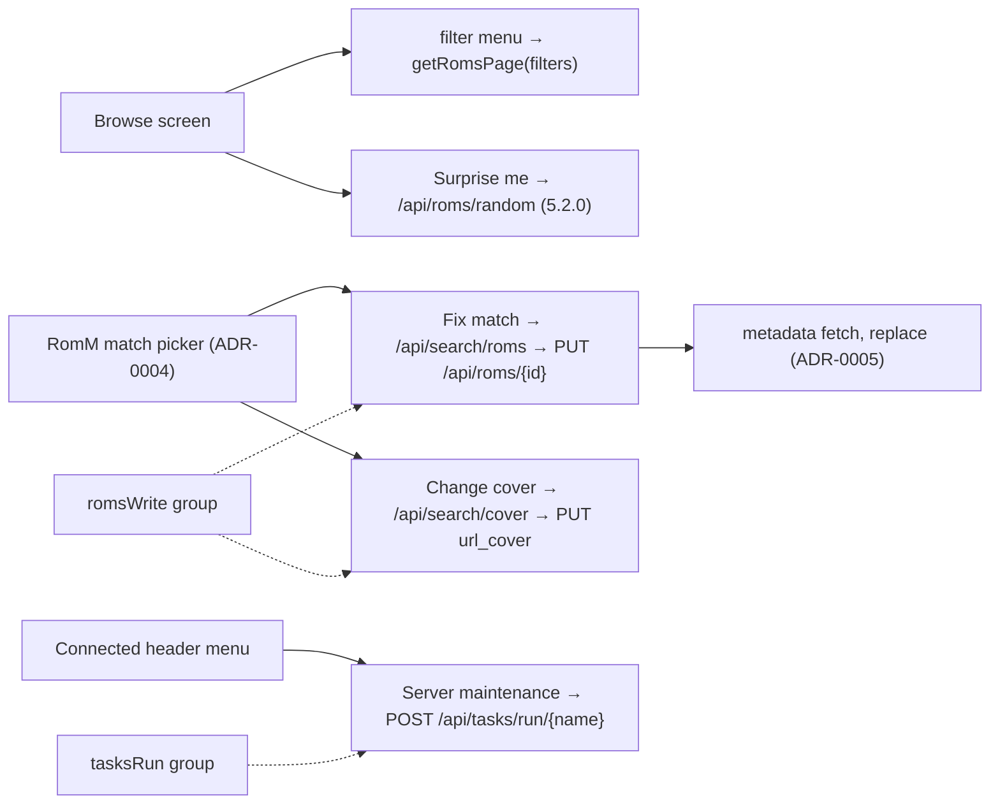

# ADR-0019: Expose RomM's library filters, random pick, metadata fix-up, and maintenance tasks

## Context and Problem Statement

The RomM browse screen sends `order_by=name`, a platform or collection, and a search term. RomM's list endpoint also takes boolean filters the client already pays for (`favorite`, `has_saves`, `has_states`, `has_ra`, `playable`, `duplicate`, `missing`, `matched`, `verified`), `GET /api/roms/random` (5.2.0) picks a game, `GET /api/search/roms?rom_id=&search_term=` queries the server's metadata providers to fix a bad match and `PUT /api/roms/{id}` (multipart, `roms.write`) applies the chosen provider ids, `GET /api/search/cover` lists SteamGridDB covers, and `POST /api/tasks/run/{name}` (`tasks.run`) runs `cleanup_missing_roms`, `sync_folder_scan`, or `scan_library`. None of this is reachable from the couch. Streaming, feeds, and music are the wrong shape for a native frontend and are excluded. Which of these belong in NeoStation, and where?

## Decision Drivers

* Filters and random pick are pure browse additions on the screen ADR-0008 already tuned.
* Fixing a bad match from the device is the missing half of ADR-0004's picker: the picker links a local file to a RomM entry; this fixes what RomM thinks the entry is.
* Maintenance tasks are admin actions; they need the `tasks.run` group and a confirmation.
* Every string localized, every control on the D-pad.

## Considered Options

* Three small additions: a filter menu plus "Surprise me" on the browse screen; "Fix match on RomM" in the game's RomM picker flow; maintenance actions on the connected RomM screen
* Filters only
* Everything including streaming, feeds, and music

## Decision Outcome

Chosen option: "Three small additions", because each reuses an existing surface, each is gated by ADR-0010 and ADR-0013 where it needs to be, and together they cover the value in the list without inventing new screens. Concretely:

1. **Filters and random.** `getRomsPage` gains the boolean filters; `RommProvider` holds a filter set per platform or collection; the browse screen gets a filter menu (a dedicated action on the ROM view's header row — **not** Y, which is already bulk sync on that screen: favourites, with saves, with states, with achievements, playable, duplicates, missing files) whose active filters show as chips and reset on leaving the platform; "Surprise me" calls `/api/roms/random` scoped to the current platform or collection (gated 5.2.0) and focuses the result.
2. **Fix match on RomM.** From the game's RomM match picker (ADR-0004), on a linked game: "Fix match on RomM" opens a search of the server's providers (`/api/search/roms?rom_id=&search_term=`) with the game's name prefilled; choosing a result applies it with `PUT /api/roms/{id}` (provider ids, name, cover URL), then re-runs the metadata fetch (ADR-0005) in replace mode. "Change cover" lists `/api/search/cover` results and applies `url_cover`. Both need the `romsWrite` group.
3. **Maintenance.** The connected RomM screen's header menu gains "Server maintenance" with "Rescan library", "Sync folder scan", and "Clean up missing ROMs", each confirmed, each `POST /api/tasks/run/{name}`, reporting queued or "already running"; shown only when `tasksRun` is granted.

### Consequences

* Good, because the browse screen becomes a real library view (what has saves, what is playable, what is duplicated) at no server cost beyond a query parameter.
* Good, because a wrong match can be fixed from the device and the fix flows back into local metadata.
* Bad, because `PUT /api/roms/{id}` is a library-wide write; it is behind a confirmation and the `roms.write` group.
* Neutral, because `search/roms` needs a metadata provider enabled on the server (500 otherwise); ADR-0010's `METADATA_SOURCES` flags hide the action when none is enabled.

### Confirmation

* Service tests for filter parameters, random, search, update, cover, and task run, including gates and the 500 mapping; provider filter state tests; layout tests for the menu, chips, and header actions; governing comments.

## Pros and Cons of the Options

### Three small additions

* Good, because bounded and surface-reusing.
* Bad, because three small features spread over three screens.

### Filters only

* Good, because smallest.
* Bad, because it leaves the fix-up and maintenance value on the table.

### Everything

* Bad, because streaming, feeds, and music are web-shaped; a native frontend would wrap a browser.

## Architecture Diagram

## More Information

* RomM: filter names on `GET /api/roms`; `random` since 5.2.0 (absent through 5.1.0; added in 5.1.1-beta.2, commit `1ee6cea0` / PR #4071, and 5.1.1 has no final release); `search/roms`, `search/cover` (3.10 or earlier); `PUT /api/roms/{id}` multipart fields; `tasks/registry.py` names.
* NeoStation: `RommService.getRomsPage`, `RommProvider` browse state, `RommBrowseScreen` header slots, `RommMatchPickerDialog`.
* Spec: SPEC-0018.
