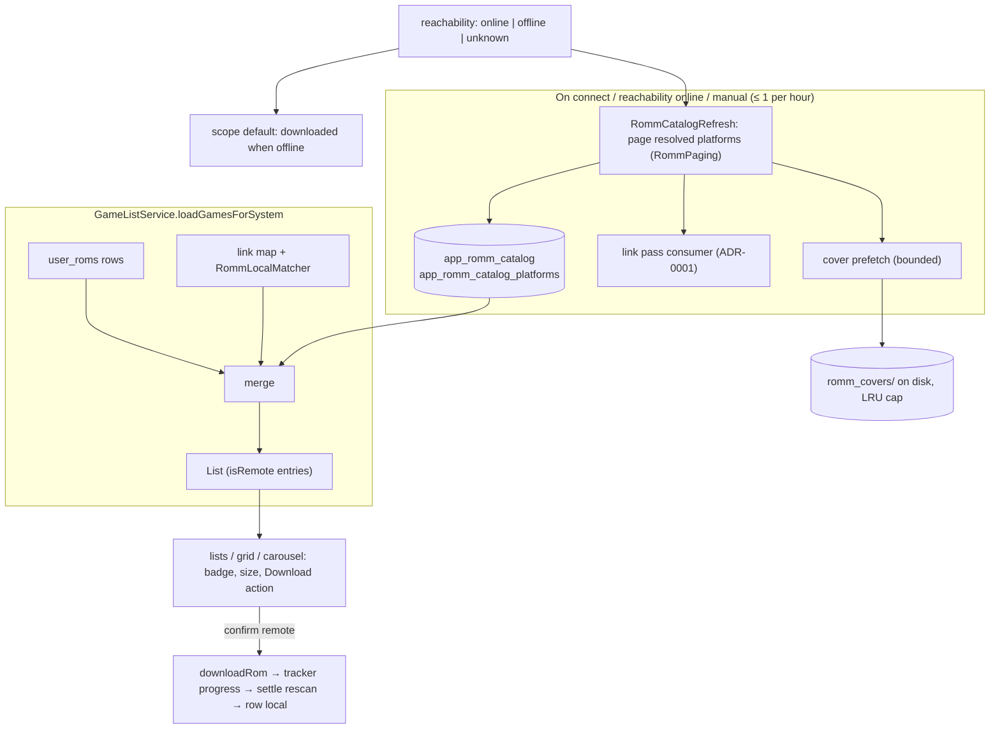

# ADR-0020: Show the RomM library inside the local library from a persisted, offline-first catalog

## Context and Problem Statement

NeoStation's home carousel and game lists show what is on the device: `user_detected_systems` and `user_roms`, keyed by `rom_path`. RomM lives in its own tab, where the user browses platforms and downloads. Upstream issue misobadev/neostation-frontend#436 and the user ask for the opposite: a setting that shows the whole RomM library under the same systems, with games not yet on the device clearly marked and downloadable in place, so that opening "GBA" shows all ten games the server has, not the two that are local. The search screen already does this at search scope: it merges `RommRom` rows into its results, marks remote ones with a cloud-download glyph, and downloads from the row.

Three things make it more than a merge. Connectivity: the app has no connectivity stream; RomM is "connected" at startup from saved config without touching the network, and loss shows up only as a failed request. A handheld is offline often, and a library that empties or hangs when the server is unreachable is worse than no feature. Identity: `user_roms.rom_path` is NOT NULL and unique; remote-only games have no path and must not become rows that every consumer (launch, recents, collections, sync) has to filter. Art: RomM covers are never written to disk today, so an offline library would be a wall of placeholders. How should the RomM library appear inside the local one, stay usable offline, and reconcile when the server is back?

## Decision Drivers

* Offline first: the library must render from local data alone, default to "downloaded" when the server is unreachable, and never block on the network.
* One identity model: local games stay `user_roms` rows; remote games are a separate, replaceable catalog. Linking (ADR-0001, ADR-0011) decides which catalog entries are hidden behind a local game.
* Reuse: the link pass already enumerates every resolved platform on connect; the settle rescan already turns a download into a library row; the search screen already has the visual language; ADR-0010 gives a probe.
* Bounded storage: a catalog of tens of thousands of rows is fine in SQLite; covers on disk need a cap and eviction.
* Every surface that consumes `GameModel` (carousel, lists, footer, context menu, secondary display, search) must handle a remote entry deliberately.

## Considered Options

* Persisted catalog merged into the game lists at load time, with an on-disk cover cache, a downloaded/all scope, and reachability-driven refresh
* Write remote games into `user_roms` with a "remote" flag
* Live merge on every list load from the RomM API, no persistence
* Separate "RomM: <platform>" systems in the carousel instead of merging

## Decision Outcome

Chosen option: "Persisted catalog merged into the game lists at load time, with an on-disk cover cache, a downloaded/all scope, and reachability-driven refresh", because it is the only option that is both offline-first and identity-safe, and every expensive part reuses a mechanism that exists. Concretely:

1. **Catalog tables.** `app_romm_catalog` holds one row per RomM ROM whose platform resolves to a local system (server URL, rom id, platform id, system folder, name, fs name, extension, size, multi-file flag, cover paths, RA id, genres, release year, server `updated_at`, `seen_at`). `app_romm_catalog_platforms` holds the resolved platforms (platform id, system folder, name, rom count, `refreshed_at`). Both come from a versioned migration; both are replaceable data, cleared on disconnect or server change.
2. **Refresh shares the link pass's walk.** `RommCatalogRefresh` pages every resolved platform (the `RommPaging` sizes and caps) and upserts rows, marking each seen; rows not seen after a platform completes are deleted. The connect-time link pass consumes the same pages (one walk, two consumers), so the network cost of the catalog is the cost ADR-0001 already accepted. A refresh runs on connect, on reachability returning, on manual request, and never more than once per hour otherwise.
3. **Reachability.** `RommProvider.reachability` is `online`, `offline`, or `unknown`: set by the heartbeat probe (ADR-0010) at connect, flipped to `offline` by a socket or timeout failure on any request, and flipped back by a periodic re-probe (every 60 s while offline, backing off to 5 min) that then triggers the catalog refresh and the pending flushes. A saved connection starts `unknown` and resolves within the first probe.
4. **Remote entries in the model, not the table.** `GameModel` gains `rommRomId`, `remoteSizeBytes`, and `isRemote` (`romPath == null && rommRomId != null`). `GameListService.loadGamesForSystem` appends catalog rows for the system that are not hidden behind a local game: a catalog row is hidden when the link map points a local game at its rom id, or when `RommLocalMatcher` matches a local filename. The same rule feeds the "all games" aggregate; favourites, recents, most played, and collections never include remote entries. Systems with catalog rows but no local folder appear in the carousel as remote-only systems.
5. **Scope.** The game lists have a scope, `all` or `downloaded`. The user's default is a setting; while reachability is `offline` the scope starts as `downloaded` regardless, and switching to `all` shows cached remote entries with downloads disabled and an "offline" line. Scope is toggled from the game view and shown in its footer.
6. **Cards and actions.** A remote entry shows a cloud-download badge in the favourite/collection badge family, its size in the subtitle, and "Download" as the footer's primary action instead of "Play"; confirming a remote entry opens a download confirmation (size, destination), starts `downloadRom`, and the card shows the tracker's progress until the settle rescan turns the row local. Failures show a retry badge. The context menu offers "Download" too. The secondary display receives the cached cover and a "not downloaded" state.
7. **Covers on disk.** `RommCoverCache` stores small covers under the media cache as `romm_covers/<server-hash>/<romId>.<ext>`, filled lazily on first render and prefetched for new catalog rows after a refresh (bounded per refresh, concurrency 3), evicted LRU above a configurable cap (default 200 MB). A local game's scraped media always wins over the cache.
8. **Settings.** "Show RomM library in my systems" (off by default), default scope, cover cache size, "Refresh RomM library now", "Clear cached RomM library", plus an "as of <time>" line.

### Consequences

* Good, because the home screen becomes the RomM client: every game the server has is one press from downloading, and the device keeps working offline with the same screens.
* Good, because local identity is untouched: no `user_roms` change, no consumer has to learn to skip rows, and a deleted local file simply reappears as a remote entry.
* Good, because the catalog walk is the link pass's walk and the download path is the browse tab's path.
* Bad, because a large library means a large first refresh (RomM's page size and cap bound it) and a cover prefetch that competes for Wi-Fi; both run in the background, and the cache cap bounds disk.
* Bad, because reachability by failed request plus re-probe is a heuristic; a flaky link can flap. The backoff and the `unknown` state keep the UI calm, and nothing depends on reachability except the default scope and download enablement.
* Neutral, because the RomM tab stays for collections, bulk sync, and search; the library shows platforms that resolve to a local system, and unresolved platforms stay tab-only.

### Confirmation

* Migration tests; repository tests for upsert, seen-marking, deletion, and per-system reads.
* Refresh tests with fakes: one walk feeds both consumers; deletion after a completed platform only; failed platform leaves rows; hourly guard; cancellation.
* Reachability tests: transitions, backoff, refresh and flush triggered on return.
* Merge tests: hidden-behind-local by link map and by filename; sort order; aggregate; never in favourites or recents; remote-only systems.
* Cover cache tests: lazy fill, prefetch bound, LRU eviction at the cap, scraped media precedence.
* Layout tests: badge, subtitle, footer action, scope toggle, offline default; launch interception; context menu.
* Manual on the Nova, including airplane mode.

## Pros and Cons of the Options

### Persisted catalog merged at load time

* Good, because offline-first and identity-safe.
* Good, because refresh, download, and settle are reused.
* Bad, because two new tables and a cover cache to maintain.

### Remote rows in `user_roms`

* Good, because every list "just shows" them.
* Bad, because `rom_path` is the identity and NOT NULL; a synthetic path lies to launch, recents, collections, save sync, RA hashing, and the scanner, each of which would need a filter, and a scan could delete or duplicate them.

### Live merge, no persistence

* Good, because always current.
* Bad, because every list open pays a network round trip, and offline the library is empty or stuck.

### Separate RomM systems in the carousel

* Good, because no merge logic.
* Bad, because it is the RomM tab moved to the home screen; the ask is one GBA list with ten games.

## Architecture Diagram

## More Information

* Search-scope precedent: `lib/screens/search_screen/search_screen.dart` (`_remote`, `_resolveDownloadedFlags`, `_downloadRemote`, remote tile glyph).
* Reuse: `RommLibraryLinker` paging, `RommProvider.downloadRom` and the settle rescan (`onDownloadsSettled`), `downloadedStateFor` for build-time checks, `system_list_builder.dart` for the carousel.
* Upstream issue misobadev/neostation-frontend#436. Spec: SPEC-0019.
