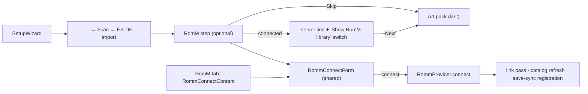

# ADR-0021: Offer the RomM connection as an optional step of first-run setup

## Context and Problem Statement

The setup wizard (`lib/widgets/setup_wizard.dart`) walks a new user through the user-data location, the Android permissions, a ROM folder, the first scan, an optional ES-DE import, and an optional System Art pack. RomM is not among them. A user whose library lives on a RomM server finishes setup looking at an empty or half-described library, and has to find the RomM tab, connect there, and wait for the link pass before the app shows what they came for.

Everything the wizard would need already exists: `RommConnectContent` holds the credential form with its three authentication modes (password, Client API Token, pairing code with QR scan on Android and macOS), and `RommProvider` runs the link pass, the catalog refresh, and the save-sync registration on a successful connection. The form, however, is built as a top-level tab: it owns the gamepad layer `romm_connect`, binds the bumpers to tab switching, and renders the connected account panel as its other face. Should the wizard offer RomM, where in the flow, and how is the form shared?

## Decision Drivers

* A RomM-first user should reach a populated library by the end of setup, without learning where the RomM tab is.
* A user with no RomM server must not be slowed down: the step has to be skippable with one press, like the ES-DE and art-pack steps.
* The credential form must stay one implementation. Pairing, QR scan, the password-login-disabled flag, and the localized error wording were each expensive to get right (ADR-0007, ADR-0010).
* The wizard is upstream's file and changes there often; the fork's addition should be a small seam, not a rewrite, so upstream merges stay cheap.
* Every control must be reachable by D-pad, and B must leave a focused text field before anything else.
* No new persistent state: a connection made in the wizard is the same connection made from the tab.

## Considered Options

* An optional "Connect to RomM" step after the ES-DE import and before the art pack, hosting the shared credential form
* The same step placed before folder selection
* No wizard step; a one-time prompt on the systems screen after setup
* A wizard step with its own simplified form (URL and pairing code only)

## Decision Outcome

Chosen option: "An optional step after the ES-DE import and before the art pack, hosting the shared credential form", because by then the database is open and the first scan has run, so the link pass that follows a connection has local ROMs to link, and the art-pack step keeps its place and its special handling as the last step.

1. **Placement.** The step sits between ES-DE import and art pack on every platform: Android becomes seven steps, desktop six. It is reached whether or not a ROM folder was chosen, so a user with nothing on the device yet can still connect.
2. **Shared form.** The disconnected half of `RommConnectContent` is extracted into a widget the tab and the wizard both host. The host supplies what differs: what the bumpers do (tab switching on the tab, nothing in the wizard), what B does with no field focused, and what happens on success. The tab's behaviour does not change.
3. **Skippable.** Skip is always available and advances to the art pack. Nothing is written when the step is skipped.
4. **After connecting.** The step shows the connected server (name and version line as on the tab) and one switch, "Show RomM library in my systems" (`romm_show_library`, ADR-0020), off by default as everywhere else. Next advances. The connection's side effects — link pass, catalog refresh, save-sync registration — run exactly as they do from the tab and are not awaited by the wizard.
5. **Already connected.** A wizard that runs while a connection exists (a re-run after a data-location change) shows the connected state and Next; it never disconnects.
6. **No schema change.** No new column and no new preference: the step is offered on every wizard run.

### Consequences

* Good, because a RomM-first user ends setup with their library linking in the background and, if they turned the switch on, with remote entries in their systems.
* Good, because the form stays one implementation, and the extraction makes its host contract explicit.
* Good, because the wizard gains one step constant, one build method call, and one branch in each of the skip and main-action handlers; the step's body lives in its own file.
* Bad, because the wizard grows by a step that most upstream-style users will skip.
* Bad, because step indices in `setup_wizard.dart` shift, which is the part of the file most likely to conflict with upstream.
* Neutral, because the QR scan pushes a full-screen route over the wizard; it already registers its own gamepad layer and returns to whatever hosted it.

### Confirmation

* Widget tests: the step appears between ES-DE and art pack; Skip advances without a request; a successful connect shows the connected state; the library switch writes `romm_show_library`.
* The tab's existing connect tests pass unchanged against the extracted form.
* Governing comments on the step, the extracted form's host contract, and the wizard's step table.
* On a device: a fresh install connected through the wizard by pairing code reaches the systems screen with the link pass running.

## Pros and Cons of the Options

### Step after ES-DE import, before art pack

* Good, because the scan has run, so linking has something to link.
* Good, because art pack stays last and keeps its manifest-loading guard.
* Bad, because the user sees the folder and scan steps first even if RomM is all they use.

### Step before folder selection

* Good, because a RomM-first user meets RomM first.
* Bad, because a connection made before any scan links nothing, and downloads need a ROM folder that has not been chosen yet.
* Bad, because the Android permissions step would sit between the connection and its first use.

### One-time prompt after setup

* Good, because the wizard is untouched.
* Bad, because it is a second onboarding surface with its own dismissal state to persist, and it interrupts the first look at the library.

### Simplified wizard-only form

* Good, because the wizard step is smaller.
* Bad, because it forks the form: the password-disabled flag, QR scan, token mode and error wording would each need a second home or be missing.

## Architecture Diagram

## More Information

* NeoStation: `lib/widgets/setup_wizard.dart` (step table at `_totalSteps`, `_handleSkip`, `_handleMainAction`, `_buildStepContent`), `lib/screens/romm_screen/romm_connect_content.dart`, `RommProvider`.
* Related: ADR-0007 (pairing and QR login), ADR-0010 (capability probe and the connect screen), ADR-0020 (unified library switch).
* Spec: SPEC-0020.
