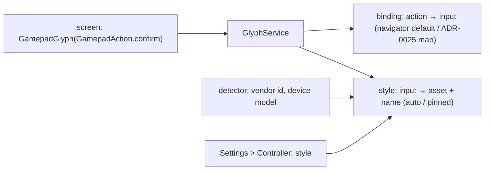

# ADR-0023: One source for controller button glyphs, with a layout style the user can pick

## Context and Problem Statement

Every button hint in the UI is an Xbox picture: 89 hard-coded paths under `assets/images/gamepad/Xbox_*` across the screens, 57 of them for A and B alone. The input layer already normalises every controller into one set of input types (`buttonA`, `buttonB`, `dpadUp`, bumpers, triggers, sticks), so the *behaviour* is right on every pad; only the *picture* is wrong. On a Retroid Pocket Nova, whose face buttons are laid out Nintendo-style, the UI says "press A" with an Xbox glyph while the button in that position is labelled B. A PlayStation pad has no letters at all.

There is no setting for this, and no single place that knows which glyph stands for which action, so adding one means touching all 89 sites. Remapping (ADR-0025) will make this worse: once a user can bind confirm to a different physical button, the hint has to follow the binding, which it cannot while it is an asset path in a widget.

## Decision Drivers

* A hint must show the button the user has to press, on the pad they are holding.
* Remapping needs hints that are derived, not drawn.
* The 89 sites should become one lookup; adding a style must not touch screens.
* Auto-detection will be wrong sometimes, so the user must be able to override it.
* Users of Steam Input are used to a positional style that avoids the naming problem entirely.

## Considered Options

* A glyph service keyed by UI action, with a layout style setting (auto, Xbox, Nintendo, PlayStation, positional) and the asset sets to match
* Swap the Xbox assets for Nintendo ones behind a single "swap A/B" toggle
* Leave the glyphs as they are and document the mismatch

## Decision Outcome

Chosen option: "A glyph service keyed by UI action, with a layout style setting", because it is the only one that both fixes the Nova today and gives ADR-0025 the hook it needs.

1. **Hints name actions, not buttons.** A `GamepadGlyph` widget takes a `GamepadAction` (confirm, back, context, favourite, previousTab, nextTab, modifier, dpad…) and asks the glyph service what to draw. No screen references an asset path.
2. **The service resolves action → input → glyph.** Action to input type comes from the navigator's binding (the default today; the user's map once ADR-0025 lands). Input type to picture comes from the active style.
3. **Styles.** `xbox` (today's assets), `nintendo` (A/B and X/Y positions swapped, Nintendo naming), `playstation` (shapes), and `positional` (a diamond with the pressed position lit, no letter; the Steam Input style). Each style is a set of assets plus a naming table for text that says "press A".
4. **Auto by default.** The style follows the connected controller's vendor id and, on Android, the device model (the Nova is Nintendo-layout); the user can pin a style in Settings > Controller. Pinned wins over detected.
5. **Text follows too.** Every string that spells a button ("Press A to…") goes through the same naming table, so a pinned PlayStation style says "Press Cross".
6. **No behaviour change.** This decision changes what is drawn and said, never what a press does.

### Consequences

* Good, because the Nova and every PlayStation pad show the right picture.
* Good, because the 89 sites collapse to one widget, and a new style is assets plus a table.
* Good, because ADR-0025 gets hints for free.
* Bad, because three new asset sets have to be drawn or sourced with compatible licences (positional can be drawn in code).
* Bad, because the first pass touches 43 files, mechanically.
* Neutral, because auto-detection by vendor id will misfire on clones; the pin is the answer.

### Confirmation

* Unit tests: action → glyph for each style; the detector picks Nintendo for the Nova's model and a Switch Pro vendor id, Xbox otherwise; pinned overrides detected.
* A lint-style test that no `lib/` file references `assets/images/gamepad/` outside the glyph service.
* On the Nova: hints match the physical labels with style on auto; switching to positional lights the right diamond position.

## Pros and Cons of the Options

### Glyph service with styles

* Good, because derived hints; one place; extensible.
* Bad, because the largest diff of the three.

### A swap-A/B toggle over the Xbox assets

* Good, because tiny.
* Bad, because it fixes only the letters, not PlayStation, not positional, and leaves 89 sites for ADR-0025 to revisit.

### Leave it

* Bad, because the mismatch is what a new Nova user sees first.

## Architecture Diagram

## More Information

* Sites: `lib/widgets/core_footer.dart` (`GamepadControl`), the settings footers, the wizard, the RomM screens, the game details footer.
* Input normalisation: `lib/utils/gamepad_translator.dart` (`GamepadInputType`), binding: `lib/utils/gamepad_nav.dart`.
* Spec: SPEC-0022.
