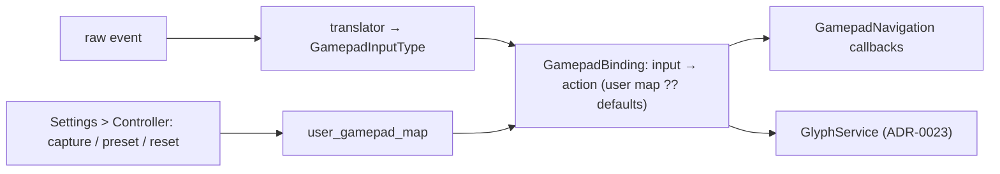

# ADR-0025: Let the user remap controller buttons for the UI, per controller

## Context and Problem Statement

The input stack normalises every pad into one set of input types and `GamepadNavigation` binds those to actions in code: A confirms, B backs out, X and Y are per-screen, the bumpers switch tabs, the triggers page, Select is a modifier, the D-pad and left stick move. A user cannot change any of it. Someone who wants B to confirm (Nintendo habit), a pad whose bumpers are hard to reach, or an arcade stick with its own ideas, has no option but to live with the defaults. Emulators are unaffected; this is about NeoStation's own UI.

Remapping touches two things at once: what a press does, and what the hint says. ADR-0023 makes hints derive from a binding table; this decision makes that table the user's.

## Decision Drivers

* Any physical input should be assignable to any UI action, within rules that keep the app usable.
* The app must never be left without confirm and back, or with the modifier lost.
* Maps are per pad: a Nova's built-in map must not apply to a paired Xbox controller.
* Capturing a press must work with the pad being mapped, including on a handheld with no other input.
* Hints follow the map with no further work (ADR-0023).

## Considered Options

* A per-controller map from input type to UI action, edited on a Settings > Controller page by pressing the button, with guard rails
* Presets only (Xbox, Nintendo swap, custom not offered)
* Remap at the translator (raw key → input type), as the emulators do

## Decision Outcome

Chosen option: "A per-controller map from input type to UI action, edited by pressing", because it is the layer the UI already dispatches through, it keeps the translator's per-platform quirk handling untouched, and it is what the glyph layer was built to read.

1. **Where.** The map sits between `GamepadInputType` and `GamepadAction` in `GamepadBinding` (ADR-0023). `GamepadNavigation` dispatches through it; nothing else changes.
2. **What is remappable.** confirm, back, context, favourite, previousTab, nextTab, leftTrigger, rightTrigger, start, and which of D-pad or left stick moves. Fixed: the modifier (Select) and Home. Fixed so that a map can never take the chords away or lock the user out of the system.
3. **Rules.** Every remappable action has exactly one input; confirm and back are always bound and never to the same input; a capture that would break either is refused with a reason; "Reset to defaults" is always on the page and reachable with the defaults.
4. **Per controller.** Keyed by the pad's stable identity (vendor and product id, or the Android device model for a built-in pad). A pad with no map uses the defaults. A map can be copied to the current pad from another.
5. **Editing.** Settings > Controller lists the actions with their current glyph; selecting one enters capture, the next press on the pad being mapped is taken, B cancels capture. A preset row applies a whole map (Xbox default, Nintendo swap).
6. **Storage.** A new table `user_gamepad_map(controller_id, action, input, updated_at)` in a versioned migration; loaded at startup and on pad connect; cached in memory.
7. **Hints.** Nothing to do: ADR-0023's glyph service reads the same table.

### Consequences

* Good, because every screen inherits the map through the one dispatch point.
* Good, because hints and presses cannot disagree.
* Bad, because capture on the pad being mapped needs care: the press that confirms "capture" must not be captured.
* Bad, because a per-screen `onXButton` means "the context action", and a user who maps context to a bumper gets it everywhere, which is the point but may surprise.
* Neutral, because emulator mappings are untouched; the page says so.

### Confirmation

* Unit tests: the rules (duplicate input refused, confirm/back always bound, modifier fixed), per-controller lookup with fallback to defaults, presets.
* Widget test of capture: the confirming press is not captured; B cancels.
* On the Nova: swap confirm and back, every screen follows, the hints follow, reset restores.

## Pros and Cons of the Options

### Per-controller map at the binding layer

* Good, because one dispatch point; hints follow; translator untouched.
* Bad, because the largest of the four decisions.

### Presets only

* Good, because no capture UI.
* Bad, because the arcade-stick and hard-to-reach-bumper cases stay unsolved.

### Remap at the translator

* Good, because the emulators work that way.
* Bad, because the translator encodes per-platform quirks (inverted keycodes, GameInput layouts); putting user choice there mixes two things that fail differently.

## Architecture Diagram

## More Information

* `lib/utils/gamepad_nav.dart` (dispatch), `lib/utils/gamepad_translator.dart` (normalisation, untouched), ADR-0023 (glyphs).
* Spec: SPEC-0024.
