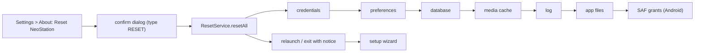

# Design: In-App Reset

## Context

See [SPEC-0021](spec.md) and [ADR-0022](../../adrs/ADR-0022-reset-the-app-from-inside-the-app.md).

State is spread over `SharedPreferences` (bootstrap keys read before the database opens), the user-data folder (`data.sqlite`, the media cache, the log), `CredentialStore` (secure storage, falling back to an encrypted file), and on Android the SAF grants `MainActivity` takes for ROM and user-data folders. `SqliteService` is a singleton with an open connection; `main()` chooses the user-data path from the preference before anything else.

## Goals / Non-Goals

### Goals
- A reset reachable on a handheld with no other device.
- One list of clearers that later partial resets reuse.

### Non-Goals
- Partial resets, exporting before reset, or undo.
- Deleting anything the app did not write.

## Decisions

### A service of clearers, run in a fixed order

**Choice**: `lib/services/reset_service.dart` with `clearCredentials`, `clearPreferences`, `clearDatabase`, `clearMediaCache`, `clearLog`, `clearSafGrants`, and `resetAll` that runs them in that order and collects a `ResetSummary`.
**Rationale**: the order is the failure story: if the process dies after credentials and preferences are gone, the next launch is already a first run. Each clearer independent so a locked file cannot leave logins behind.

### Delete the app's files, not the folder

**Choice**: inside the user-data folder the clearers delete by name (`data.sqlite*`, the media cache directory, the log), never the folder.
**Rationale**: a custom user-data folder is the user's folder and may hold ROMs beside the database.

### Typed word, not a held button

**Choice**: the dialog's destructive button enables only when the field holds RESET.
**Rationale**: every gamepad action is a single press; a held press is produced by a device in a bag. Typing is the one deliberate act a pad cannot do accidentally.

### Relaunch rather than re-initialise

**Choice**: Android finishes and restarts the activity through the existing method channel; desktop uses `Process.start` of its own executable where possible and otherwise exits with a notice.
**Rationale**: the providers were built once at startup from the state that no longer exists; re-initialising them in place would mean every provider learning to reset, for a path taken once a year.

## Architecture

## Risks / Trade-offs

- **Desktop restart.** Restarting a process portably is uneven; the fallback is an exit with a notice. Mitigation: the notice is a localized line and the state is already consistent.
- **The secondary display engine** holds the same database open. Mitigation: the reset tells it to close through the shared state before deleting, or relaunches with it.

## Migration Plan

None.

## Open Questions

- Whether to offer "keep my logins" as a checkbox in the first version. The ADR says no; it would be the first partial.
