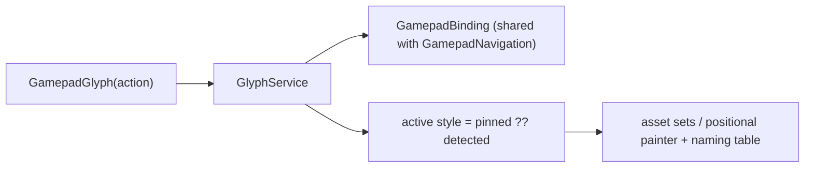

# Design: Controller Button Glyphs

## Context

See [SPEC-0022](spec.md) and [ADR-0023](../../adrs/ADR-0023-one-source-for-controller-button-glyphs.md).

`GamepadControl` (`lib/widgets/core_footer.dart`) takes an `iconPath`; 89 call sites pass `assets/images/gamepad/Xbox_*.png`. `GamepadEventTranslator` (`lib/utils/gamepad_translator.dart`) normalises raw events into `GamepadInputType`, and `GamepadNavigation` (`lib/utils/gamepad_nav.dart`) binds those to callbacks (`onSelectItem` for `buttonA`, `onBack` for `buttonB`, …). The connected pad's vendor id and system info are logged on connect.

## Goals / Non-Goals

### Goals
- One widget and one service for every hint.
- Hints that follow the pad, and later the user's map.

### Non-Goals
- Changing what any press does.
- Per-game or per-emulator glyphs.

## Decisions

### A widget keyed by action, a service that resolves it

**Choice**: `GamepadGlyph(action)` → `GlyphService.resolve(action)` → `(asset | positional slot, name)`.
**Rationale**: screens know what they *do*, not which button does it; keeping the button out of the widget is what lets the hint follow a map later.

### The binding table is shared with the navigator

**Choice**: `GamepadBinding` holds action → input type; `GamepadNavigation` dispatches through it; the glyph service reads it.
**Rationale**: ADR-0025 replaces this table with the user's map and both consumers follow.

### Positional is drawn, the others are assets

**Choice**: the positional style is a `CustomPainter` diamond; Xbox stays as is; Nintendo and PlayStation are asset sets.
**Rationale**: drawing the diamond avoids a fourth licence question, and it scales.

### Detection by vendor id plus a device-model list

**Choice**: Nintendo for vendor 0x057e and for the Android models in a small list (Retroid Pocket Nova, and others as reported), Sony for 0x054c, Xbox otherwise.
**Rationale**: handhelds with built-in pads report generic vendor ids; the model is the only signal.

## Architecture

## Risks / Trade-offs

- **Mechanical diff across 43 files.** Mitigation: one story, reviewed as a search-and-replace, with the no-asset-path test as the gate.
- **Clone pads.** Mitigation: the pin.

## Migration Plan

One column, `gamepad_glyph_style TEXT DEFAULT 'auto'`, in the next free migration slot.

## Open Questions

- Whether `positional` should be the auto choice for pads the detector cannot place, rather than Xbox.
