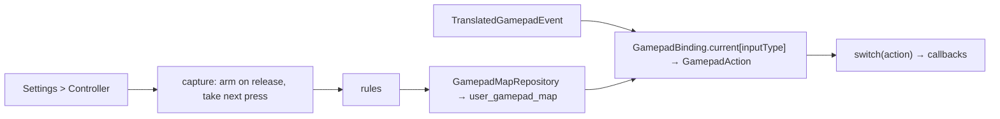

# Design: Controller Remapping

## Context

See [SPEC-0024](spec.md), [ADR-0025](../../adrs/ADR-0025-remap-controller-buttons-for-the-ui.md), [SPEC-0022](../controller-button-glyphs/spec.md).

`GamepadNavigation` (`lib/utils/gamepad_nav.dart`) switches on `GamepadInputType` to call `onSelectItem`, `onBack`, `onXButton`, `onFavorite`, the tab and bumper callbacks, the Select chords. Pads are identified on connect with vendor and product ids and system info. SPEC-0022 introduces `GamepadBinding` and `GamepadAction`.

## Goals / Non-Goals

### Goals
- Any input to any remappable action, per pad, with guard rails.
- One dispatch point; hints follow.

### Non-Goals
- Emulator mappings; analog curves; chords other than Select's.

## Decisions

### Replace the switch with a table lookup

**Choice**: `GamepadNavigation` maps `event.inputType` → `GamepadAction` through `GamepadBinding.current`, then switches on the action.
**Rationale**: one place to change; the per-screen callbacks keep their names.

### Identity is vendor/product, else device model

**Choice**: `controller_id = "vid:pid"` when both are known, else `"model:<Build.MODEL>"` for a built-in pad.
**Rationale**: built-in pads on handhelds report generic ids; the model is stable per device.

### Capture ignores the press that started it

**Choice**: capture arms on the *release* of the selecting press and takes the next *press* edge.
**Rationale**: the Android keycode path reports press and release inverted on some devices (see CLAUDE.md); working from edges the translator already normalises avoids re-learning that.

### Rules checked on capture, not on load

**Choice**: a capture that breaks a rule is refused; a stored map that breaks one (edited elsewhere) falls back per action to the default with a warning.
**Rationale**: the page is the only writer; the load path just has to stay safe.

## Architecture

## Risks / Trade-offs

- **Locking out.** Mitigation: confirm and back always bound; reset reachable; a swap applies only after a successful save.
- **Chords.** Mitigation: Select fixed; chord actions resolve through the same table.

## Migration Plan

One table in the next free migration slot.

## Open Questions

- Whether to offer per-screen exceptions. The ADR says no: one map per pad.
