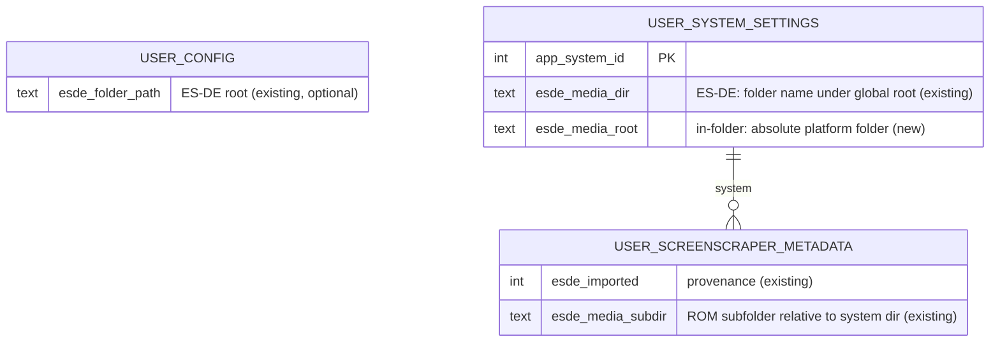

# Design: In-Folder Gamelist Metadata Import

## Context

See [SPEC-0002](spec.md) and [ADR-0002](../../adrs/ADR-0002-import-in-folder-gamelist-metadata.md).

The importer lives in `lib/services/esde_import_service.dart`. Its entry point requires `<root>/gamelists/` and aborts otherwise, then imports each `gamelists/<system>/gamelist.xml` through `_importSystem`, which parses the fragment, deduplicates `<game>` entries by basename, matches basenames case-insensitively against the system's `user_roms` rows, and writes fill-gaps metadata via `ScraperRepository.buildEsdeMetadataWrite` with `esde_imported = 1` on insert. It records one string per system, `user_system_settings.esde_media_dir`, which `FileProvider` later joins under a single global media root derived from `user_config.esde_folder_path` (or ES-DE's `es_settings.xml` override). `GameModel.getImagePath` and `getVideoPath` consult those candidates after NeoStation's own media. A structural test restricts which files may call the candidate builders and asserts the importer never writes under the media root.

RomM's exporter writes `gamelist.xml` into each platform folder with `./{fs_name}` paths and puts media in sibling folders whose names (`covers`, `screenshots`, `marquees`, `fanart`, `videos`, `titlescreens`, `3dboxes`, and others) already match `FileProvider`'s category map. The XML carries no RomM id or hash.

Constraints: strict layering, versioned migrations only, all UI strings through `AppLocale` in twelve languages, every setting reachable by controller, and Android ROM folders being SAF trees that the importer's `dart:io` core cannot read without a real path.

## Goals / Non-Goals

### Goals
- Import metadata and artwork from `<romfolder>/<system>/gamelist.xml` plus sibling media folders with no restructuring.
- Reuse the importer core and media lookup unchanged; change only discovery and the media-root model.
- Keep media strictly read-only in place, now including the user's ROM folders.
- Preserve every existing ES-DE behaviour and test.
- Ship for real filesystem paths first, with SAF folders reported rather than silently ignored.

### Non-Goals
- SAF reading inside the importer or SAF-aware media existence checks. That is a separate decision.
- Establishing RomM links or pulling anything over the RomM API. See SPEC-0001.
- Renaming the ES-DE-branded config column, provenance flag, or existing strings.
- Importing media categories the app has no slot for (manuals, mix images, bezels).

## Decisions

### Discovery yields a layout record; the core consumes only that

**Choice**: Introduce a small `GamelistSource` record (`gamelistFile`, `mediaRoot`, `systemFolderName`, `mode`) produced by two discovery functions, `discoverEsdeRoot(root)` (existing logic) and `discoverInFolder(romFolders)` (new). `_importSystem` and `_linkMediaOnlySystems` take a `GamelistSource` instead of `(mediaRoot, esdeDirName)`.
**Rationale**: The core is already layout-agnostic in everything but its inputs. Making the input explicit lets both modes share parsing, matching, merge, and provenance with zero duplication, and makes each mode unit-testable by feeding records.
**Alternatives considered**:
- A second import service: duplicates the tested core; rejected.
- Branching on mode inside `_importSystem`: works but spreads layout knowledge through the core.

### In-folder discovery reuses the scanner's subdirectory enumeration

**Choice**: `discoverInFolder` calls `SqliteDatabaseService.getExistingSubdirectories(romFolders)` through the repository layer to get `{romFolder: {lowercasedName: path}}`, then checks each path for `gamelist.xml`. System resolution uses `ScraperRepository.resolveSystemByFolderName`, the same alias table the scanner uses.
**Rationale**: The scanner already knows how to enumerate system subfolders for both plain paths and SAF trees, and its alias resolution is what decided which system a ROM belongs to. Reusing it guarantees the importer sees the same system set the library does.

### Per-system absolute media root via a new column

**Choice**: Add `user_system_settings.esde_media_root` (nullable text, absolute path) by a versioned migration. In-folder imports write it and leave `esde_media_dir` null. `FileProvider._loadEsdeConfig` builds, per system, either `esde_media_root` when set or `<global root>/<esde_media_dir>` when not, and no longer returns early when the global ES-DE root is empty.
**Rationale**: The two layouts differ in exactly one dimension, where the media lives, and a nullable absolute column expresses that without overloading the existing name-typed column or touching ES-DE rows. Existing databases keep working because the new column is null for them.
**Alternatives considered**:
- Store an absolute path in `esde_media_dir` and detect with `path.isAbsolute`: no migration, but overloads a column's meaning and relies on a heuristic; rejected.
- A global "in-folder mode" flag: cannot express a library where some systems came from ES-DE and some from in-folder exports.

### Media-only systems are linked per mode

**Choice**: In in-folder mode, a system subfolder with media folders but no `gamelist.xml` is linked (media root recorded) only if it resolves to a system and at least one mapped category folder contains a file. In ES-DE mode, the existing `_linkMediaOnlySystems` walk of the global media root is unchanged.
**Rationale**: The ES-DE behaviour is useful and tested; the in-folder equivalent is the same idea rooted at the platform folder, and gating on actual media files avoids recording roots for empty folders.

### SAF folders are reported, not imported

**Choice**: For each configured ROM folder that is a `content://` URI, try the existing real-path resolution (`UserDataLocationService.resolveAndroidUserDataPath` / `safUriToRealPath`, as the ES-DE picker already does). If it yields no readable real path, count the folder as skipped, log its URI, and continue. The summary shows the skipped-folder count with a hint that all-files access or the follow-up SAF work is needed.
**Rationale**: The importer cannot read SAF trees today, and pretending otherwise produces an empty import with no explanation, which is worse than a clear "skipped". The Android-with-all-files-access case, which the app already requests, works through the same path the ES-DE picker uses.

### Generic user-facing naming, unchanged internals

**Choice**: The settings action is labelled as importing metadata from the ROM folders, with no ES-DE or RomM branding, while columns, flags, and existing keys keep their `esde` names.
**Rationale**: Batocera users benefit as much as RomM users, and renaming the internals would touch a migration, a provenance flag, and twelve language files for no behavioural gain.

## Architecture

```mermaid
sequenceDiagram
    participant UI as Directories settings
    participant Svc as EsdeImportService
    participant DS as SqliteDatabaseService (via repository)
    participant Disc as discoverInFolder
    participant Core as _importSystem (shared core)
    participant Repo as ScraperRepository
    participant FP as FileProvider

    UI->>Svc: importInFolder(romFolders, onProgress)
    Svc->>Svc: resolve real paths; skip unresolved SAF folders
    Svc->>DS: getExistingSubdirectories(realFolders)
    DS-->>Svc: {romFolder: {name: path}}
    Svc->>Disc: build GamelistSource per <system>/gamelist.xml
    Disc-->>Svc: [GamelistSource(mode: inFolder, mediaRoot: <romfolder>/<system>)]
    loop each source
        Svc->>Repo: resolveSystemByFolderName(name)
        Svc->>Core: import(source)
        Core->>Repo: buildEsdeMetadataWrite (fill-gaps, esde_imported)
        Core->>Repo: record media root (esde_media_root)
    end
    Svc-->>UI: EsdeImportResult (+ foldersSkippedSaf, mode)
    UI->>FP: refreshEsde()
    FP->>Repo: load per-system media roots
    FP-->>FP: candidates = <mediaRoot>/<category>/<stem>.<ext>
```



Layer placement: discovery and the layout record live in the service; the new column is written through `ScraperRepository` and read by `FileProvider` through the repository layer; the settings screen only calls the service and refreshes `FileProvider`.

## Risks / Trade-offs

- **Pinned candidate paths in `file_provider_test.dart`** → The ES-DE cases stay byte-identical because ES-DE rows keep `esde_media_dir`; new cases are added for `esde_media_root`. The write-protection allowlist is extended deliberately, not bypassed.
- **A platform folder is also the ROM folder the scanner watches** → Nothing is written there; the read-only assertion is extended to platform folders so a regression fails a test rather than a user's library.
- **Large libraries with thousands of games per system** → Same per-system in-memory index and batched writes as the ES-DE path; discovery adds one directory listing per ROM folder.
- **Android without all-files access sees "folders skipped"** → Explicit in the summary, with the reason. The SAF follow-up removes the limitation.
- **RomM `images/` and `thumbnails/` folders** → Treated as SHOULD-level fallbacks; if their contents prove inconsistent across RomM versions they can be dropped without affecting the mapped categories.
- **A game both ES-DE-imported and in-folder-imported** → Fill-gaps means the first import wins per column; the media root is whichever import ran last for that system, which matches how ES-DE re-imports already behave.

## Migration Plan

1. Migration: add `esde_media_root TEXT` to `user_system_settings`, guarded by a `PRAGMA table_info` check, with a migration test in the existing pattern.
2. Ship the discovery mode, media-root resolution, and settings action together; the action is gated on configured ROM folders.
3. Rollback: removing the code leaves a nullable column that nothing reads; a downgrade recreates the database per the standing rule.

Tests: extend `test/esde_import_service_test.dart` with in-folder trees (multiple ROM folders, alias subfolder, unmatched subfolder, no gamelists, media-only system, malformed gamelist); add migration test; extend `test/file_provider_test.dart` for per-system roots; extend `test/esde_media_write_protection_test.dart` to platform folders.

## Open Questions

- Should the ES-DE root import and the in-folder import be one "Import metadata" action that runs whichever layouts it finds, or two actions? The spec keeps them separate for clarity; merging them is a UX call that can be made when the settings screen is touched.
- Should a system imported from both an ES-DE root and an in-folder export prefer one media root over the other, rather than last-writer-wins? Deferred until a real library needs it.
