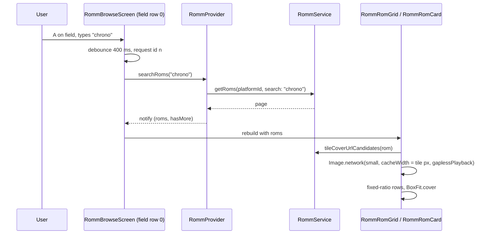

# Design: RomM Browse Cover Loading And In-Platform Search

## Context

See [SPEC-0008](spec.md) and [ADR-0008](../../adrs/ADR-0008-romm-browse-cover-loading-and-platform-search.md).

Today: `RommService.coverUrlCandidates` orders `url_cover`, `path_cover_large`, `path_cover_small`; `RommRomCard._buildCover` uses `Image.network` with auth headers, an `errorBuilder` that steps `_coverAttempt` to the next candidate, and no decode hint; `RommRomGrid` keeps a row cache, exact extents via `SliverVariedExtentList`, and per-card ratios from `RommCoverAspect`, measuring visible cards and coalescing reflows in `_scheduleReflow`. The browse screen owns the selection model (`_view`, source/platform/collection/ROM indices, `_inRomGrid`), a 28-pixel header bar with a back button, and `_handleBack`; it has no text input. `RommProvider.searchRoms(term)` re-runs the platform or collection query with RomM's `search_term`; `backToPlatforms()` clears `_searchTerm`. The search screen shows how a text field lives inside a gamepad screen: a focus node in the selection order, `isTextFieldFocused`, `exitTextEntry` on B, a debounced remote search.

## Goals / Non-Goals

### Goals
- First paint from LAN thumbnails decoded at tile size; no post-decode reflow.
- No storage beyond the in-memory image cache.
- A scoped search field inside a platform or collection.

### Non-Goals
- A disk cache; prefetching whole platforms; changing the local (non-RomM) games grid.
- Sorting or filtering beyond RomM's `search_term`.

## Decisions

### Tile order is a separate helper

**Choice**: `tileCoverUrlCandidates(rom)` beside `coverUrlCandidates(rom)`; tiles call the former, large-cover surfaces keep the latter.
**Rationale**: Two callers want two orders; one helper with a flag hides that.

### Decode width from a pure function

**Choice**: `int coverDecodeWidth({required double logicalWidth, required double devicePixelRatio})` = ceil(logicalWidth × dpr), in `lib/utils/cover_decode.dart`; the card passes it as `cacheWidth` (Flutter wraps the provider in `ResizeImage`), plus `gaplessPlayback: true`.
**Rationale**: `cacheWidth` is the smallest change that bounds decode memory; `ResizeImage` keys the cache by size so the same URL at two widths is two entries, which is what the grid and list want.

### Fixed ratio replaces measurement

**Choice**: Delete `RommCoverAspect` and the grid's `_ensureMeasured`/`_scheduleReflow`/`_measureCards`; row heights derive from `RommRomGrid.tileRatio` (the former fallback constant); covers use `BoxFit.cover`.
**Rationale**: Layout independent of content is what stops the resizing; RomM's web UI crops the same way.

### Search field as row 0 of the ROM view

**Choice**: In the browse screen, when `_inRomGrid`, a `TextField` row sits between the header bar and the grid. Selection: the field is a new slot before the grid rows; A calls `focus()`, B calls `unfocus()` (text kept), Down moves to the first grid row, Up from the grid's first row returns to the field. A 400 ms `Timer` debounces `onChanged` into `provider.searchRoms(text)`; a monotonically increasing request id ignores stale results; empty text calls `searchRoms('')`. The grid keyed by platform/collection id remounts on scope change; the term lives in the provider (`_searchTerm`) so it survives opening a ROM; `backToPlatforms` already clears it. The count line reads `provider.roms.length` and `romsHasMore`.
**Rationale**: Reuses the search screen's proven text-field pattern and the provider's existing scoped search.

## Architecture

## Risks / Trade-offs

- **Cropping off-ratio covers** → accepted; documented in the ADR.
- **Libraries without server-cached covers** → gain only decode hints and layout; noted.
- **`cacheWidth` doubles cache entries when the same cover appears in grid and list** → the RAM-budgeted `ImageCache` evicts; acceptable.
- **Search field and D-pad** → the field is part of the existing slot model; B leaves it before any other back handling, matching the search screen.

## Migration Plan

1. Service helper, decode function, card and grid changes, `RommCoverAspect` removal, tests.
2. Search row in the browse screen, debounce, count line, l10n, tests.

Rollback: revert either story independently.

## Open Questions

- Should the list layout expose the same search field? It shares the browse screen, so yes by construction.
