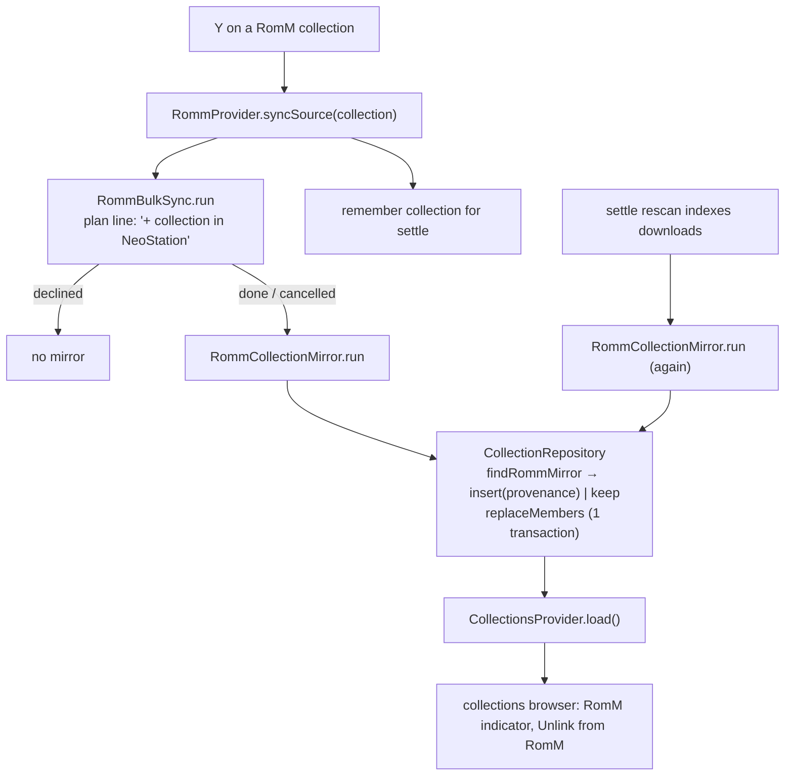

# Design: RomM Collection Mirroring

## Context

See [SPEC-0009](spec.md), [ADR-0009](../../adrs/ADR-0009-mirror-romm-collections-into-local-collections.md), and [SPEC-0001](../romm-existing-rom-linking/spec.md).

Local collections (upstream 0.12.0): `user_collections` (uuid `id`, `name`, `image_path`, `color1`, `color2`, `sort_order`, timestamps) and `user_collection_items(collection_id, rom_path)` with cascade on both keys; `CollectionRepository` is a static pass-through to `SqliteService`; `CollectionsService` creates (uuid v4), renames, deletes, and manages images; `CollectionsProvider` loads and exposes `List<CollectionModel>`; the browser has a per-collection menu (rename, change image, remove image, delete) and games carry a bookmark badge when in any collection.

RomM side: `RommCollection {id (string), name, romCount, isVirtual, covers}`; `RommService.getRomsPage(collectionId | virtualCollectionId, search, limit, offset)`; `RommProvider.syncSource` runs `RommBulkSync.run` with `fetchPage`, `isDownloaded`, `link` (writes the map row for local copies), `download`, `confirm(plan)`; the browse screen's `_confirmSyncPlan` renders plan lines and `_reportSyncOutcome` the result. Downloads register in `_completedPendingIndex` and the debounced settle rescan (`onDownloadsSettled`) indexes them, then marks each tracker indexed. `findLocalCopy(rom, romFolders)` returns the local `GameModel` (with `romPath`) for a RomM ROM.

## Goals / Non-Goals

### Goals
- One Y-sync yields the same collection locally; repeat syncs update it.
- Downloaded ROMs join once indexed.
- Mirrored collections are visible as such and can be unlinked.

### Non-Goals
- Pushing local collections to RomM.
- Mirroring on connect or for platform syncs.
- Syncing collection artwork from RomM (the montage is server-side; local image stays user-managed).

## Decisions

### Provenance on the collection row

**Choice**: Four nullable columns on `user_collections` (server URL, RomM id, virtual flag, synced-at) via migration v161; `getCollections`/`getCollectionById` select them; `CollectionModel.rommCollectionId` etc.; `CollectionRepository.findRommMirror(serverUrl, collectionId)` and `setRommProvenance(id, ...)` / `clearRommProvenance(id)`.
**Rationale**: The uuid id stays the local identity (artwork file name, synthesized system folder); provenance is an attribute, and per-server scoping avoids id collisions across servers.

### Mirror as an injected-function service

**Choice**: `RommCollectionMirror` in `lib/services/romm/` mirroring `RommMetadataFetch`'s shape: `fetchPage`, `resolveLocal(rom) → String? romPath`, `repo` operations, `shouldStop`, logger; `run(RommCollection, {serverUrl})` → `RommCollectionMirrorSummary {created, added, removed, kept, unresolved, cancelled, failed}`; static single-instance guard with a queued follow-up flag so a settle-triggered run after an active one is not lost.
**Rationale**: Same testability and layering as the linker and the metadata pass; the service never touches datasources.

### Membership write in one transaction

**Choice**: Add `CollectionRepository.replaceMembers(collectionId, Set<String> romPaths)` (delete rows not in the set, insert missing) executed inside `SqliteService`'s transaction helper.
**Rationale**: SPEC "Database Operation Standards" wants atomic multi-step mutation; a half-written membership would look like data loss.

### Resolution: local copy, then indexed downloads

**Choice**: `resolveLocal` first tries `findLocalCopy(rom, romFolders)` (what the sync uses to decide "already here"); after the settle, ROMs recorded in `_completedPendingIndex` for this sync are resolved by their `indexedName` under the system folder (a `GameRepository` lookup by system folder and filename, added if missing).
**Rationale**: Reuses the sync's own notion of "local" and the completion tracker upstream already keeps.

### Provider hooks

**Choice**: In `syncSource`, after `bulkSync.run` returns and `!bulkSync.declined`, run the mirror for the collection and remember `_pendingCollectionMirrors[collection.id] = collection`; in the settle handler, after downloads are marked indexed, run the mirror again for each remembered collection and clear it. Both runs call `CollectionsProvider`-facing refresh through a callback the app wires in `main.dart` (like `onDownloadsSettled`), so the collections screen updates.
**Rationale**: Keeps the trigger where the sync already lives; the settle is the only point where downloaded files are guaranteed in `user_roms`.

### Browser surfaces

**Choice**: `CollectionModel.isRommMirror` drives a small RomM cloud glyph on the collection card and a "Unlink from RomM" entry in the existing per-collection menu (index appended; existing indices unchanged), confirmed by the app's confirm dialog; unlink calls `clearRommProvenance`.
**Rationale**: Follows the menu and badge patterns the upstream feature already has.

## Architecture

Layer placement: migration in datasources; repository additions in `CollectionRepository`; the service in `lib/services/romm/`; provider hooks in `RommProvider`; UI in the browse screen (dialog line, outcome) and the collections browser.

## Risks / Trade-offs

- **Managed membership removes hand-added games** → indicator plus unlink; documented in the ADR.
- **Large virtual collections** → same paging as the sync; cancellation between pages.
- **Settle may fire for other downloads** → the mirror is keyed by remembered collection ids, and re-running is idempotent.
- **Server URL changes (scheme fallback)** → compare the normalised base URL the service reports.

## Migration Plan

1. Migration v161, model, repository (`findRommMirror`, provenance setters, `replaceMembers`), tests.
2. `RommCollectionMirror` with tests; provider hooks (post-sync, post-settle, refresh callback) with tests.
3. Dialog line, outcome count, browser indicator and unlink, l10n, tests.

Rollback: columns are nullable and ignored by the upstream code paths.

## Open Questions

- Should the local collection adopt the RomM montage as its image when the user has set none? Deferred; artwork stays user-managed for now.
