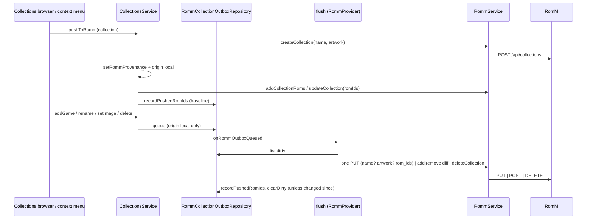

# Design: RomM Collections Push

## Context

See [SPEC-0015](spec.md), [ADR-0015](../../adrs/ADR-0015-push-local-collections-to-romm.md), [SPEC-0009](../romm-collection-sync/spec.md), and [SPEC-0013](../romm-play-state-writeback/spec.md).

Collections: `user_collections` with v161 provenance (`romm_server_url`, `romm_collection_id`, `romm_collection_virtual`, `romm_synced_at`), `user_collection_items(collection_id, rom_path)`; `CollectionsService` (`createCollection`, `renameCollection`, `deleteCollection`, `setCollectionImage`, `clearCollectionImage`, `addGame`, `removeGame`, `toggleGame`, `unlinkFromRomm`); `CollectionsProvider`; `RommCollectionMirror`; the browser menu (`collection_menu_layout.dart`, `kRommMirrorGlyph`). Members resolve to ROM ids through `RommSaveMapRepository.getRomIdIndex`. RomM: multipart create/update, JSON add/remove (4.9.0), owner checks, duplicate name → 500.

## Goals / Non-Goals

### Goals
- Push a local collection and keep it current from the device.
- One writer per collection; mirror behaviour untouched.

### Non-Goals
- Pulling RomM edits into pushed collections.
- Smart collections; public flag management.

## Decisions

### Origin as a column beside provenance

**Choice**: `romm_origin` next to the v161 columns, backfilled from `romm_collection_id`.
**Rationale**: the existing columns say *which* RomM collection; origin says *who writes*.

### Outbox per collection, not per member

**Choice**: one row per collection with dirty flags (`name_dirty`, `artwork_dirty`, `members_dirty`, `delete_remote`), the `last_pushed_rom_ids` baseline, `updated_at`, and the collection's `romm_server_url` / `romm_collection_id` copied at queue time so a queued delete survives the local delete and a row for another server is left alone. The flush sends one `PUT` per dirty collection carrying every dirty aspect and always `rom_ids` (resolved members when dirty, else the baseline), because RomM requires `rom_ids` on every `PUT`; only a members-only change on 4.9.0+ with a baseline goes out as the add/remove diff. The baseline is recorded after any request that carried members and seeded by the initial push. A pushed row stays (flags cleared) as the baseline's holder; a delete, a 404, or an unlink drops it. A scope-denied row is kept, not dropped as SPEC-0013's props flush does: the edit is the user's own work on a collection this device created (see the spec for the costs).
**Rationale**: membership is small and the server's `rom_ids` replace is idempotent; a burst of toggles costs one request, and a rename costs one request that repeats what the server holds instead of a 422.

### Hooks in `CollectionsService`

**Choice**: `addGame`, `removeGame`, `toggleGame`, `renameCollection`, `setCollectionImage`, `clearCollectionImage`, `deleteCollection` call `RommCollectionOutboxService.queue(...)`; the origin rule is inside it, so a mirror or an ordinary collection writes nothing. When a row was written the service invokes `CollectionsService.onRommOutboxQueued`, a static callback `main.dart` wires to `rommProvider.flushCollectionOutbox()` next to `onCollectionsMirrored`; the service imports no provider, and the secondary engine leaves the callback null. The delete prompt's answer arrives as `deleteOnRomm:` through the provider rather than as a callback the service invokes, and the remote delete goes through the outbox plus an immediate flush even when connected.
**Rationale**: every UI path already goes through the service; one flush path means one 404 rule.

## Architecture

## Risks / Trade-offs

- **Server-side edits lost** → origin badge and documented rule; a rename or artwork push re-sends the baseline `rom_ids`, so a RomM-side membership edit since the last push is overwritten (a `GET` first would preserve it at one extra request; not taken). The mirror declines to adopt a `local`-origin collection, so syncing it from the RomM tab cannot silently flip the writer.
- **Scope-denied rows kept** → re-read and re-resolved on every flush until the scope arrives; a different account on the same server pushes under that account and settles as a 403.
- **Duplicate name on create** → distinct error, user renames.
- **Artwork upload size** → the local image is already a small file; multipart as for saves.

## Migration Plan

One versioned migration: `romm_origin` column with backfill, outbox table. Version at merge time.

## Open Questions

- Push `is_public`? Not exposed locally; default private.
- ~~Should the favourites collection (SPEC-0013) appear as a pushed collection in the browser?~~ Resolved by construction (#217): the favourites collection is RomM's and favourites here are a flag on the ROM, so no local collection is the favourites collection; the only local row that can stand for it is a mirror, which the provenance rule already keeps off the push entry.
