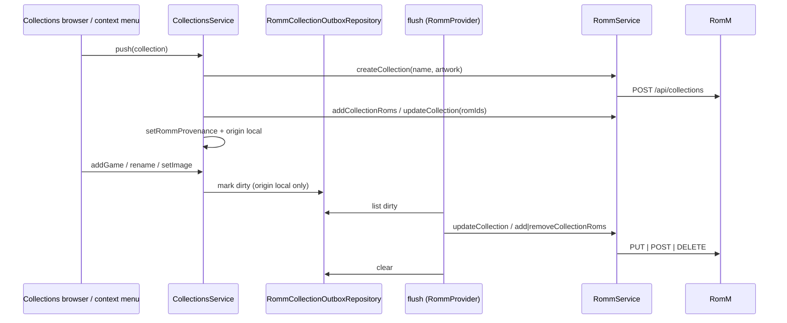

# Design: RomM Collections Push

## Context

See [SPEC-0015](spec.md), [ADR-0015](../../adrs/ADR-0015-push-local-collections-to-romm.md), [SPEC-0009](../romm-collection-sync/spec.md), and [SPEC-0013](../romm-play-state-writeback/spec.md).

Collections: `user_collections` with v161 provenance (`romm_server_url`, `romm_collection_id`, `romm_collection_virtual`, `romm_synced_at`), `user_collection_items(collection_id, rom_path)`; `CollectionsService` (`createCollection`, `renameCollection`, `deleteCollection`, `setCollectionImage`, `clearCollectionImage`, `addGame`, `removeGame`, `toggleGame`, `unlinkFromRomm`); `CollectionsProvider`; `RommCollectionMirror`; the browser menu (`collection_menu_layout.dart`, `kRommMirrorGlyph`). Members resolve to ROM ids through `RommSaveMapRepository.getRomIdIndex`. RomM: multipart create/update, JSON add/remove (4.9.0), owner checks, duplicate name → 500.

## Goals / Non-Goals

### Goals
- Push a local collection and keep it current from the device.
- One writer per collection; mirror behaviour untouched.

### Non-Goals
- Pulling RomM edits into pushed collections.
- Smart collections; public flag management.

## Decisions

### Origin as a column beside provenance

**Choice**: `romm_origin` next to the v161 columns, backfilled from `romm_collection_id`.
**Rationale**: the existing columns say *which* RomM collection; origin says *who writes*.

### Outbox per collection, not per member

**Choice**: one row per collection with dirty flags; the flush replaces membership from the local set (or diffs on 4.9.0+ against the last pushed set stored in the row).
**Rationale**: membership is small and the server's `rom_ids` replace is idempotent; a burst of toggles costs one request.

### Hooks in `CollectionsService`

**Choice**: `addGame`, `removeGame`, `renameCollection`, `setCollectionImage`, `clearCollectionImage`, `deleteCollection` consult the model's origin and queue.
**Rationale**: every UI path already goes through the service.

## Architecture

## Risks / Trade-offs

- **Server-side edits lost** → origin badge and documented rule.
- **Duplicate name on create** → distinct error, user renames.
- **Artwork upload size** → the local image is already a small file; multipart as for saves.

## Migration Plan

One versioned migration: `romm_origin` column with backfill, outbox table. Version at merge time.

## Open Questions

- Push `is_public`? Not exposed locally; default private.
- Should the favourites collection (SPEC-0013) appear as a pushed collection in the browser? Excluded for now.
