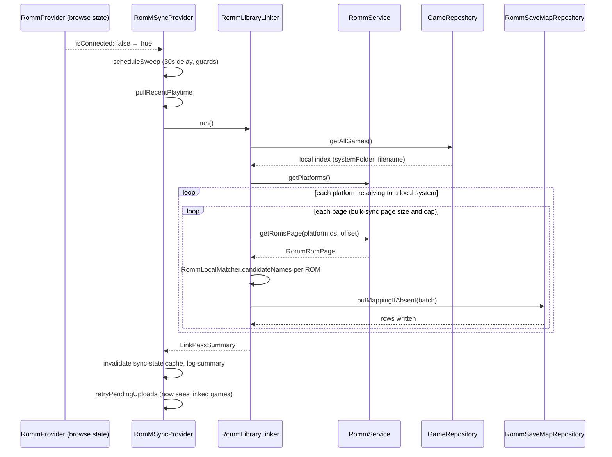
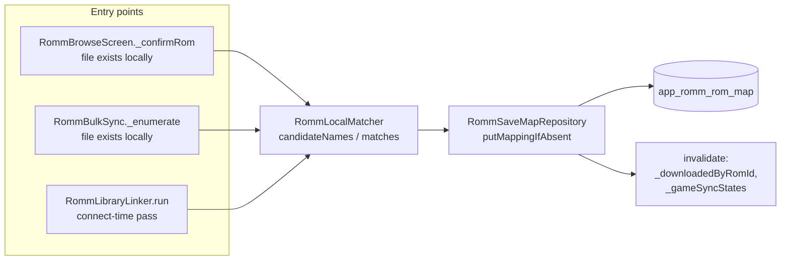

# Design: RomM Existing ROM Linking

## Context

See [SPEC-0001](spec.md) and [ADR-0001](../../adrs/ADR-0001-link-existing-roms-to-romm-by-filename.md).

The RomM integration is split across three layers. `RommService` (`lib/services/romm_service.dart`) is the HTTP client. `RommProvider` (`lib/providers/romm_provider.dart`) owns browsing, downloads, platform-to-system resolution (`resolveSystem`, `platformIdsForSystemName`, the `_slugAliases` table), and the "already downloaded" probe (`isDownloaded`, `_existingRomDir`, `_existingRomNames`). `RomMSyncProvider` (`lib/sync/providers/romm_provider.dart`) implements `ISyncProvider`, holds a reference to `RommProvider` as `_browse`, and owns the connect-time schedule: `_onBrowseChanged` fires on a disconnected-to-connected transition, `_scheduleSweep` waits thirty seconds, pulls playtime, then runs `retryPendingUploads`.

The link table is `app_romm_rom_map` (`romname`, `system_folder`, `romm_rom_id`, `romm_fs_name`, `updated_at`), primary key on `(romname, system_folder)`, accessed only through `RommSaveMapRepository`. `putMapping` uses replace-on-conflict, which the spec's never-overwrite rule forbids for the new entry points.

Upstream issue #383 narrowed to "saves sync for downloaded ROMs but not pre-existing ones" after 0.11. The related #386 asks for RomM metadata on pre-existing ROMs. Both bottom out in the missing map row.

Constraints from the repo rules: strict layering (UI to providers to services to repositories), no new SQLite columns without a versioned migration, every user-facing string through `AppLocale` in twelve languages, and Android ROM folders being SAF `content://` trees.

## Goals / Non-Goals

### Goals
- Pre-existing ROMs whose filenames match the server become linked with no download.
- One shared matching rule so the "downloaded" badge and the link never disagree.
- Zero schema change and zero Kotlin change.
- The whole library links on the first connect after a USB copy from the server.
- Manual links made later are never clobbered.

### Non-Goals
- Matching renamed files. That is the manual picker's job.
- Hash-based matching. Rejected in ADR-0001.
- Pulling metadata or media for every game in the connect pass. Offline metadata comes from the planned in-folder `gamelist.xml` import.
- Linking games whose platform does not resolve to a local system. Extending the alias table is separate work.

## Decisions

### One matcher, extracted from the provider

**Choice**: Extract the filename equivalence logic into a small pure class, `RommLocalMatcher`, with two operations: `candidateNames(RommRom)` (the existing `_existingRomNames` logic) and `matches(localFilename, RommRom)` (case-insensitive comparison against those candidates). `RommProvider._existingRomDir` and the new link paths both call it.
**Rationale**: The spec requires the "downloaded" check and the link decision to be the same rule. Sharing code is the only way to guarantee it, and a pure class is trivially unit-testable without a provider.
**Alternatives considered**:
- Call `RommProvider.isDownloaded` from the pass: it probes the filesystem per ROM, which is exactly the SAF cost the pass must avoid.
- Duplicate the comparison in the linker: would drift, and the ADR names that drift as a failure mode.

### The connect pass matches the library index, not the disk

**Choice**: The pass builds an in-memory index of the local library from `GameRepository.getAllGames` keyed by `(systemFolder, lowercased filename)`, then walks server pages and looks up each ROM's candidate names. Only the browser and bulk-sync entry points keep using the filesystem probe, because they already have it and act on a single ROM.
**Rationale**: The library index already exists (the sync provider's `_listGames` uses it), it is scan-derived so it reflects what NeoStation can launch, and it makes the pass network-bound only. On Android, avoiding per-ROM SAF listings for a multi-thousand-game library is the difference between seconds and minutes.
**Alternatives considered**:
- Probe disk per ROM: correct but slow over SAF; rejected.
- Match by scanning the server for each local game with `search_term`: one request per game instead of one page per fifty ROMs; rejected.

### The pass lives in a new service, invoked by the sync provider's scheduler

**Choice**: Add `RommLibraryLinker` under `lib/services/romm/` with injected dependencies (`fetchPage`, `listGames`, `resolveSystem`, `platformIds`, `putMappingIfAbsent`), following the injection style of `RommBulkSync`. `RomMSyncProvider._scheduleSweep` awaits `linker.run()` after the playtime pull and before `retryPendingUploads`, sharing the same disconnect and bulk-sync guards.
**Rationale**: The sync provider already owns the connect-time lifecycle and guards, so no new scheduler is needed. Keeping the algorithm in a service keeps the sync provider from growing further and makes it testable with fakes, the way `romm_bulk_sync_test.dart` tests enumeration.
**Alternatives considered**:
- Put the pass in `RommProvider`: it would need the sweep's scheduling and guards duplicated.
- A standalone scheduled runner modeled on `RaLibraryMatchRunner` with a Tools entry: more UI and strings for the same outcome. A manual "re-link now" entry can be added later if reconnecting proves too coarse a trigger.

### Insert-if-absent instead of replace

**Choice**: Add `RommSaveMapRepository.putMappingIfAbsent` using `INSERT OR IGNORE` semantics through the existing adapter's conflict algorithm, returning whether a row was written. `putMapping` keeps its replace semantics for the download path, which legitimately re-targets a mapping when a ROM is re-downloaded.
**Rationale**: The never-overwrite rule protects future manual links without a provenance column. Returning a boolean gives the callers their "linked" versus "already linked" counts for free.
**Alternatives considered**:
- Read-then-write in the caller: two round trips and a race with the download path.
- Add a `linked_by` column now: requires a migration for a distinction nothing consumes yet. Deferred to the manual picker.

### Ambiguity is skipped, not resolved

**Choice**: When two ROMs from platforms resolving to the same system produce the same candidate name for a local file, the pass records both ids and writes nothing.
**Rationale**: Guessing wrong silently attaches a user's saves to the wrong server entry. The cost of skipping is one unlinked game with a log line; the manual picker resolves it later.

### Browser path imports metadata, bulk and pass do not

**Choice**: `_confirmRom` on an existing file writes the mapping and, if the local game has no scraped metadata, calls the existing `_importMetadata` (made callable from the browser path). Bulk sync and the connect pass only write rows.
**Rationale**: The browser action is a single, user-initiated ROM, so one metadata fetch is proportionate and directly answers #386's "let the download button do something". The pass touches thousands of ROMs and must stay network-light.

## Architecture

Layer placement: `RommLocalMatcher` is a pure utility (no I/O) consumed by both the providers layer and the services layer. `RommLibraryLinker` is a service that receives repository and service functions by injection, which keeps the sync layer and the providers layer from calling datasources directly.

## Risks / Trade-offs

- **Alias table gaps leave whole platforms unlinked** → The summary log names unresolved platforms with their slugs, the same signal `_orderBySupport` already emits, so missing aliases surface as a one-line fix.
- **Server enumeration on every connect** → Bounded by the existing page size and cap; the pass exits early when the local index is empty or every local game is already linked, so steady-state cost is one platform list plus cheap page walks. If this proves heavy, a "last full pass" timestamp can gate it to once per server per day.
- **Filename collisions across platforms mapping to one system** → Skipped and logged, never guessed.
- **Case-insensitive match on case-sensitive filesystems** → The mapping is written with the library's canonical filename, which is what the sync provider looks up, so a case mismatch between server and disk still links correctly.
- **Metadata import from the browser path re-scrapes a game the user curated** → Gated on "no scraped metadata", matching the ES-DE importer's fill-gaps posture.
- **Dart has no race detector** → The spec's concurrency requirement is written for the single-threaded event loop: cancellation checks between awaits and a single-instance guard, not thread-safety primitives.

## Migration Plan

No schema change. Deploy as an ordinary release. On first connect after upgrade the pass runs once and links everything it can. Rollback is removing the code; rows already written are harmless and identical in shape to download-written rows.

Tests to update: `test/romm_bulk_sync_test.dart` "ROMs already on disk are skipped, not queued" becomes "skipped but linked". Tests to add: `romm_local_matcher_test.dart` (equivalence rule), `romm_library_linker_test.dart` (links unlinked, never overwrites, skips ambiguous, honours guards and cancellation, summary counts), a browser-path test for the linked notification, and a repository test for `putMappingIfAbsent`.

## Open Questions

- Should the pass be re-runnable from the Tools settings screen for users who rename a folder and want to relink without reconnecting? Deferred until the connect trigger proves insufficient.
- When the same server hosts one game under two platforms that both resolve to one local system (the ambiguity case), should the manual picker be offered inline from the log? Deferred to the manual picker spec.
