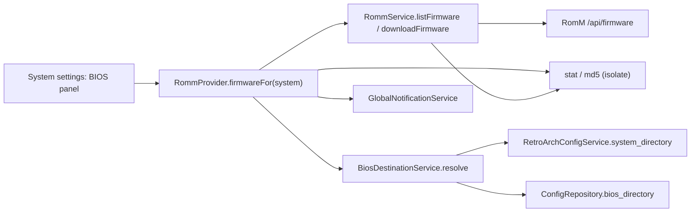

# Design: RomM Firmware Download

## Context

See [SPEC-0012](spec.md), [ADR-0012](../../adrs/ADR-0012-download-bios-firmware-from-romm.md), and [SPEC-0001](../romm-existing-rom-linking/spec.md).

NeoStation has no BIOS model. `RetroArchConfigService` parses `system_directory` from `retroarch.cfg` (`lib/services/retroarch_config_service.dart:121`) into the RetroArch config table (`system_directory TEXT`). ROM downloads (`RommService.downloadRom`, `lib/services/romm_service.dart:1143`) stream `GET /api/roms/{id}/content/{fs_name}` into `<dest>.part` and rename; the destination directory comes from `RommProvider._resolveDestDir` with SAF trees translated by `UserDataLocationService.safUriToRealPath`. The system settings dialog (`lib/widgets/system_emulator_settings_dialog/`) already hosts a per-system RomM row (`romm_fetch.dart`). RomM: `GET /api/firmware?platform_id=` (scope `firmware.read`, in the base grant), `GET /api/firmware/{id}/content/{file_name}`; `FirmwareSchema` carries hashes, `is_verified`, `missing_from_fs`.

## Goals / Non-Goals

### Goals
- List, check, and download a system's firmware from RomM in one panel.
- Reuse the granted scope and the streaming download path.

### Non-Goals
- Uploading firmware to RomM (`firmware.write`).
- Per-emulator BIOS locations for standalone emulators.
- Automatic downloads.

## Decisions

### Destination resolver in a small service

**Choice**: `BiosDestinationService.resolve(system)` returns RetroArch's `system_directory` when known and existing, else `user_config.bios_directory`, else null; the panel calls a picker and persists through `ConfigRepository.setBiosDirectory`.
**Rationale**: one place to grow per-emulator rules later (a `bios_dir` in the emulator JSON) without touching the panel.
**Alternatives considered**:
- Always ask: annoying when RetroArch already tells us.
- Per-system column: more schema for a need not yet seen.

### Presence by name and size, md5 on request

**Choice**: `stat` only for the list; `Verify` streams md5 in a background isolate.
**Rationale**: BIOS sets are small in count but the panel opens often; reading every file each time is wasteful, and the verify action covers the doubtful case.

### Firmware download reuses the ROM streaming helper

**Choice**: extract the `.part`-and-rename streaming from `downloadRom` into a private `_streamToFile(uri, dest, onProgress, shouldCancel)` used by both.
**Rationale**: one implementation of cancel and cleanup.

## Architecture

Layering: UI → provider → service/repository → datasource; the destination service reads the RetroArch config through its existing service and the config through `ConfigRepository`.

## Risks / Trade-offs

- **Wrong destination for standalone emulators** → documented as RetroArch-first; the picker lets the user point at any folder.
- **Large files over Wi-Fi** → explicit per-file actions, progress, cancel.
- **Android write permission** → same translation and writability check as ROM downloads (`dirIfWritable`).

## Migration Plan

One versioned migration adding `user_config.bios_directory TEXT` (guarded, idempotent; version assigned at merge time per `lib/data/datasources/CLAUDE.md`). No data backfill.

## Open Questions

- Should the emulator JSON carry a `bios_dir` per standalone emulator so the resolver can serve them? Deferred until a concrete emulator needs it.
- Whether to show firmware for platforms that resolve to a system with no configured emulator.
