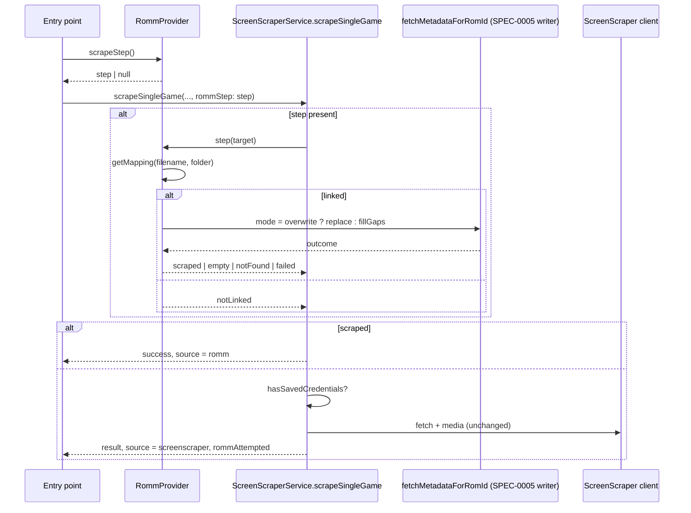
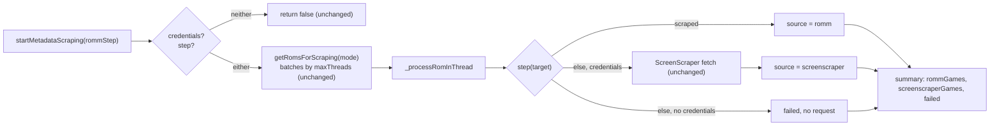

# Design: RomM-First Scrape With ScreenScraper Fallback

## Context

See [SPEC-0006](spec.md), [ADR-0006](../../adrs/ADR-0006-romm-first-scrape-with-screenscraper-fallback.md), the writer in [SPEC-0005](../romm-metadata-fetch/spec.md), and the link rows in [SPEC-0001](../romm-existing-rom-linking/spec.md).

Today four entry points scrape: `_forceRescrape` in the game settings Scraping tab (`forceOverwrite: true`), `_scrapeSelectedGame` in `my_games_list.dart` (Select+A in grid and carousel; overwrite when a description exists), `_startSingleGameScrape` in the details card (list view), and the Scraper screen's bulk start. The first three call `ScreenScraperService.scrapeSingleGame`, which checks credentials, resolves the ScreenScraper system id, fetches game info with three attempts, writes metadata through `_saveGameMetadata` (always a replace), and downloads media honouring `forceOverwrite`. Two of them pre-check `hasSavedCredentials` and show a hardcoded prompt. Bulk goes through `startMetadataScraping`, which returns early without credentials, builds candidates from `getRomsForScraping(mode)`, batches them by the thread setting, and runs `_processRomInThread` per ROM.

`RommProvider.fetchMetadataForRomId` is the SPEC-0005 writer core: rom id, system, file provider, indexed filename, mode. `RommSaveMapRepository.getMapping` resolves one game; `getRomIdIndex` reads the whole map. `RommMetadataOutcome` reports kind, columns written, media written, skipped, failed.

Constraints: strict layering (`ScreenScraperService` cannot import providers), twelve-language strings, unchanged behaviour when RomM is absent, the bulk pipeline's threading and quota logic untouched.

## Goals / Non-Goals

### Goals
- One source chain for every scrape entry point: RomM first, ScreenScraper fallback.
- Byte-for-byte ScreenScraper behaviour when the step is absent.
- RomM-only users can scrape from the same actions.
- Users can see which source handled a game.

### Non-Goals
- A source selector on the Scraper screen.
- Changing ScreenScraper's overwrite semantics or the bulk candidate query.
- Merging fields from both sources for one game; the first source that delivers wins.

## Decisions

### Injected step, not a provider import

**Choice**: `typedef RommScrapeStep = Future<RommScrapeStepResult> Function(RommScrapeTarget target)` in `lib/models/`, with `RommScrapeTarget {appSystemId, filename, systemFolder, forceOverwrite}` and `RommScrapeStepResult {status: scraped | notLinked | notFound | empty | failed, outcome, error}`. `RommProvider.scrapeStep()` returns a step when connected and `null` otherwise; `RommProvider.bulkScrapeStep()` returns a step that has preloaded `getRomIdIndex()`. `scrapeSingleGame` and `startMetadataScraping` gain `RommScrapeStep? rommStep`.
**Rationale**: Mirrors the injected-function pattern of `RommLibraryLinker` and `RommMetadataFetch`; keeps the service free of provider imports; makes the step trivially fakeable.
**Alternatives considered**:
- Move the writer into a service: the writer needs `FileProvider` for media paths and lives in the provider by SPEC-0005; moving it is churn with no gain here.
- A coordinator provider wrapping both services: duplicates the per-game and bulk flows instead of slotting into them.

### Success rule lives in one place

**Choice**: `RommScrapeStepResult.scraped` is computed by the step from the outcome: kind `filled`, `replaced`, or `partial` with `columnsWritten + mediaWritten > 0`, or `columnsWritten == 0 && mediaWritten == 0 && mediaSkipped > 0 && mediaFailed == 0`. Everything else is `empty`, `notFound`, `notLinked`, or `failed`.
**Rationale**: Both scrape functions consume the same boolean; the rule is testable without either.

### Credentials gate moves behind the step

**Choice**: Per-game sites drop their `hasSavedCredentials` pre-check. `scrapeSingleGame` runs the step first and checks credentials only when the step did not scrape the game. `startMetadataScraping` treats `credentials == null && rommStep == null` as the existing early return, and with `rommStep != null` proceeds, skipping ScreenScraper per ROM when there are no credentials. The Scraper screen's start button enables when either source is available.
**Rationale**: The user's rule is "RomM first if logged in"; a credentials wall in front of it defeats the purpose for RomM-only users.

### Result carries the source

**Choice**: The per-game result map gains `source` (`romm` | `screenscraper`) and `rommAttempted` (bool). Bulk `_processRomInThread` returns `source` too; the run tallies `rommGames` and `screenscraperGames` and passes them to the summary dialog. Progress status keys: a new "Fetching from RomM" key alongside the existing ScreenScraper keys.
**Rationale**: Notifications and the summary must name the source; the map is the existing contract, so one more key is the least invasive change.

### Localize the leaked strings at the touched sites

**Choice**: The three hardcoded strings at the per-game sites become keys in the same change.
**Rationale**: Every touched notification is rewritten anyway; leaving upstream's literals next to new localized ones would be inconsistent.

## Architecture

Layer placement: the step type and target in models; the step builders in `RommProvider`; the optional parameter and chain in `ScreenScraperService`; entry points pass `context.read<RommProvider>().scrapeStep()`.

## Risks / Trade-offs

- **Empty RomM entry costs two requests** → Accepted; it is the fallback the user asked for, and the step's "empty" result is logged so it can be seen.
- **Bulk worker count is the ScreenScraper thread setting** → The step inherits it; RomM detail fetches are light and `RommService` has no throttling, so this stays within the per-system pass's assumptions (concurrency 3 to 4).
- **Provenance flips** → A replace by ScreenScraper after RomM (or vice versa) rewrites `metadata_source`; that is the truth of who last owned the row, per SPEC-0005.
- **Credentials message timing** → It now appears after a RomM attempt; the notification text explains RomM had nothing.

## Migration Plan

1. Step type, target, result, and the success rule with tests.
2. `RommProvider.scrapeStep()` / `bulkScrapeStep()` with tests on link resolution and mode mapping.
3. `scrapeSingleGame(rommStep:)` chain with tests; `startMetadataScraping(rommStep:)` chain, counts, summary with tests.
4. Entry points, Scraper screen start gating, notifications, localized keys.

Rollback: omit the parameter at the call sites; the services behave as before.

## Open Questions

- Should the summary dialog also list which games fell through to ScreenScraper? Deferred; counts first.
