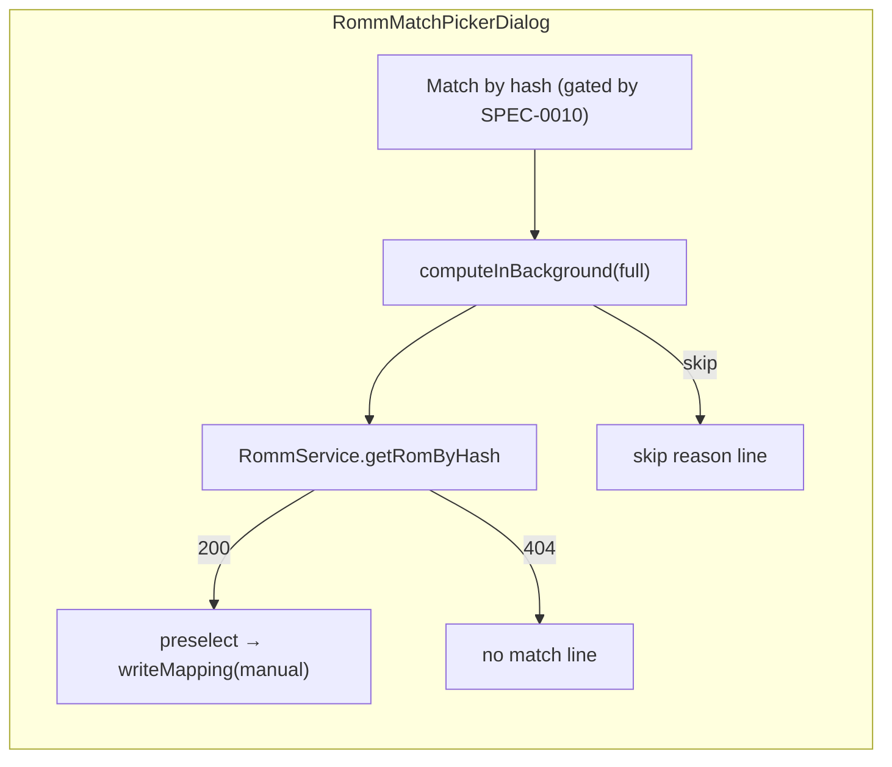

# Design: RomM Hash-Based Linking

## Context

See [SPEC-0011](spec.md), [ADR-0011](../../adrs/ADR-0011-link-local-roms-to-romm-by-hash.md), [SPEC-0001](../romm-existing-rom-linking/spec.md), [SPEC-0004](../romm-manual-link-picker/spec.md), and [SPEC-0010](../romm-server-capabilities/spec.md).

`RommLibraryLinker` (`lib/services/romm/romm_library_linker.dart`) builds `_LocalIndex` from `GameRepository.getAllGames()` keyed by normalized folder and filename, pages each platform of each system group through the injected `fetchPage`, collects filename claims per local game, resolves ambiguity and conflicts, and writes `RommSaveMapEntry` rows through `putMappingsIfAbsent`. `RomFingerprintService` (`lib/services/rom_fingerprint_service.dart`) offers `fingerprint(path, systemFolder, {keepsArchivesPacked, effort})` with `FingerprintEffort.cheapOnly` (zip central directory) and full (streamed crc32 and md5), and `computeInBackground` for UI-driven callers. Migration 135 added `user_roms.rom_crc32`, `rom_size`, `rom_fingerprint_skipped` and repurposed `ss_hash` as md5; the ScreenScraper path (`screenscraper_service.dart`) is their only writer today. `RommMatchPickerController` (`lib/screens/game_screen/game_settings_dialog/romm_match_picker_controller.dart`) drives the picker with injected `searchRoms`, `readMapping`, `writeMapping`, `fetchMetadata`.

RomM: `RomSchema` (inherited by the list schema) and `RomFileSchema` carry `crc_hash`, `md5_hash`, `sha1_hash`, `ra_hash` (files also `chd_sha1_hash`); `GET /api/roms/by-hash` (4.5.0+, `roms.read`) returns a detailed ROM or 404.

## Goals / Non-Goals

### Goals
- Link renamed and re-tagged files automatically on connect with no extra requests.
- Keep SAF reads near zero: persisted fingerprints first, cheap zip crc32 second, nothing else.
- One-press hash match in the picker for the remaining cases.

### Non-Goals
- Full hashing of the library.
- Disc images, 7z archives, and multi-file ROMs beyond what the cheap path and the ROM-level hash already cover.
- Using RomM hashes for RetroAchievements (RA has its own hashing).

## Decisions

### A second stage in the same pass, not a second pass

**Choice**: `_run` keeps one enumeration per platform. The page callback records, per ROM, `allCrc32`, `allMd5`, and size alongside the filename claims; after a group completes, the hash stage runs over the group's unlinked games against that in-memory hash index, then rows for both stages are written together.
**Rationale**: the pass already holds every ROM of the group; a second enumeration would double the network cost ADR-0001 worked to bound.
**Alternatives considered**:
- A separate `RommHashLinker` service: cleaner on paper, but it would re-page every platform and duplicate the guards.

### crc32 as the key, md5 and size as vetoes

**Choice**: index by crc32; when both sides have an md5 they must agree, when both have a size and the local file is a bare file they must agree (RomM's size is the stored archive's, its hashes and the local `rom_size` are the inner image's, so the veto is skipped for archives); a crc32 matching more than one RomM ROM id is an ambiguity.
**Rationale**: crc32 is the fingerprint most local games already have (scraped libraries and the zip cheap path); md5 is present when a full fingerprint was computed and is decisive when it is. Requiring md5 would exclude every game that only has the cheap fingerprint.

### Compare against ROM-level and file-level hashes

**Choice**: `allCrc32` unions the ROM's own hash with every file's hash.
**Rationale**: whether RomM hashed the stored archive or its inner file depends on the server version and file type; the local fingerprint follows the No-Intro inner-file convention (or the archive for packed systems). Comparing against both covers both conventions without a version table. The foundation story includes a device check on the user's server: a zipped game whose crc32 is known must match on the first pass.

### Cheap fingerprints only, capped, persisted

**Choice**: unlinked games without `rom_crc32` and not `rom_fingerprint_skipped` get `FingerprintEffort.cheapOnly` in a background isolate, at most 500 per pass, results and skip reasons persisted through a new `GameRepository.saveFingerprints(batch)` that writes the migration-135 columns.
**Rationale**: the cheap path touches only the zip's tail; a real failure is parked with a reason so the pass never re-walks it, while a file the cheap path merely declines (bare ROM, packed-archive set, unparseable zip tail) is deferred — not persisted, not charged to the cap — so the scraper's full path can still fingerprint it. The cap keeps a first connect on a large library bounded; the persisted results make the second pass free.
**Alternatives considered**:
- Full fingerprints in the pass: rejected in ADR-0001 and ADR-0011 for SAF cost.
- No persistence: every connect would re-read every zip tail.

### `RommLinkSource.hash`

**Choice**: a new enum value stored as `'hash'`; automatic for the never-overwrite and never-replace-manual rules; the picker's provenance text names it.
**Rationale**: the `link_source` column is free text, so no migration; the conflict log and the picker can say how a row came to be.

### Picker shortcut uses the full fingerprint and the by-hash endpoint

**Choice**: `RommMatchPickerController` gains an injected `lookupByHash(RomFingerprint) → Future<RommRom?>` and `fingerprintFile() → Future<({fingerprint, skipReason})>`; the dialog gets a "Match by hash" button in its action row, a busy state, and a result line. The gate is `RommService.supports(romLookupByHash) != unsupported`, passed in as a bool.
**Rationale**: the user is looking at one file; one full read and one request are proportionate, and `by-hash` returns a detailed ROM that the picker can preselect and confirm through its existing manual-row path.

## Architecture

```mermaid
sequenceDiagram
    participant L as RommLibraryLinker
    participant G as GameRepository
    participant F as RomFingerprintService (isolate)
    participant S as RommService
    participant M as RommSaveMapRepository

    L->>G: getAllGames() (with rom_crc32, ss_hash, rom_size)
    loop each system group
        loop each platform page
            L->>S: getRomsPage(platformIds, offset)
            S-->>L: ROMs with fs_name + hashes
            L->>L: filename claims; hash index (crc32 → rom ids)
        end
        L->>L: unlinked after filename stage, no crc32?
        L->>F: cheap fingerprint (≤500/pass, stop checked)
        F-->>L: crc32 | skip reason
        L->>G: saveFingerprints(batch)
        L->>L: hash stage: crc32 match, md5 veto, size veto (bare files), ambiguity
        L->>M: putMappingsIfAbsent(filename rows + hash rows)
    end
    L-->>L: summary (rowsAdded, hashRowsAdded, fingerprintsComputed, ...)
```



Layering: model (hash fields) ← service (linker stage, fingerprint isolate, `getRomByHash`) ← repository (fingerprint persistence, mapping rows) ← provider (unchanged wiring, passes the gate) ← UI (picker action, l10n).

## Risks / Trade-offs

- **Archive convention mismatch** → union of ROM-level and file-level hashes; device check in the foundation story; md5 veto prevents a wrong link when both sides have it.
- **First-connect cost on a large unscraped library** → 500-file cap, tail-only reads, persisted results, stop signal between files.
- **Duplicate local files** → both link to the same ROM; correct, and the sync map is per local file.
- **A wrong hash link** → rows are insert-if-absent and visible in the picker as "linked by hash"; the picker can replace them with a manual row.

## Migration Plan

No schema change (columns exist since migration 135; `link_source` is free text). Ships behind nothing: the stage runs on the next connect. Rollback is removing the stage; rows already written are ordinary automatic rows.

## Open Questions

- Should the packed-archive systems (arcade sets, where the archive is the ROM) use the ROM-level hash only? The union handles it; a stricter rule can follow if the device check shows false positives.
- Whether to surface hash-stage ambiguities in the UI (today ambiguities are log-only, per SPEC-0001).
