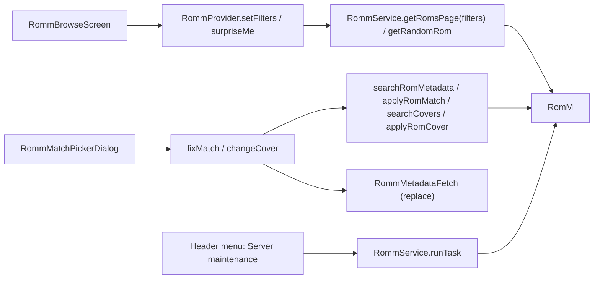

# Design: RomM Library Extras

## Context

See [SPEC-0018](spec.md), [ADR-0019](../../adrs/ADR-0019-expose-romm-library-filters-search-and-maintenance.md), [SPEC-0008](../romm-browse-performance-and-search/spec.md), [SPEC-0004](../romm-manual-link-picker/spec.md), and [SPEC-0013](../romm-play-state-writeback/spec.md).

`RommService.getRomsPage` (`lib/services/romm_service.dart:799`) sends `order_by=name`, platform or collection, `search_term`; `RommProvider` keeps `_currentPlatform`, `_currentCollection`, `_searchTerm`, a generation counter for stale pages; `RommBrowseScreen` has a two-slot header, a search row, and no filter or sort UI; the local library has a random-game gesture (Select+Y). `RommMatchPickerDialog` searches and writes manual links. RomM: filters on `/api/roms`; `random` (4.8.0); `search/roms`, `search/cover`; `PUT /api/roms/{id}` multipart; `tasks/run/{name}`.

## Goals / Non-Goals

### Goals
- Server-side filters and random pick on the browse screen.
- Fix a wrong RomM match from the device and refresh local metadata.
- Run maintenance tasks with confirmation.

### Non-Goals
- Streaming, feeds, music; smart collections; sort options other than name.

## Decisions

### Filters as a value object on the provider, reset on navigation

**Choice**: `RommRomFilters` immutable; provider state per current platform or collection; cleared by `backToPlatforms` and selection changes.
**Rationale**: filters are contextual; carrying them across platforms confuses.

### Fix match lives in the picker, not the scraping tab

**Choice**: the picker already knows the RomM ROM and has the search UI.
**Rationale**: one RomM identity surface (ADR-0004); the scraping tab stays ScreenScraper-shaped.

### Maintenance is a header menu, confirmed

**Choice**: header action opens a small menu; each item confirms; result via toast.
**Rationale**: admin actions are rare; no dedicated screen.

## Architecture

## Risks / Trade-offs

- **Library-wide writes** → confirmation plus the `romsWrite` group.
- **Random on huge collections** → server-side; focusing may page; bounded by the page cap.
- **No metadata source on the server** → heartbeat flags hide the action; 500 mapped.

## Migration Plan

No schema change.

## Open Questions

- Persist filters per platform across sessions? Not for v1.
- Show task progress (`GET /api/tasks/{id}`)? Queued/busy is enough for v1.
