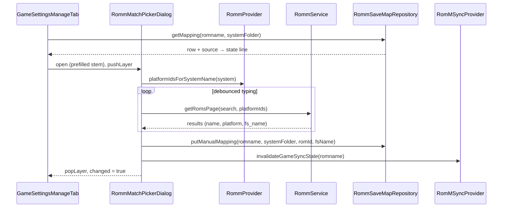
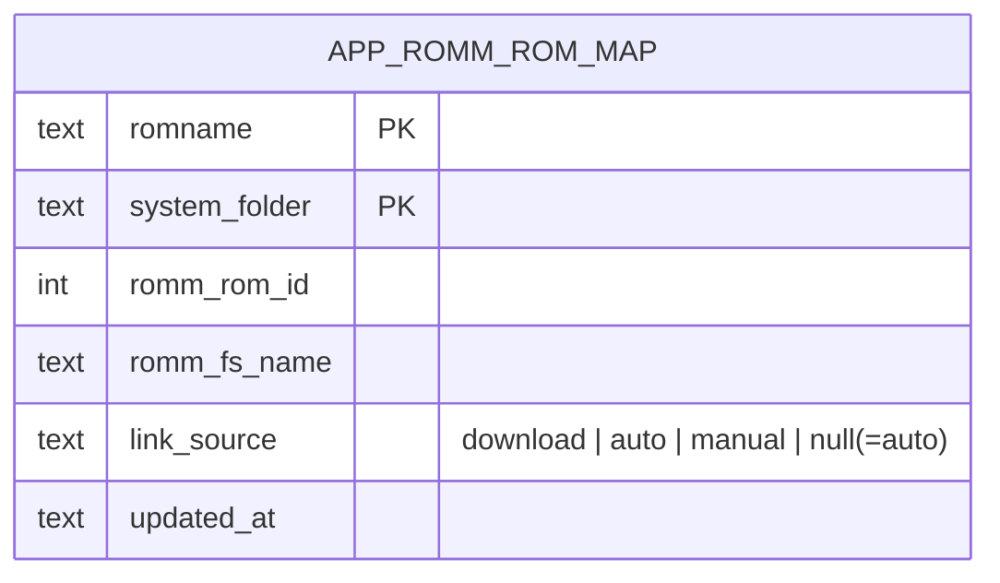

# Design: RomM Manual Link Picker

## Context

See [SPEC-0004](spec.md), [ADR-0004](../../adrs/ADR-0004-manual-romm-link-picker-with-provenance.md), and the base capability [SPEC-0001](../romm-existing-rom-linking/spec.md).

After SPEC-0001 the link table `app_romm_rom_map` has three writers: the download path (`RommSaveMapRepository.putMapping`, replace on conflict), the "already downloaded" paths and the connect-time pass (`putMappingIfAbsent` / `putMappingsIfAbsent`, insert-if-absent), and `removeMapping` on delete. Rows are keyed by filename and system folder and carry `romm_rom_id`, `romm_fs_name`, and `updated_at`; nothing records who wrote them.

The RetroAchievements feature has the exact shape this spec needs: `RaMatchPickerDialog` is a debounced title search with its own gamepad layer that writes the chosen id and `ra_match_source = 'manual'`, and the automatic RA pass filters on that column. The game settings dialog's Manage tab already reads `RommProvider` and calls `forgetLocalDownload` on delete; its rows are index-driven with the standard layer push/pop. `RommService.getRomsPage` supports `search` and `platformIds`, and `RommProvider.platformIdsForSystemName` maps a local system to platform ids. The connect-time linker already logs conflicts where an existing row points elsewhere.

Constraints: versioned migrations only, strict layering, all strings through `AppLocale` in twelve languages, controller reachability including text fields, B as cancel.

## Goals / Non-Goals

### Goals
- Let the user resolve renamed and ambiguous files with a search picker in the surface they already use.
- Make "manual wins" a repository rule backed by data, not a property of call sites.
- Show the user why a game is linked the way it is.

### Non-Goals
- Fuzzy or heuristic automatic matching of renamed files.
- Bulk manual linking.
- Changing SPEC-0001's automatic behaviour beyond respecting manual rows and logging conflicts.

## Decisions

### Provenance as a nullable column with null meaning automatic

**Choice**: `link_source TEXT NULL` with `download`, `auto`, `manual`; existing rows stay null; readers treat null as automatic.
**Rationale**: No backfill heuristic is reliable, because automatic writers also populate `romm_fs_name`. Only `manual` needs to change behaviour, so null-as-automatic costs nothing and avoids a wrong guess written permanently.
**Alternatives considered**:
- Backfill by `romm_fs_name` presence: wrong for automatic rows; rejected.
- Separate table of manual overrides: two lookups per resolve on a hot path; rejected.

### Enforcement in the repository, with a `source` parameter

**Choice**: `putMapping` gains a required `source`. For `download` it becomes replace-unless-manual (a parameterized `INSERT ... ON CONFLICT DO UPDATE ... WHERE link_source IS NOT 'manual'`, or a transaction with a guarded update). `putMappingsIfAbsent` writes `auto` and stays insert-if-absent. A new `putManualMapping` replaces unconditionally with `manual`. `getMapping(romname, systemFolder)` returns the row with its source for the Manage tab.
**Rationale**: Every writer already goes through this repository, so the rule lives in one place and every caller inherits it. The download path is the only writer that replaced before, so it is the only one whose semantics change.

### Picker cloned from the RA precedent, scoped by platform ids

**Choice**: `RommMatchPickerDialog` under the game settings dialogs, with its own `_layerId`, a text field escaped by B, a debounced `getRomsPage(search:, platformIds:, limit:)` query, and a result list with name, platform, and `fs_name`. Platform ids come from `RommProvider.platformIdsForSystemName(system.realName)`; when the system resolves to none, the search runs unscoped and the list shows platforms so the user can still choose.
**Rationale**: The RA dialog is the tested controller-navigable pattern in the codebase; reusing its structure keeps focus handling and layer semantics consistent. Scoping keeps result lists short and relevant.

### Entry points: Manage tab first, search screen second

**Choice**: The Manage tab hosts "Link to RomM" (disabled unless connected), "Unlink from RomM" (present only with a row), and a state line. The search screen's result action list gains a link action when a local game exists for a remote result, opening the same dialog pre-selected.
**Rationale**: The Manage tab is where per-game RomM actions already live. The search screen already pairs local and remote entries, so offering the link there is one action added to an existing list.

### After a manual write, refresh once

**Choice**: On confirm, call the SPEC-0001 per-game invalidation once, then close the dialog.
**Rationale**: The badge and downloaded cache must reflect the new link immediately; the single-game invalidation exists for exactly this.

### Conflict reporting reuses the linker's summary

**Choice**: The linker's existing conflict record gains the existing row's source; manual rows appear in the same "N conflicting" count and warn lines.
**Rationale**: SPEC-0001's observability rule is one summary line; adding a field to the existing record avoids a second reporting path.

## Architecture

Layer placement: the dialog and Manage tab rows are UI; they call `RommProvider` for platform ids and connection state, `RommService` through the provider for search, and `RommSaveMapRepository` for reads and writes; the repository is the only SQLite caller; the migration lives in the datasource layer.

## Risks / Trade-offs

- **Migration version collisions across branches** → Follow the datasource rules; pick the next version at merge time and keep the guard idempotent.
- **Re-download no longer re-targets a manual row** → Documented behaviour; the Manage tab shows the state so the user knows to unlink first.
- **Search latency in the picker** → Debounce, a small page limit, and a visible loading state; errors leave the dialog usable.
- **Unscoped search when the system has no platform mapping** → Results show their platform; the user chooses consciously. This is also the path to link games on systems the alias table does not cover.
- **Text field focus on controller** → Reuse the RA dialog's field handling, where B escapes the field before it closes the dialog.

## Migration Plan

1. Migration adding `link_source`, guarded and tested.
2. Repository changes with tests, including the replace-unless-manual rule.
3. Writers updated to pass their source: download path `download`, automatic paths `auto`.
4. Picker, Manage tab rows, state line, search-screen action, and twelve-language strings.
5. Linker conflict record extended.

Rollback: removing the UI leaves a nullable column that readers ignore.

## Open Questions

- Should "Unlink" on an automatic row offer "unlink and never relink automatically"? That needs a fourth source value (`blocked`); deferred until asked for.
- Should the picker be offered from the RomM browser for a remote ROM that has no local match? Out of scope; the browser's confirm already downloads.
