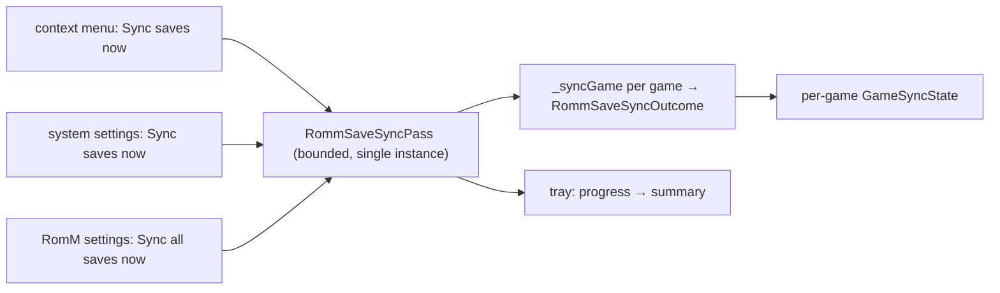

# Design: Manual RomM Save Sync

## Context

See [SPEC-0023](spec.md) and [ADR-0024](../../adrs/ADR-0024-manual-romm-save-sync.md).

`RomMSyncProvider` (`lib/sync/providers/romm_provider.dart`) owns `_syncGame` (decide and transfer for one game), `_runGameSync` (publish the per-game state), `retryPendingUploads` (two-phase sweep, `_sweeping` guard), and the per-game `GameSyncState` the cards read. The catalog refresh shows the tray pattern: a runner started from a settings row, reporting through `GlobalNotificationService` with a stable id.

## Goals / Non-Goals

### Goals
- One pass, three entry points, typed outcomes, tray reporting.
- No second decision engine.

### Non-Goals
- Resolving conflicts; changing the automatic hooks; NeoSync.

## Decisions

### A pass runner over `_syncGame`, in the sync provider

**Choice**: `RommSaveSyncPass` in `lib/sync/providers/romm_save_sync_pass.dart`, owned by `RomMSyncProvider`, taking a list of games and yielding outcomes; `_syncGame` gains a typed outcome return rather than a bare status so the pass does not re-derive it.
**Rationale**: the decision stays where it is; the pass is a loop with bounds and reporting.

### Early end on unreachable and auth

**Choice**: those two reasons end the pass after the game that produced them.
**Rationale**: every remaining game would fail identically, and a library of two hundred timeouts is not a report.

### Conflicts reported, not resolved

**Choice**: a both-changed save keeps today's backup behaviour and is counted as a conflict.
**Rationale**: a manual pass has no session to break the tie; choosing would risk another device's save.

### Reporting through the catalog refresh's pattern

**Choice**: one notification id per pass, progress updates per game, a final summary line, the same words in the per-game state.
**Rationale**: the user already knows that shape from "Refresh RomM library now".

## Architecture

## Risks / Trade-offs

- **Library pass cost.** Mitigation: the sweep's local-first filter decides which games need the network.
- **Interleaving with hooks.** Mitigation: a per-game lock shared with the launch and close hooks.

## Migration Plan

None.

## Open Questions

- Whether the system scope should also offer "download only" for a device being set up from the server.
