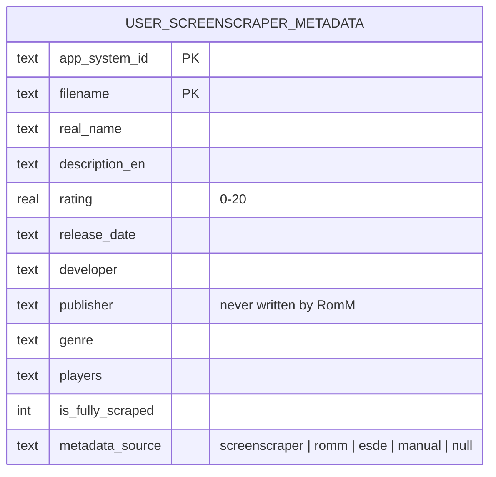

# Design: RomM Metadata Fetch

## Context

See [SPEC-0005](spec.md), [ADR-0005](../../adrs/ADR-0005-romm-as-metadata-source-for-linked-games.md), the linking base [SPEC-0001](../romm-existing-rom-linking/spec.md), and the picker [SPEC-0004](../romm-manual-link-picker/spec.md).

Today `RommProvider._importMetadata(rom, system, fileProvider, indexedName)` reads `/api/roms/{id}` raw detail, maps summary, genres, companies, player count, and release date, writes them with `ScraperRepository.saveGameMetadata(..., isFullyScraped: true)`, a whole-row replace, and downloads cover, fan art, wheel, one screenshot, and video through `_saveRommMedia`, which overwrites and deletes stale sibling extensions. It is private, reached from download completion and from `importMetadataIfMissing`, which refuses when any metadata row exists.

`ScraperRepository.buildEsdeMetadataWrite` is a pure fill-gaps builder (only null or blank columns) used by the importers; `updateGameMetadata` is the manual editor's partial update; `getGameMetadata` is keyed by system id and filename with extension. `runBounded` gives a bounded worker pool with per-item failure isolation. `RommSaveMapRepository.getRomIdIndex` reads the whole link map once. The Manage tab already loads the mapping and connection state for its Link and Unlink rows. The ScreenScraper global scrape reports progress through an ongoing global notification and a summary dialog; there is no per-system scrape. The system settings dialog has General, Appearance, Emulators, and Hidden tabs.

Constraints: strict layering, versioned migrations, twelve-language strings, controller reachability, and `RommService` having no request throttling.

## Goals / Non-Goals

### Goals
- Per-game and per-system RomM metadata on demand, fill-gaps by default, replace on request.
- Metadata arrives with a link confirmation without touching the connect-time pass.
- Existing ScreenScraper, ES-DE, and manual data is never damaged by default.
- Every row records its source.

### Non-Goals
- A source selector in the ScreenScraper options screen.
- Automatic backfill on connect.
- Publisher or non-English descriptions from RomM; it has neither.
- A per-source badge in the games list (the column makes it possible later).

## Decisions

### One writer, mode as a parameter

**Choice**: Refactor `_importMetadata` into a public `fetchMetadata({game, system, mode})` on `RommProvider` where `mode` is `fillGaps` or `replace`. It reads the detail once, builds the mapped column set, then either delegates to a new repository fill-gaps write (built on `buildEsdeMetadataWrite`'s rule, generalised and renamed so it is not ES-DE-specific) or to `saveGameMetadata`. Media goes through `_saveRommMedia` with a `skipExisting` flag for fill-gaps.
**Rationale**: The mapping and media code already exist and are correct; the only thing missing is the write policy. Keeping one writer means the link-confirm paths, the Manage tab, and the system pass cannot drift.
**Alternatives considered**:
- A separate fill-gaps importer: duplicates the mapping; rejected.
- Always fill-gaps: the user asked for an explicit replace; rejected.

### Provenance column, set on insert by fill-gaps writers

**Choice**: `metadata_source TEXT NULL` added by migration; `saveGameMetadata` gains a required `source`, the fill-gaps write sets it only on insert, `updateGameMetadata` sets `manual`, the importers set `esde`.
**Rationale**: Mirrors `esde_imported`'s insert-only semantics and the `link_source` precedent from SPEC-0004, so a row's source describes who created it and replace mode describes who last owned it. Legacy rows stay null with no guessing.

### Key by the metadata row's filename, not the display name

**Choice**: The writer takes the `user_roms.filename` with extension (for a linked game, the map row's stored `romname`) and uses it for both `getGameMetadata` and the write, the same key the download path uses.
**Rationale**: `getGameMetadata` is keyed on the scanned filename; `GameModel.romname` is extension-stripped and would create a second row.

### Per-system pass as a small ChangeNotifier service

**Choice**: `RommMetadataFetch` under `lib/services/romm/` with injected `listGames`, `linkIndex`, `fetchOne`, `shouldStop`, `onProgress`, and a summary record; run with `runBounded` at `RommBulkSync.defaultConcurrency`; a static single-instance guard; progress mirrored into `GlobalNotificationService` with an ongoing notification the way the ScreenScraper scrape does; a summary dialog or notification at the end.
**Rationale**: `RommBulkSync` and the linker set the pattern for injectable, testable RomM services; the notification pattern is what users already see for scrapes. The dialog that starts the pass may close; the notification carries progress and completion.

### Entry points

**Choice**: Manage tab row "Fetch metadata from RomM" beside Link and Unlink (index appended, enabled when linked and connected), a mode-choice dialog with the replace warning; system settings dialog gains a "Metadata" action (a row on the General tab or a small new tab, whichever the dialog's index scheme makes cheapest) with the same mode choice; the picker confirm, search link, and browser confirm call `fetchMetadata(mode: fillGaps)` for the single game.
**Rationale**: The user chose the system settings dialog; the Manage tab already owns RomM per-game actions; the link paths become the natural place metadata arrives, as the user expected.

### Fix the scrape-candidate join

**Choice**: `getRomsForScraping` and `getRomCountForScraping` join on `app_system_id` as well as `filename`.
**Rationale**: Discovered while tracing cooperation with `new_only`; without it a RomM-filled row in one system hides a same-named ROM in another from ScreenScraper. Small, and every other join in the codebase already includes the system id.

## Architecture

```mermaid
sequenceDiagram
    participant SD as System settings dialog
    participant F as RommMetadataFetch
    participant Map as RommSaveMapRepository
    participant P as RommProvider.fetchMetadata
    participant Svc as RommService
    participant Repo as ScraperRepository
    participant N as GlobalNotificationService

    SD->>F: run(system, mode)
    F->>Map: getRomIdIndex()
    F->>F: games of system → linked subset
    F->>N: show ongoing (0/N)
    loop runBounded(linked, concurrency)
        F->>P: fetchMetadata(game, system, mode)
        P->>Svc: getRomDetail(id)
        Svc-->>P: detail
        alt fill gaps
            P->>Repo: getGameMetadata → fill-gaps write (empty columns), source on insert
            P->>P: media: skip existing files
        else replace
            P->>Repo: saveGameMetadata(source: romm)
            P->>P: media: overwrite
        end
        P-->>F: outcome (filled | replaced | notFound | failed)
        F->>N: update (i/N)
    end
    F->>N: summary; evict artwork caches once
```



Layer placement: the writer stays in `RommProvider` (provider) calling `RommService` and `ScraperRepository`; the pass is a service with injected functions; the migration is in the datasource layer; UI calls the provider and the service only.

## Risks / Trade-offs

- **Replace clears non-English descriptions and cannot supply a publisher** → Named in the replace confirmation; fill-gaps is the default everywhere.
- **No throttling on `RommService`** → Bounded to the bulk-sync concurrency; per-game failures isolated; cancel between games.
- **Rating scale conversion** → 0 to 100 divided by 5 onto the app's 0 to 20 scale, rounded to one decimal; documented in the writer.
- **Media overwrite in replace mode deletes sibling extensions** → Existing behaviour of the download path; fill-gaps never touches existing files.
- **Source column threading touches every writer** → Small, mechanical, and each writer already has one call site; tests per writer.
- **Same filename in two systems under `new_only`** → Fixed by the join change, with a test.

## Migration Plan

1. Migration adding `metadata_source`, guarded and tested.
2. Repository: `source` on `saveGameMetadata`, a generalised fill-gaps write, `updateGameMetadata` sets `manual`, the join fix.
3. Writer refactor with modes, rating mapping, media skip-existing.
4. Link-confirm hooks and the Manage tab action with the mode dialog.
5. The per-system service, the system settings action, notification and summary, and twelve-language strings.

Rollback: removing the UI leaves a nullable column that readers ignore.

## Open Questions

- Should the games list show a small per-source marker now that the column exists? Deferred; cheap to add later.
- Should RomM become the default source for newly downloaded games' rescrape actions? Out of scope; Force Rescrape stays ScreenScraper.
