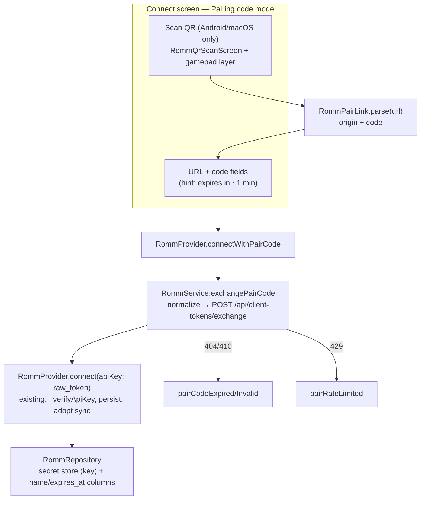

# Design: RomM Pairing Code And QR Login

## Context

See [SPEC-0007](spec.md) and [ADR-0007](../../adrs/ADR-0007-romm-pairing-code-and-qr-login.md).

Today `RommService.configure` takes either username/password or `apiKey`; `authenticate()` dispatches to `_authenticateWithPassword` (OAuth2 `/api/token`) or `_verifyApiKey` (`GET /api/users/me` with `Authorization: Bearer <key>`). `RommProvider.connect({serverUrl, username, password, apiKey})` configures, authenticates, persists through `RommRepository` (the API key goes to the `CredentialStore` secret path), and updates status. The connect screen (`romm_connect_content.dart`, ~1000 lines) has a two-position auth switch (`_useApiKey`), focus lists per mode, D-pad Left/Right on the switch, and `_connect()` reading the fields.

RomM's pairing flow: the web UI calls `POST /api/client-tokens/{id}/pair` and shows an 8-character code (`ABCDEFGHJKMNPQRSTUVWXYZ23456789`, displayed `XXXX-XXXX`) with a QR encoding `<origin>/pair?code=XXXX-XXXX`; it polls `GET /api/client-tokens/pair/{code}/status` until claimed; validity is `expires_in` (60 s), single use, exchange rate-limited to 5 per 60 s. The device calls `POST /api/client-tokens/exchange` `{"code"}` unauthenticated and receives `{id, name, scopes, expires_at, raw_token, …}`; the server normalises `code.replace("-", "").upper()`.

Constraints: strict layering, twelve-language strings, controller reachability, targets Windows/Linux/macOS/Android, `mobile_scanner` unsupported on Windows/Linux.

## Goals / Non-Goals

### Goals
- Type a pairing code on any platform and be connected.
- Scan the QR on Android and macOS and be connected with no typing.
- Reuse the API-key connection, persistence, and reconnect end to end.

### Non-Goals
- A `neostation://` deep-link callback for QRs scanned by the system camera app.
- Managing or revoking client tokens from inside NeoStation.
- Web or iOS targets.

## Decisions

### Exchange lives in the service, connection in the provider

**Choice**: `RommService.exchangePairCode(String serverUrl, String code) → Future<RommPairedToken>` configures the base URL only (no credentials), normalises and validates the code with a pure `RommPairCode.normalize` / `isValid`, POSTs JSON, and maps responses. `RommProvider.connectWithPairCode(serverUrl, code)` awaits the exchange, then calls the existing `connect(serverUrl: serverUrl, apiKey: token.rawToken)` and, on success, stores `name`/`expiresAt` via a small repository addition (two nullable columns on the RomM connection row, versioned migration, `PRAGMA table_info` guard).
**Rationale**: The service already owns HTTP and scheme fallback; the provider already owns status, persistence, and sync-provider adoption. Nothing downstream learns a new mode.
**Alternatives considered**:
- A new "paired" auth mode in the service: duplicates the API-key branch for no behavioural difference.
- Storing the token outside the existing secret path: two places to clear on disconnect.

### Sentinel errors on `RommException`

**Choice**: Add an optional `RommErrorKind` (`pairCodeInvalid`, `pairCodeExpired`, `pairRateLimited`, plus the existing implicit kinds) to `RommException` so the connect screen can pick a localized message per kind while the message string stays the log detail.
**Rationale**: SPEC-0007 REQ "Error Handling Standards" wants distinguishable failures; the current exceptions carry only a status code.

### Third mode, same switch

**Choice**: Replace `bool _useApiKey` with `enum RommAuthMode { password, apiKey, pairCode }`; the switch renders three segments; Left/Right cycles; focus lists gain the code field and, on camera platforms, the scan action. Code field input is upper-cased and dashes tolerated; the hint says the code lasts about a minute.
**Rationale**: The existing switch already does two modes with gamepad semantics; extending it keeps one navigation model.

### Scanner as its own screen and layer

**Choice**: `RommQrScanScreen` under `lib/screens/romm_screen/`, pushed with `Navigator.push`, registering a `GamepadNavigationManager` layer in the same post-frame callback as initialize and popping it in dispose; B pops with null. It hosts `MobileScanner(onDetect:)` and returns the first `RommPairLink` that parses; non-matching values show a transient refusal and continue. The action is shown when `Platform.isAndroid || Platform.isMacOS`. Camera permission is requested by the plugin on start; a denial is surfaced from the controller's error and the screen pops with a `denied` result.
**Rationale**: Every full-screen route registers a layer (CLAUDE.md rule); the plugin owns camera lifecycle; the gate keeps Windows/Linux builds free of dead UI.

### Bundled ML Kit

**Choice**: Default `mobile_scanner` (bundled) on Android; add `<uses-feature android:name="android.hardware.camera" android:required="false"/>` so camera-less devices remain installable; `CAMERA` permission comes from the plugin manifest merge.
**Rationale**: The app is sideloaded, not on Play; bundling avoids depending on Play Services for the model.

### Pure parser

**Choice**: `RommPairLink.parse(String) → RommPairLink? {serverUrl, code}` in `lib/models/`: `Uri.tryParse`, scheme http/https, path `/pair` or `/pair/`, `code` query parameter normalised and validated; origin rebuilt as `scheme://host[:port]`.
**Rationale**: Testable without a camera; the same parser can serve a pasted link in the code field later.

## Architecture

Layer placement: parser and token model in `lib/models/`; exchange in the service; entry point in the provider; migration in the datasource layer; scanner screen and mode switch in UI.

## Risks / Trade-offs

- **60-second window** → immediate exchange on Connect and on scan; errors relay the server's reason; RomM regenerates codes with one click.
- **Rate limit 5/min** → sentinel message tells the user to wait; no automatic retry.
- **Plugin size (3–10 MB)** → accepted; unbundled variant is a later gradle flag.
- **Migration** → two nullable columns with guards; downgrade recreates the DB as usual, so ship in a versioned migration only.
- **macOS camera entitlement** → `com.apple.security.device.camera` must be added to the sandbox entitlements or the scan action fails; part of the scanner story.

## Migration Plan

1. Models (`RommPairCode`, `RommPairLink`, `RommPairedToken`), service exchange, exception kinds, tests.
2. Provider entry, repository columns and migration, tests.
3. Connect screen mode, l10n, gamepad focus lists.
4. Scanner screen, platform gate, Android/macOS manifest and entitlement changes, dependency.

Rollback: hide the mode; the migration's columns are nullable and unused.

## Open Questions

- Should the code field also accept a pasted pairing link? The parser makes it trivial; deferred until someone asks.
