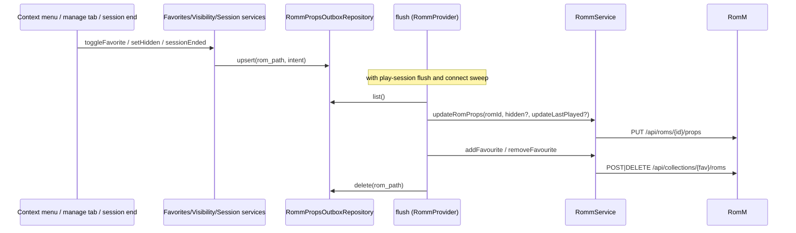

# Design: RomM Play State Write-Back

## Context

See [SPEC-0013](spec.md), [ADR-0013](../../adrs/ADR-0013-push-play-state-to-romm.md), [SPEC-0001](../romm-existing-rom-linking/spec.md), and [SPEC-0010](../romm-server-capabilities/spec.md).

Local state lives on `user_roms` (`is_favorite`, `is_hidden`, `last_played`, `play_time`), written by `GameRepository.toggleFavorite`, `setGameHidden`, `unhideAllGames`, `recordGamePlayed`; UI entry points are the game context menu and the manage tab. Play sessions are queued in `app_romm_play_sessions` at session end (`GameSessionManager._recordRommPlaySession`) and flushed by `RommPlaytimeService.flushQueuedSessions` from `RommProvider._flushQueuedPlaytime` and the sync provider's sweep. `RommService._authenticateWithPassword` requests `_readScopes` plus `_playtimeScopes` and retries without the latter on 403. RomM: `PUT /roms/{id}/props` (bare body since 4.9.0), favourites as an `is_favorite` collection with `/collections/{id}/roms` add/remove (4.9.0).

## Goals / Non-Goals

### Goals
- Hide, favourite, and last-played visible in RomM for linked games, offline-safe.
- Scope negotiation generalized for every write feature.

### Non-Goals
- Pulling state from RomM.
- Local rating, completion, status, backlog fields.
- Servers older than 4.9.0.

## Decisions

### Scope groups negotiated by probing

**Choice**: combined grant first; on 403, one probe per group; final grant for the union. Results held per connection; logged once.
**Rationale**: RomM gives no "which scope was denied" detail; probing is the only way to learn the allowed set, and it happens once per login. The bound (`groups + 2`) keeps a bad-account login cheap.
**Alternatives considered**:
- Binary fallback (today): loses every optional feature when one is denied.
- Ask the user which features to enable: pushes a server-policy question onto the user.

### One outbox table, column-per-intent

**Choice**: `app_romm_props_outbox` keyed by `rom_path` with nullable intent columns; upsert coalesces.
**Rationale**: the last state wins per column; a burst of toggles costs one request. Keyed by path because the link row can arrive later, and the flush resolves the ROM id at flush time.

### Push hooks in the repository-facing services, not the UI

**Choice**: `FavoritesService.toggleFavorite`, the manage tab's hide path (through a new `GameVisibilityService.setHidden`), and `GameSessionManager` session end call `RommPropsOutbox.queue(...)` via the provider; UI unchanged.
**Rationale**: every entry point (context menu, manage tab, system dialog unhide-all) funnels through the same few methods.

### Favourites collection cached per connection

**Choice**: `ensureFavouritesCollection` lists collections once, caches the id, creates on miss.
**Rationale**: one list call per connection; RomM allows one favourite collection per user.

## Architecture

Layering: UI → services → repositories (outbox, config) → datasource; the provider owns the flush and consults the service's gates.

## Risks / Trade-offs

- **Probe cost on denied accounts** → bounded, once per login, logged.
- **Hidden means different things per client** → push-only; the device never pulls `hidden`.
- **Favourites collection name clash** → RomM enforces one `is_favorite` per user; the client reuses whatever exists.

## Migration Plan

Two guarded columns/tables in one versioned migration (outbox table, `romm_push_play_state` config column), version assigned at merge time per `lib/data/datasources/CLAUDE.md`. Rollback: drop the hooks; rows are harmless.

## Open Questions

- Whether `remove_last_played` should be sent when play time is reset locally (the manage tab's "reset play time"). Leaning no.
- Whether to add `now_playing = true` while a session is active and clear it at the end; cheap, but two extra requests per session.
