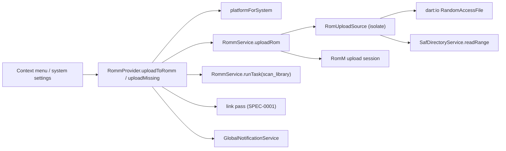

# Design: RomM ROM Upload

## Context

See [SPEC-0014](spec.md), [ADR-0014](../../adrs/ADR-0014-upload-local-roms-to-romm-in-chunks.md), [SPEC-0001](../romm-existing-rom-linking/spec.md), [SPEC-0010](../romm-server-capabilities/spec.md), and [SPEC-0013](../romm-play-state-writeback/spec.md).

`SafDirectoryService.readRange(uri, offset, length)` (`lib/services/saf_directory_service.dart:275`) is the only ranged SAF read, backed by `readSafFileRange` in `MainActivity.kt`; `RomFingerprintService.computeInBackground` shows the isolate-with-root-token pattern. `RommService._uploadAsset` is the multipart precedent; `_sendWithAuthRetry` the retry policy. RomM's session: `start` (headers), `PUT {id}` raw chunks, `complete`, `cancel`; server-recomputed chunk size; Redis TTL 24 h; `scan_library` task via `POST /api/tasks/run/{name}` (`tasks.run`).

## Goals / Non-Goals

### Goals
- Upload a single-file ROM from desktop or SAF with progress and cancel.
- Get it indexed and linked with the least ceremony the server allows.

### Non-Goals
- Upload into an existing ROM's folder (RomM master only).
- Parallel chunks; multi-file or disc games; archive repacking.

## Decisions

### `RomUploadSource` as the platform seam

**Choice**: one interface, two implementations (random-access file, SAF range), constructed by path scheme; reads happen in a `compute` isolate that holds the root token.
**Rationale**: the service stays platform-agnostic; SAF cost is paid per chunk, never per file.

### Sequential chunks, three retries, cancel on give-up

**Choice**: mirror RomM's web client.
**Rationale**: the server has already been tuned against those numbers; parallelism is a later knob.

### Scan is best effort, link is authoritative

**Choice**: request `scan_library` when allowed; either way the outcome tells the truth, and the existing link pass links the file when it appears.
**Rationale**: RomM offers no REST per-platform scan and rejects concurrent scans; the client must not pretend.

### Platform mapping by inversion

**Choice**: `platformForSystem` inverts `systemForPlatform` over the loaded platform list; ambiguity yields null with a log.
**Rationale**: one alias table, both directions; a wrong platform folder is worse than a refusal.

## Architecture

Layering: UI → provider → service; the source is a service-level utility; no repository writes (the link pass writes the map row later).

## Risks / Trade-offs

- **Slow uploads on Wi-Fi** → progress, cancel, sequential batch; parallel chunks later.
- **Server never scans** → honest "pending scan" state and "Link now".
- **Name collisions** → distinct error, listed in the summary; no overwrite.
- **Wrong platform** → ambiguity refuses; the user sees the reason.

## Migration Plan

No schema change. Rollback: remove the surfaces; uploaded files stay on the server.

## Open Questions

- Offer the upload-into-existing-ROM target once RomM releases it (register immediately, no scan)?
- Should the bulk action also offer archives that RomM stores unpacked? Skipped for now.
