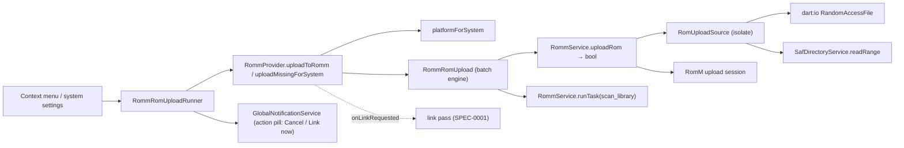

# Design: RomM ROM Upload

## Context

See [SPEC-0014](spec.md), [ADR-0014](../../adrs/ADR-0014-upload-local-roms-to-romm-in-chunks.md), [SPEC-0001](../romm-existing-rom-linking/spec.md), [SPEC-0010](../romm-server-capabilities/spec.md), and [SPEC-0013](../romm-play-state-writeback/spec.md).

`SafDirectoryService.readRange(uri, offset, length)` (`lib/services/saf_directory_service.dart:275`) is the only ranged SAF read, backed by `readSafFileRange` in `MainActivity.kt`; `RomFingerprintService.computeInBackground` shows the isolate-with-root-token pattern. `RommService._uploadAsset` is the multipart precedent; `_sendWithAuthRetry` the retry policy. RomM's session: `start` (headers), `PUT {id}` raw chunks, `complete`, `cancel`; server-recomputed chunk size; Redis TTL 24 h; `scan_library` task via `POST /api/tasks/run/{name}` (`tasks.run`).

## Goals / Non-Goals

### Goals
- Upload a single-file ROM from desktop or SAF with progress and cancel.
- Get it indexed and linked with the least ceremony the server allows.

### Non-Goals
- Upload into an existing ROM's folder (RomM master only).
- Parallel chunks; multi-file or disc games; archive repacking.

## Decisions

### `RomUploadSource` as the platform seam

**Choice**: one interface, two implementations (random-access file, SAF range), constructed by path scheme; reads happen in a `compute` isolate that holds the root token.
**Rationale**: the service stays platform-agnostic; SAF cost is paid per chunk, never per file.

### Sequential chunks, three retries, cancel on give-up

**Choice**: mirror RomM's web client. `uploadRom` returns `Future<bool>` (`false` = gated, nothing sent), and a cancel is sent on retry exhaustion, a short read, `shouldCancel`, or a stale connection generation (the service bumps a counter in `configure()` and on forgetting server state, so a disconnect or reconfigure mid-session cancels rather than finishing against the wrong server).
**Rationale**: the server has already been tuned against those numbers; parallelism is a later knob. The `bool` return mirrors `updateRomProps`, so the batch engine can tell "gated" from "uploaded" without a second gate check.

### Refuse, never encode, an unsendable name

**Choice**: `RomUploadSource.validateUploadName` refuses any name with a code unit outside printable ASCII (0x20–0x7E) as `unsendableName` before `start`; the header carries the name verbatim.
**Rationale**: `dart:io`'s `HttpHeaders` accepts only printable ASCII in a header value (`_HttpParser._isValueChar`), applied by `IOClient` on every header, so `Pokémon.gba` would throw on `start`. RomM 4.8.0 does not decode `x-upload-filename` — its web client sends raw Latin-1 bytes a browser allows and `dart:io` cannot — so percent-encoding would store `Pok%C3%A9mon.gba`, a name the user would not recognise and the SPEC-0001 name-based link pass would not match. A skip with a typed reason is honest; a mangled file on the server is not. The check is a property of the file, so it runs before the feature and scope gates and before the busy guard: a bad name reports `unsendableName`, never `uploadBusy` or a silent `false`.

### The collision phrase, not the file name

**Choice**: on the upload route a 400/409 is `alreadyExists` only when the detail says "already exists" (`_saysFileAlreadyExists`); the collection route keeps its whole-word file-name fallback (`_saysAlreadyExists`, unchanged).
**Rationale**: RomM 4.8.0's `complete` also answers 400 for path validation and "Assembled file size mismatch: expected X, got Y", both of which can mention the file name; the collision text is exactly `File {filename} already exists`, so the phrase alone is the signal there.

### Busy throws, nothing queues

**Choice**: a second `uploadRom` while a session is open throws `RommErrorKind.uploadBusy`; a second batch while one runs throws `RommUploadBusyException` before opening any source.
**Rationale**: both surfaces show the running batch (the settings row turns into Cancel whichever surface started it), so a queue would only hide work the user can already see; a thrown error is the more specific answer and leaves nothing to drain on disconnect.

### Scan is best effort, link is authoritative

**Choice**: request `scan_library` once at the end of the batch, only when something landed, reading `canRunServerTasks` at that moment rather than at batch start; every non-success of the request — no `tasks.run`, gated, `taskBusy`, any other error — is "pending", never a failure. Either way the outcome tells the truth, and the existing link pass links the file when it appears.
**Rationale**: RomM offers no REST per-platform scan and rejects concurrent scans; the client must not pretend. Reading the scope late means a group learned mid-batch (a 403 settles a group, a heartbeat can widen one) counts. The files are on the server whatever the scan said, so "failed" would misreport the batch.

### "Link now" and Cancel ride the global notification

**Choice**: `GlobalNotificationData` gains an optional `GlobalNotificationAction {label, onPressed}`; the bell renders it as a pill, a tap or A on the highlighted row fires it and leaves the row listed for the owner to rewrite, X still dismisses, and `update()` clears it unless re-passed (the same reasoning as `ongoing`). The running batch puts Cancel there; the summary replaces it with "Link now" when anything landed, and the link result is appended to the row.
**Rationale**: the spec's "cancel through the global notification" needed an affordance the bell did not have, and a dialog is the wrong home for "Link now" — it needs a live context minutes after the surface that started the batch has closed, while the bell is always reachable (Select) from any screen. The link pass is installed on the browse provider as an `onLinkRequested` hook by the sync provider, so `RommProvider` does not import the sync layer.

### Surfaces decide at open, not per frame

**Choice**: the context menu binds "Upload to RomM" only when `rommUploadGateFor(game, linked:, serverAllows:)` says offered, with the ROM map read before the menu is built; the settings row is offered from the gate's value when the dialog opens, and a gate that changes while the dialog is up only enables or disables the row. The bulk enumeration drops hidden and linked games and keeps playlists and disc images so they appear as skips with a reason; neither provider method takes a `romFolders` argument, since game rows carry `rom_path`.
**Rationale**: a row that appears under the cursor is a mis-press waiting to happen, and the General tab allocates its keys from the row count, so the count must be settled at open — the same trade-off the BIOS row's one-shot lookup makes. Hidden games are the user's own "not this one".

### Platform mapping by inversion

**Choice**: `platformForSystem` inverts `systemForPlatform` over the loaded platform list; ambiguity yields null with a log.
**Rationale**: one alias table, both directions; a wrong platform folder is worse than a refusal.

## Architecture

Layering: UI → provider → service; the source is a service-level utility; no repository writes (the link pass writes the map row later). `RommRomUpload` is callback-driven like `RommBulkSync` so it is testable with fakes; the runner resolves strings up front and detaches the batch from the widget, following `RommMetadataFetchRunner`.

## Risks / Trade-offs

- **Slow uploads on Wi-Fi** → progress, cancel, sequential batch; parallel chunks later.
- **Server never scans** → honest "pending scan" state and "Link now".
- **Name collisions** → distinct error, listed in the summary; no overwrite.
- **Wrong platform** → ambiguity refuses; the user sees the reason.
- **Unsendable names** → every accented European name (`Pokémon.gba`, `Astérix.sfc`, `Über…`), not only CJK, is a skip from this client until RomM decodes `x-upload-filename`; the ADR-0011 hash link may still match a file uploaded from the web UI.
- **One `compute` isolate per chunk** → `RomUploadSource.read` spawns an isolate (with `BackgroundIsolateBinaryMessenger.ensureInitialized`) per read, about 410 spawns for a 4 GB image: milliseconds each against seconds per chunk, so acceptable today. The knob to turn if it shows on a low-end handheld is a single long-lived reader isolate that serves every chunk of a session.
- **Cancel after disconnect relies on a coupling** → `_cancelUploadSession` runs after the provider's `disconnect()` has called `forgetServerState()`, which clears server facts but keeps the credential, so the cancel goes out authenticated. A later change that clears tokens on disconnect would make that cancel 401 and leave the server's 24 h Redis TTL as the only backstop; keep the credential until after the cancel, or send the cancel first.

## Migration Plan

No schema change. Rollback: remove the surfaces; uploaded files stay on the server.

## Open Questions

- Offer the upload-into-existing-ROM target once RomM releases it (register immediately, no scan)?
- Should the bulk action also offer archives that RomM stores unpacked? Skipped for now.
