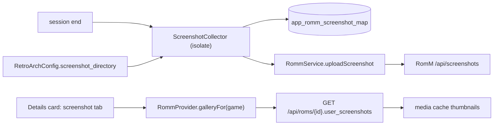

# Design: RomM Screenshots

## Context

See [SPEC-0016](spec.md), [ADR-0016](../../adrs/ADR-0016-sync-in-game-screenshots-with-romm.md), [SPEC-0001](../romm-existing-rom-linking/spec.md), and [SPEC-0010](../romm-server-capabilities/spec.md).

NeoStation's `ScreenshotService` only triggers a system screenshot on Android; scraped media has one `screenshots` slot per game (`FileProvider.screenshotsFolder`), shown by `GameDetailsScreenshotVideoTab`. `RetroArchConfigService` parses `retroarch.cfg` for directories. Session end runs `GameSessionManager._recordRommPlaySession`. `RommService._uploadAsset` builds multipart uploads. RomM: `POST /api/screenshots?rom_id=` (`screenshotFile`), overwrite by file name, `user_screenshots` on the ROM detail, content route and gallery flags since 5.0.0, 413 over 512 MiB.

## Goals / Non-Goals

### Goals
- RetroArch captures reach RomM after the session, once each.
- The RomM gallery is visible on the device.

### Non-Goals
- Capturing screenshots in NeoStation.
- Standalone emulators' screenshot folders (until known).
- Deleting or publishing screenshots from the device.

## Decisions

### Collector keyed by content stems and session window

**Choice**: name prefix match on any of the game's content stems (the ROM filename stem, plus a `.zip`'s largest-member stem) plus an mtime window from session start.
**Rationale**: RetroArch names captures `<content>-<date>-<time>.png`; the window bounds the listing to this session's files even in a large folder.

### Ledger instead of hash comparison

**Choice**: `(rom_path, file_name, size)` ledger.
**Rationale**: RomM overwrites by name anyway; the ledger avoids re-reading files and re-sending unchanged ones.

### Gallery reads the ROM detail, not a new list call

**Choice**: `GET /api/roms/{id}` already returns `user_screenshots`; the strip uses it and the media cache.
**Rationale**: one request the app already makes for metadata; thumbnails are cached like covers (ADR-0008).

## Architecture

## Risks / Trade-offs

- **Large folders** → prefix and mtime filter; listing only.
- **Session end latency** → detached task after playtime hooks.
- **Older servers** → uploads work (3.10+), gallery gated (5.0.0).

## Migration Plan

One versioned migration: RetroArch config columns, ledger table, `romm_upload_screenshots` config column. Version at merge time.

## Open Questions

- Should uploads be marked public by default? RomM defaults private; keep private.
- Per-emulator screenshot directories in the emulator JSON for standalones.
