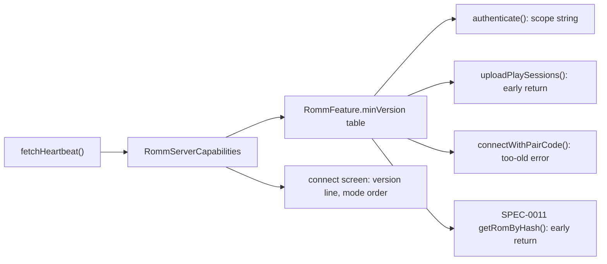

# Design: RomM Server Capabilities

## Context

See [SPEC-0010](spec.md), [ADR-0010](../../adrs/ADR-0010-romm-heartbeat-capability-probe.md), and [SPEC-0007](../romm-pairing-login/spec.md).

`RommService` (`lib/services/romm_service.dart`) holds the connection: `configure()` sets base URL and credentials, `authenticate()` runs the password grant (`_authenticateWithPassword`, requesting `_readScopes` plus `_playtimeScopes` and re-posting without the latter on 403) or accepts the API key, `_sendWithAuthRetry` wraps every authenticated call with the 401-refresh / 403-re-auth policy, and `_notePlaySessionFailure` flips `_playSessionsSupported` on 404 or a confirmed 403. `RommProvider` (`lib/providers/romm_provider.dart`) drives `connect`, `connectWithPairCode` (SPEC-0007), and `initialize` (restored session, no network). The connect screen (`lib/screens/romm_screen/romm_connect_content.dart`, `romm_auth_mode.dart`) offers password, API key, pairing code, and QR modes.

RomM's `GET /api/heartbeat` is public and returns `SYSTEM {VERSION, SHOW_SETUP_WIZARD}`, `METADATA_SOURCES {*_API_ENABLED, SS_DEV_CREDENTIALS_SET, ...}`, `FILESYSTEM {FS_PLATFORMS, ...}`, `EMULATION {DISABLE_*}`, `FRONTEND {DISABLE_USERPASS_LOGIN, DISABLE_LOGS_VIEWER, YOUTUBE_BASE_URL}`, `OIDC {...}`, `TASKS {ENABLE_SCHEDULED_*, *_CRON}`.

## Goals / Non-Goals

### Goals
- One public probe per connect; a typed capability object; one threshold table.
- No request to an endpoint the server is known not to have; no double token POST on old servers.
- A failed probe changes nothing.

### Non-Goals
- Persisting capabilities across launches.
- Gating on account scopes (the grant and the 403 path keep doing that).
- Acting on `METADATA_SOURCES` beyond exposing them (ADR-0006's scrape may consume them later).

## Decisions

### A value object in `lib/models/`, the table beside it

**Choice**: `lib/models/romm_server_capabilities.dart` holds `RommServerVersion`, `RommServerCapabilities`, `RommFeature` (with `minVersion` and a verification comment per entry), and `RommFeatureSupport {supported, unsupported, unknown}`.
**Rationale**: the thresholds are data about RomM, reviewed in one place; the model layer has no dependencies, so the service, provider, and tests share it.
**Alternatives considered**:
- Thresholds as constants inside `RommService`: hidden next to HTTP code, harder to test in isolation.
- A JSON asset updated over the air like `assets/systems`: overkill for three entries; revisit if the table grows past a dozen.

### Probe inside `authenticate()`, not a separate provider step

**Choice**: `authenticate()` probes when `_capabilities == null && !_probed` for the current base URL, then builds the scope string from the result. `fetchHeartbeat()` is also public for `initialize()`.
**Rationale**: the scope request is the one consumer that must run after the probe and before the grant; putting the probe there guarantees the order for every login path (password, API key, pairing) without each provider method remembering to call it.
**Alternatives considered**:
- Probe in the provider before `authenticate()`: three call sites, easy to miss on the next login mode.

### `unknown` never gates

**Choice**: only `unsupported` short-circuits; `unknown` runs today's code paths unchanged.
**Rationale**: a reverse proxy that blocks `/api/heartbeat` or a future RomM that renames a field must not lose features that work.

### Early return mirrors today's unavailable state

**Choice**: `uploadPlaySessions` on `unsupported` sets `_playSessionsSupported = false` through the existing `_notePlaySessionFailure`-style path so `playtimeSyncAvailable` reads false and the outbox is not retried; the provider's queue flush therefore sees "unavailable" and behaves as it does after a 404 today.
**Rationale**: one state for "no playtime on this connection", whatever proved it.

### Restored session probes in the background

**Choice**: `initialize()` marks connected, then `unawaited(_probeCapabilities())` guarded by a generation counter; on completion, `notifyListeners()`.
**Rationale**: startup must not wait on the network; the first gated call within that window behaves as `unknown`, which is today's behaviour.

### Pairing gate returns a typed error

**Choice**: `connectWithPairCode` checks `supports(clientTokenExchange)` after the heartbeat and, on `unsupported`, sets `lastErrorKind = RommErrorKind.unsupported` (new enum value) and the localized message `rommPairServerTooOld`; `romm_pair_error_message.dart` maps the kind.
**Rationale**: SPEC-0007 already maps error kinds to messages; a new kind slots in without touching the screen.

## Architecture

```mermaid
sequenceDiagram
    participant P as RommProvider
    participant S as RommService
    participant C as RommServerCapabilities
    participant R as RomM

    P->>S: authenticate()
    S->>R: GET /api/heartbeat
    R-->>S: 200 body | error
    S->>C: parse (tolerant) → capabilities | null
    S->>C: supports(playSessions)
    C-->>S: supported | unsupported | unknown
    alt unsupported
        S->>R: POST /api/token scope=read
    else supported / unknown
        S->>R: POST /api/token scope=read+playtime (403 → read)
    end
    S-->>P: connected; capabilities exposed
    P->>P: serverVersion, passwordLoginDisabled → notifyListeners
```



Layering: model (value object) ← service (probe, gates) ← provider (exposure, re-probe) ← UI (version line, mode order). No repository or datasource is involved.

## Risks / Trade-offs

- **Wrong threshold gates a working feature** → each entry cites its verification; `unknown` never gates; a unit test pins the table; the connect screen's version line makes a misgate diagnosable from a screenshot.
- **Heartbeat blocked by a proxy** → null capabilities, today's behaviour.
- **Startup probe on a metered or slow network** → 5 s cap, one small body, off the critical path.
- **Two mechanisms (version gate, scope fallback)** → each has one job and a comment saying which; the 403 path is unchanged.

## Migration Plan

No schema change. Ships with the next build; nothing to migrate. Rollback is removing the gates; the probe is harmless on its own.

## Open Questions

- Should `METADATA_SOURCES.SS_API_ENABLED` and `SS_DEV_CREDENTIALS_SET` feed ADR-0006's scrape-source decision (skip RomM when the server has no metadata sources at all)? Out of scope here; the flags are exposed for it.
- The `playSessions` threshold is inferred from the ingest commit date (2026-03-22, between 4.7.0 and 4.8.0); the implementer SHOULD confirm 4.8.0 against the RomM release notes and record it in the table comment.
