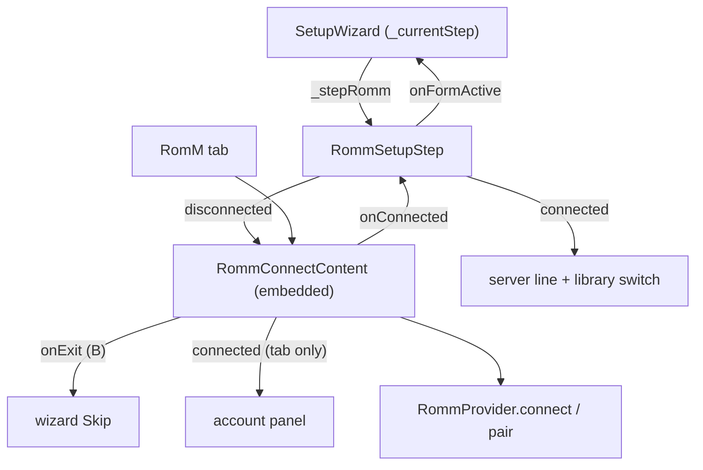

# Design: RomM Step In First-Run Setup

## Context

See [SPEC-0020](spec.md), [ADR-0021](../../adrs/ADR-0021-connect-to-romm-during-first-run-setup.md), [SPEC-0007](../romm-pairing-login/spec.md), [SPEC-0010](../romm-server-capabilities/spec.md).

`SetupWizard` (`lib/widgets/setup_wizard.dart`) keeps `_currentStep` and a set of step constants; `_totalSteps` is 6 on Android and 5 on desktop. `_handleSkip`, `_handleMainAction`, `_buildStepContent` and the footer builder each branch on the step. ES-DE import and art pack are the two optional trailing steps. The wizard owns one `GamepadNavigation`.

`RommConnectContent` (`lib/screens/romm_screen/romm_connect_content.dart`) is the RomM tab's disconnected view and its connected account panel in one state class. It mixes in `LoginFormSelection`, pushes the layer `romm_connect`, binds the bumpers to `AppNavigation.previousTab`/`nextTab`, and imports `app_screen.dart` for that.

## Goals / Non-Goals

### Goals
- A RomM-first user can connect during setup with any of the three authentication modes.
- One credential form, hosted twice.
- A small, contained change to the wizard file.

### Non-Goals
- Picking a download destination, running a bulk sync, or showing link-pass progress inside the wizard.
- Remembering that the step was skipped, or prompting again later.
- Changing what the RomM tab looks like or does.

## Decisions

### One widget with a host contract, not an extracted form

**Choice**: `RommConnectContent` stays one widget and gains host parameters: `tabNavigation` (true on the tab), `onExit` (B with no field focused, disconnected), `onConnected`, `onBusyChanged`, and `embedded` (no space reserved for the tab dock). The wizard mounts it only while disconnected, so the connected account panel never renders there. The defaults are the tab's behaviour; the tab passes nothing.
**Rationale**: the first plan was to move the disconnected half into a `RommConnectForm`. The two halves share one state class — the selection mixin, the scroll controller, the gamepad navigator and its layer, the card chrome — so the split would have rewritten about nine hundred lines of gamepad-sensitive code that only a device can verify, to end at the same user-visible result. Parameters reach "one implementation, hosted twice" with a diff the tab can be shown not to notice. What B does is a pure function (`rommConnectBackFor`) so the contract is tested without a widget.

### The wizard step lives in its own file

**Choice**: `lib/widgets/setup_wizard/romm_step.dart` holds the step's body (form or connected state, the library switch). `setup_wizard.dart` gains the step constant, the `_totalSteps` change, and one branch in each handler.
**Rationale**: the wizard file is upstream's and conflicts there are the cost of this feature; a separate file keeps the fork's lines in it to a handful.

### The wizard's navigator stands down while the form is up

**Choice**: the wizard's `GamepadNavigation` is not a registered layer, so the step tells the wizard when the form mounts and unmounts (`onFormActive`) and the wizard deactivates and reactivates its navigator. B on the form with nothing focused is the wizard's Skip; the footer shows only Skip while the form is up, and only Next once connected. The library switch has no cursor to sit under, so the wizard binds it to X and the row shows that button.
**Rationale**: the wizard's buttons are A and B bindings, not cursor targets, so there is nothing to hand a cursor to. Leaving both navigators live would make one A press connect and advance. `GamepadNavigationManager.reactivate()` wakes the top registered layer on resume, which is the form — the right owner after the QR scanner or the soft keyboard.

### The library switch is offered, not defaulted on

**Choice**: `romm_show_library` stays off unless the user turns it on in the step.
**Rationale**: ADR-0020 made the unified library opt-in because it changes what "my library" means; the wizard is a good place to ask, not a reason to decide for the user.

## Architecture

## Risks / Trade-offs

- **Upstream conflicts in the wizard.** Step indices shift. Mitigation: the step table comment and constants are the only shared lines; the body is in a separate file.
- **Regressions on the tab.** Mitigation: the tab passes no new parameter and every default is the old behaviour; the only branch that changed for it is B, which is a tested pure function.
- **Soft keyboard on Android inside the wizard.** The wizard's layout was not built around text entry. Mitigation: the step scrolls, and the form already keeps the focused field above the keyboard on the tab; verify on a device.

## Migration Plan

None. No schema change, no stored preference. Existing installs never see the wizard again unless they reset.

## Open Questions

- Should the step be hidden on a wizard re-run when RomM is already connected, rather than shown in its connected state? The spec shows it; hiding it would save a press.
