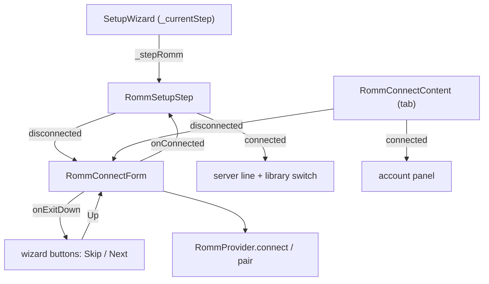

# Design: RomM Step In First-Run Setup

## Context

See [SPEC-0020](spec.md), [ADR-0021](../../adrs/ADR-0021-connect-to-romm-during-first-run-setup.md), [SPEC-0007](../romm-pairing-login/spec.md), [SPEC-0010](../romm-server-capabilities/spec.md).

`SetupWizard` (`lib/widgets/setup_wizard.dart`) keeps `_currentStep` and a set of step constants; `_totalSteps` is 6 on Android and 5 on desktop. `_handleSkip`, `_handleMainAction`, `_buildStepContent` and the footer builder each branch on the step. ES-DE import and art pack are the two optional trailing steps. The wizard owns one `GamepadNavigation`.

`RommConnectContent` (`lib/screens/romm_screen/romm_connect_content.dart`) is the RomM tab's disconnected view and its connected account panel in one state class. It mixes in `LoginFormSelection`, pushes the layer `romm_connect`, binds the bumpers to `AppNavigation.previousTab`/`nextTab`, and imports `app_screen.dart` for that.

## Goals / Non-Goals

### Goals
- A RomM-first user can connect during setup with any of the three authentication modes.
- One credential form, hosted twice.
- A small, contained change to the wizard file.

### Non-Goals
- Picking a download destination, running a bulk sync, or showing link-pass progress inside the wizard.
- Remembering that the step was skipped, or prompting again later.
- Changing what the RomM tab looks like or does.

## Decisions

### Extract the form, leave the account panel on the tab

**Choice**: a `RommConnectForm` widget carries the fields, the mode switch, the scan action, connect, the error line and the form's gamepad navigation. `RommConnectContent` keeps the connected panel and hosts the form when disconnected.
**Rationale**: the wizard needs the form and none of the account actions (disconnect, save-sync toggle, maintenance). Splitting at that line means the wizard hosts no code it has to hide.

### The host contract is three parameters

**Choice**: `onConnected`, `onExitDown` (cursor leaves past the last control; null means stop there), and `tabNavigation` (true on the tab). B with no field focused calls `onExitDown` when present.
**Rationale**: these are the only three things that differ. Anything more and the hosts start configuring the form's inside.

### The wizard step lives in its own file

**Choice**: `lib/widgets/setup_wizard/romm_step.dart` holds the step's body (form or connected state, the library switch). `setup_wizard.dart` gains the step constant, the `_totalSteps` change, and one branch in each handler.
**Rationale**: the wizard file is upstream's and conflicts there are the cost of this feature; a separate file keeps the fork's lines in it to a handful.

### Two layers, handed over explicitly

**Choice**: the form pushes its layer above the wizard's when the step is entered disconnected. `onExitDown` pops it, so the wizard's navigator drives Skip and Next; Up from the buttons pushes it back.
**Rationale**: `GamepadNavigationManager.reactivate()` wakes the top registered layer on resume (returning from the QR scanner or the soft keyboard), so the cursor's owner has to be whichever layer is on top, not a flag.

### The library switch is offered, not defaulted on

**Choice**: `romm_show_library` stays off unless the user turns it on in the step.
**Rationale**: ADR-0020 made the unified library opt-in because it changes what "my library" means; the wizard is a good place to ask, not a reason to decide for the user.

## Architecture

## Risks / Trade-offs

- **Upstream conflicts in the wizard.** Step indices shift. Mitigation: the step table comment and constants are the only shared lines; the body is in a separate file.
- **Extraction regressions on the tab.** The form's cursor order, the password-disabled reordering and the QR return path all move. Mitigation: the tab's existing tests run unchanged against the extracted form before the wizard is touched.
- **Soft keyboard on Android inside the wizard.** The wizard's layout was not built around text entry. Mitigation: the step scrolls, and the form already keeps the focused field above the keyboard on the tab; verify on a device.

## Migration Plan

None. No schema change, no stored preference. Existing installs never see the wizard again unless they reset.

## Open Questions

- Should the step be hidden on a wizard re-run when RomM is already connected, rather than shown in its connected state? The spec shows it; hiding it would save a press.
