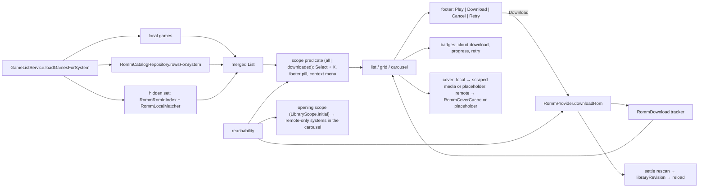

# Design: RomM Unified Library

## Context

See [SPEC-0019](spec.md), [ADR-0020](../../adrs/ADR-0020-show-romm-library-inside-the-local-library.md), [SPEC-0001](../romm-existing-rom-linking/spec.md), [SPEC-0008](../romm-browse-performance-and-search/spec.md), and [SPEC-0010](../romm-server-capabilities/spec.md).

Local library: `user_roms` (`UNIQUE(rom_path)`, NOT NULL) and `user_detected_systems`; `SqliteDatabaseProvider` holds games per system folder; every system list is built by `GameListService.loadGamesForSystem` (`lib/services/game/game_list_service.dart:126`), which applies name settings and hides hidden games; `buildSystemsList` (`lib/screens/systems_screen/my_systems_section/system_list_builder.dart:21`) returns recents plus detected systems; three views (`my_games_list.dart`, `my_games_grid.dart`, `my_games_carousel.dart`) draw `List<GameModel>` with heart, collection, and achievements badges; `launch_flow.dart:137` `_selectCurrentGame` is the confirm path (interception point at `:170`); the context menu has favourite and collections; `GameModel.romPath` is nullable. RomM side: `RommService.getPlatforms`, `getRomsPage`, `RommPaging` (500 per page, 500 pages), `RommLibraryLinker._pagePlatform`, `RommProvider.downloadRom` with `RommDownload` trackers and the settle rescan (`onDownloadsSettled` wired in `main.dart:400`), `downloadedStateFor` for build-time checks, `resolveSystem`/`systemForPlatform` with `_slugAliases`; covers via `tileCoverUrlCandidates` and `imageHeadersFor`, never on disk; no connectivity stream; `initialize()` marks connected without network. Search screen precedent: `_remote`, `_resolveDownloadedFlags`, `_downloadRemote`, remote tile with `cloud_download_rounded`.

## Goals / Non-Goals

### Goals
- One list per system with local and remote games; download in place; row flips local on settle.
- Works offline from the catalog and the cover cache; defaults to downloaded when offline; refreshes on reconnect.
- No change to local identity.

### Non-Goals
- Remote entries in favourites, recents, collections, or RA matching.
- Unresolved RomM platforms (stay in the RomM tab).
- Streaming or launching without download.

## Decisions

### Catalog as replaceable data beside the link map

**Choice**: `app_romm_catalog` keyed by `(server_url, romm_rom_id)`, plus a platforms table; cleared on disconnect or server change.
**Rationale**: the catalog is a cache of the server, the link map is the user's truth; keeping them apart lets the catalog be rebuilt freely.
**Alternatives considered**:
- Rows in `user_roms`: rejected in the ADR (identity).
- JSON blob per platform: no indexed per-system reads, no incremental deletes.

### One walk, two consumers

**Choice**: `RommCatalogRefresh` owns the paging (extracted from `RommLibraryLinker._pagePlatform`); the linker becomes a consumer registered per ROM. The sync provider's connect sweep calls the refresh, which runs the link stage at the end of each group as today.
**Rationale**: the link pass already pays for the walk; two walks would double the cost ADR-0001 bounded. The linker's early exit when nothing is unlinked no longer skips the walk; the hourly guard bounds it instead.

### Reachability from failures plus re-probe

**Choice**: three-state field on the provider; failures flip offline; heartbeat re-probe with backoff flips online; `unknown` at startup.
**Rationale**: no connectivity dependency; the heartbeat is public and cheap (SPEC-0010); `unknown` avoids a false offline default on a cold start.

### Merge in `GameListService`, not in the views

**Choice**: the service reads the toggle and the server URL once per load (a light `RommRepository.getServerUrl`, no credential-store read), reads catalog rows for the system's folder and each alias, builds the hidden set from `RommRomIdIndex` and `RommLocalMatcher` (`normalizeName` over the system's local filenames, hidden games included, against `candidateNamesFor` — the shared candidate list, callable from a catalog row), and appends remote `GameModel`s through `GameModel.fromCatalogRow(row, system, displayName:, showRomFileNameSubtitle:)`; the aggregate path does the same per system, visiting each row once by id. Scope filtering is a view-level predicate over the merged list (`LibraryScope.filter`).
**Rationale**: one funnel feeds all three views and the aggregate; the views only learn `isRemote`. The factory takes the resolved display name rather than a name-settings object (the issue's `nameSettings` shape) because the name formatter lives in `GameListService` and a model cannot import a service; the merge applies the same per-system settings the local path does.

### Download reuses the browse path

**Choice**: confirm → `RommProvider.downloadRom(rom from catalog row)`; the card reads `downloadFor(romId)`; the settle rescan and `libraryRevision` trigger the list reload that flips the row.
**Rationale**: the same tracker, unpack, metadata fetch, link row, and rescan as the RomM tab.

### Cover cache under the media cache with LRU

**Choice**: files on disk, an index of `(path, size, lastUsed)` kept in memory and rebuilt from the directory on start; eviction after prefetch and on a size check every 100 fills.
**Rationale**: covers are the offline experience; a cap keeps the handheld's storage predictable.
The cache serves remote entries only: a local game without scraped media draws the placeholder, not the RomM cover of its linked ROM (`rommCoverPathFor`, #206). The server's directory is cleared on disconnect and on a server change (#206); the catalog clear on the same events is #107's.

### Remote-only systems through the same builder

**Choice**: `buildSystemsList` unions `RommProvider.catalogSystemCounts` (per-folder counts and the newest `refreshed_at`, from one `RommCatalogRepository.countsBySystem` query, refreshed on initialize, connect, after a refresh or clear, and on disconnect) with the detected systems, resolves each extra folder through `systemForFolder` (detected systems first, then `SqliteConfigProvider.availableSystems`), orders the union with `compareSystemsForCarousel` (`lib/utils/system_sort.dart`, the provider's comparator extracted verbatim so both share one rule), and marks the extras with `badgeIcon: cloud`, a localized semantics label, and the catalog count. The provider exposes a `catalogRevision` so the carousel and the grid select on it rather than on every download tick.
**Rationale**: the carousel is the only place systems are listed; the destination resolver already creates missing folders; the old `firstWhere` on an unknown folder threw, and the resolver replaces it in both the carousel and the grid.

### Scope is per game view; the carousel follows the opening scope

**Choice**: the games screen holds `_libraryScope`, initialised before the first load from `rommLibraryDefaultScope` and forced to `downloaded` while `RommProvider.reachability == offline` (`LibraryScope.initial(configured:, offline:)`). The carousel has no toggle, so `remoteOnlySystems` applies the same `LibraryScope.initial` rule and a scope toggled inside a list does not reach back to it. The toggle is Select + X, the footer pill (`lib/widgets/library_scope_pill.dart`, in both the details-card footer and the grid/carousel footer), and a context-menu item.
**Rationale**: Select + X is the free chord on this screen (X alone is the view-mode picker, Select + A scrape, Select + Y random). Giving the carousel a scope of its own would need a second toggle and a second footer; the opening scope is the only coherent reading of "`downloaded` hides remote-only systems".

### Offline "cached library" as a notice plus a pill mark, not a banner

**Choice**: switching to `all` while offline toasts the localized "offline, showing the cached RomM library" line once, and the footer pill wears a cloud-off mark whose tooltip carries the same line for as long as the view is `all` and offline.
**Rationale**: the footer is one line high and already carries the chord and the scope name; a persistent banner would cost list height for a state the pill already shows. The pill has a label slot should a persistent line be wanted later.

### Remote entries are inert until the download flow lands

**Choice**: with #108 (cards, badges, download-from-the-list, secondary display) still open, a launch, favourite, per-game settings, or scrape press on a remote entry answers with a localized "Not downloaded" notice (`_notifyRemoteNotDownloaded`) instead of writing rows keyed to a file that is not there; the context menu drops favourite, collections, settings, and scrape for `isRemote` and keeps the view-level items. The scrape guard must cover the Select + A chord as well as the menu (the #213 review found the chord bypassing it).
**Rationale**: `user_roms`-keyed writes for a path-less entry would be exactly the identity leak ADR-0020 rejected; the search screen and the secondary display are untouched, since a remote entry reaching the secondary display resolves its media paths to files that do not exist and draws the placeholder.

## Architecture

```mermaid
sequenceDiagram
    participant Sync as RomMSyncProvider (connect sweep)
    participant Ref as RommCatalogRefresh
    participant S as RommService
    participant Cat as RommCatalogRepository
    participant Link as RommLibraryLinker (consumer)
    participant Cov as RommCoverCache

    Sync->>Ref: run(reason: connect)
    loop platform resolving to a system
        loop page (RommPaging)
            Ref->>S: getRomsPage(platformIds, offset)
            S-->>Ref: RommRomPage
            Ref->>Cat: upsert(rows, seen_at)
            Ref->>Link: onRom(rom) (claims)
        end
        Ref->>Cat: deleteUnseen(platform)
        Ref->>Link: groupComplete → write link rows
    end
    Ref->>Cov: prefetch(new rows, ≤300, ×3)
    Ref-->>Sync: summary
```



Layering: UI → providers → `GameListService`/`RommCatalogRefresh`/`RommCoverCache` (services) → repositories (`RommCatalogRepository`, `GameRepository`, `RommSaveMapRepository`) → datasource.

## Risks / Trade-offs

- **First refresh on a huge library** → paging caps, background, per-platform commits; the list works from whatever is already stored.
- **Cover prefetch bandwidth** → bounded per refresh, lazy fill otherwise, cap with eviction.
- **Reachability flapping** → backoff, `unknown` on start, only scope default and download enablement depend on it.
- **Duplicate display when a local file exists but is unlinked and misnamed** → the ADR-0011 hash stage shrinks this; the picker fixes the rest; the row shows twice until then.
- **Secondary display and other `GameModel` consumers** → `isRemote` checked at each named consumer; tests per surface.

## Migration Plan

One versioned migration: two catalog tables with index, config columns `romm_show_library`, `romm_library_default_scope`, `romm_cover_cache_mb`. Version at merge time per `lib/data/datasources/CLAUDE.md`. Rollback: toggle off hides everything; tables are cache.

## Open Questions

- Should remote entries appear in collections that mirror RomM collections (ADR-0009) as unresolved members? Deferred; would let a mirrored collection show its undownloaded games.
- Incremental refresh by `updated_at` ordering instead of a full walk, once RomM exposes a stable `updated_at` filter; the full walk is the ADR-0001 cost model for now.
- Auto-play after download: a single "Play now" toast is specified; a setting to auto-launch is not.
