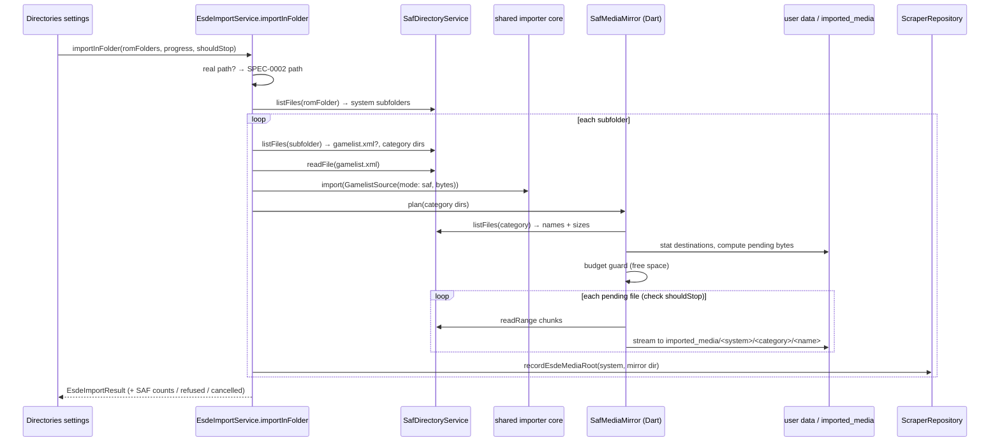
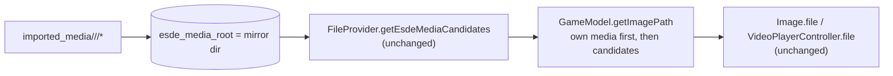

# Design: SAF Mirror Gamelist Import

## Context

See [SPEC-0003](spec.md), [ADR-0003](../../adrs/ADR-0003-mirror-saf-gamelist-media-into-app-storage.md), and the base capability [SPEC-0002](../in-folder-gamelist-import/spec.md).

After SPEC-0002 the importer has a `GamelistSource` record, `importInFolder` discovery over real paths, a per-system `esde_media_root` written through `ScraperRepository`, and a SAF skip path that counts unresolvable `content://` folders. `FileProvider` resolves candidates from the per-system root and every render site reads plain files.

SAF primitives in `SafDirectoryService`: `listFiles(uri)` returns children with name, URI, directory flag, size, and mtime in one call; `readFile(uri)` returns whole-file bytes; `readRange(uri, offset, length)` returns a chunk; there is no single-document existence check, and `OptimizedMd5Utils.fileExists` answers true for any `content://` URI. The native side has a streamed recursive mirror used for emulator NAND folders that skips files whose destination size matches, and a free-space query. Archive extraction already copies a SAF ROM into a temp file with chunked reads.

Constraints from the repo rules: prefer Dart over Kotlin for new behaviour, keep the Kotlin bridge emulator-agnostic, strict layering, all strings through `AppLocale`, and controller reachability for any UI.

## Goals / Non-Goals

### Goals
- SAF-only Android ROM folders import metadata and artwork with no permission escalation.
- Zero changes to the media resolver, caches, or widgets.
- Read-only toward the SAF tree, always.
- Cheap re-runs through size skipping, bounded disk use through the budget guard, complete undo through reset.

### Non-Goals
- Rendering `content://` media in place.
- Mirroring ROMs or anything outside the mapped media categories.
- Watching the SAF tree for changes.
- Kotlin changes. Everything here is Dart over the existing channel.

## Decisions

### Copy in Dart over the existing SAF reads, not a new native mirror

**Choice**: Implement the mirror as a Dart loop: for each mapped category folder, `listFiles` once, then for each file compare the listing size with the destination `File.length()`, and copy changed or missing files with the chunked `readRange` pattern from `OptimizedMd5Utils.readAllBytes` streamed into a `File` sink.
**Rationale**: The repo rule prefers Dart; the native NAND mirror copies whole trees with no filter and no progress and would need Kotlin changes to gain both. Images are kilobytes, so per-file channel calls are fine, and the chunked read already exists for large files (videos). A Dart loop is also directly testable with a fake SAF service.
**Alternatives considered**:
- Extend the native `mirrorSafRecursive` with a filter and progress events: faster for thousands of files, but Kotlin work and a new channel event surface; deferred unless the Dart loop proves too slow.
- Whole-file `readFile` per file: simpler but holds videos in memory; rejected for the `videos` category.

### Mirror root is `<user data>/imported_media/`, separate from NeoStation's media directory

**Choice**: Mirror into `<user data>/imported_media/<system folder>/<category>/` and record that directory as `esde_media_root`. Never write into `<user data>/media/`.
**Rationale**: `getImagePath` gives NeoStation's own media directory precedence and consults the per-system root only after it. Keeping the mirror out of `media/` preserves that precedence, so a later scrape wins without special casing, and reset can delete a whole subtree by prefix with no risk to scraped art.
**Alternatives considered**:
- Copy into `media/` directly: would shadow later scrapes and make reset ambiguous; rejected.
- Copy into a temp directory: lost on cache clears; rejected.

### Size match is the change detector

**Choice**: A destination file is skipped when its length equals the listing's size for the source.
**Rationale**: The listing already carries sizes, so the check costs nothing; mtime over SAF is unreliable across providers; hashing would require reading every source file, defeating the skip. Same-size in-place edits of artwork are rare and acceptable.

### Budget guard from listing sizes before any copy

**Choice**: Per system, sum the sizes of files that are missing or size-mismatched, compare with a fresh reading of the existing free-space query for the user-data volume, and refuse that system's mirror when short, while still importing its metadata. Earlier systems keep their mirrors.
**Rationale**: The disk is what must be protected, and a fresh reading before each system guarantees no system starts a copy it cannot finish. Planning the whole folder first would double the listing work for large libraries and still could not account for space consumed by other apps mid-run. A partially mirrored library is a valid state: every mirrored file is complete, and the next run resumes by size skip.

### Reset deletes by prefix, never by column value alone

**Choice**: Reset deletes a system's mirror only when its recorded `esde_media_root` starts with the resolved `imported_media` root, then clears the column for all systems as before.
**Rationale**: The column may hold a real platform folder from SPEC-0002; deleting that would destroy user files. The prefix check makes the deletion provably scoped.

### One import at a time, cancellable between files

**Choice**: A single-instance guard shared with the SPEC-0002 entry points, a `shouldStop` callback checked between files, and a result that distinguishes cancelled from complete.
**Rationale**: Mirrors can take minutes; the user needs to be able to back out, and two overlapping imports would race on the same destination files.

## Architecture

Layer placement: the mirror is a service-layer helper next to the importer, depending on `SafDirectoryService` and `dart:io` only; media roots are written through `ScraperRepository`; free space comes through the existing storage-space service; the settings screen only calls the importer and shows the result.

## Risks / Trade-offs

- **Thousands of small channel calls** → One listing per category folder gives names and sizes; only changed files are read. If a first mirror of a very large library is slow, the native filtered mirror is the escape hatch, recorded as an alternative above.
- **Disk duplication** → Category filter plus budget guard plus reset. The summary shows bytes copied so the cost is visible.
- **Stale mirror after same-size edits** → Accepted for artwork; documented in the result wording as "unchanged files skipped".
- **Reset deleting the wrong thing** → Prefix-scoped deletion under `imported_media` only, with a test that a real-path root is never deleted.
- **Cancel leaves a partial mirror** → Partial mirrors are valid: every copied file is complete (streamed to a temp name then renamed), and the next run resumes by size skip.
- **SAF grant revoked mid-run** → Reads fail per file, are counted, and the run completes with failures reported; the scanner's existing permission warning covers the root cause.

## Migration Plan

No schema change; the SPEC-0002 column is reused. Ship the SAF path behind the same settings action. Rollback removes the code; mirrored files under `imported_media` are inert and can be removed by reset.

Tests: fake `SafDirectoryService` recording every call (asserting no writes); mirror plan and copy with size skip, changed-file recopy, budget refusal, cancel between files, per-file failure isolation; media root recorded as mirror dir; reset prefix-scoped deletion; real-path folder unaffected; l10n keys present in twelve files.

## Open Questions

- Should the `videos` category be opt-in for SAF mirrors, since videos dominate bytes? The spec keeps the SPEC-0002 category set; a per-category toggle can follow if budget refusals are common.
- Should a native filtered mirror be added later for very large libraries? Deferred until the Dart loop's speed is measured on a device.
